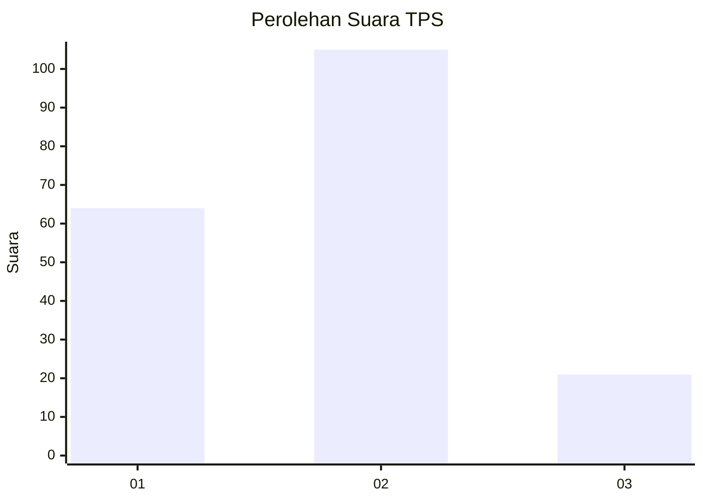
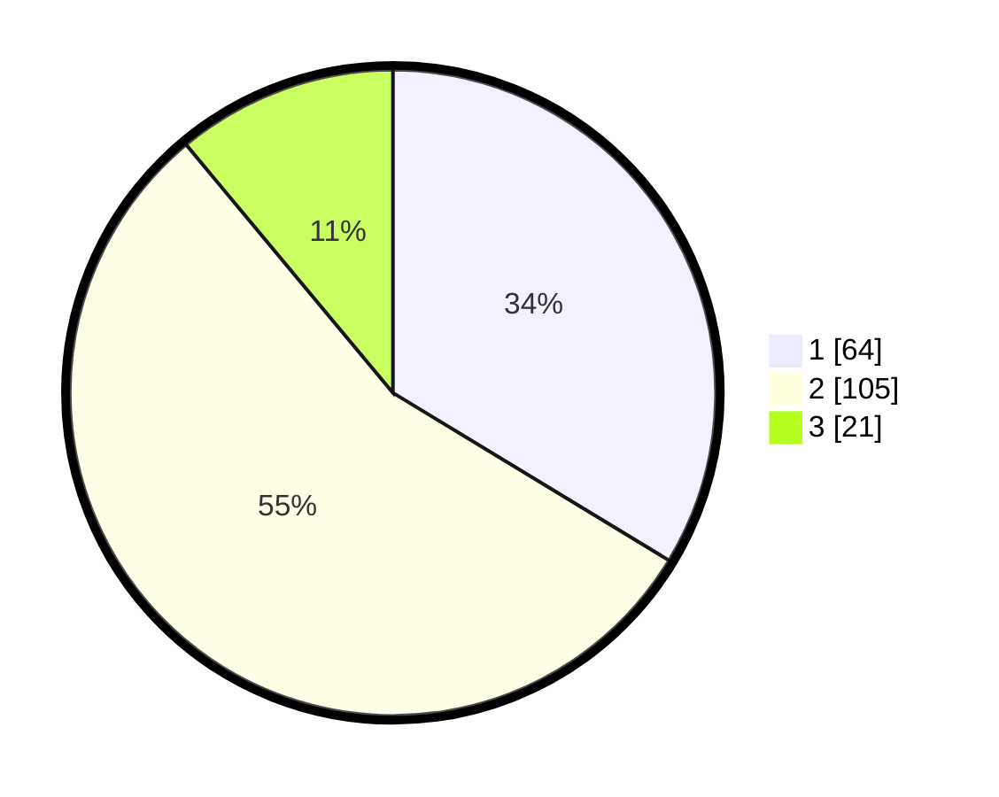

# Hasil

## Grafik

## Tabel

| No. | Nama Paslon    | Suara | Suara (raw) | Persentase |
|:--- |:-------------- | -----:| -----------:| ----------:|
| 1   | ANIES MUHAIMIN | 64    | [64][p-1]   | 33,68      |
| 2   | PRABOWO GIBRAN | 105   | [105][p-2]  | 55,26      |
| 3   | GANJAR MAHFUD  | 21    | [21][p-3]   | 11,05      |

[p-1]: https://github.com/gigit-pemilu/pemilu-2024/blob/main/pilpres/hitung-suara/sub/35-jawa-timur/sub/09-jember/sub/18-tempurejo/sub/2001-sidodadi/sub/019-tps/sub/paslon-1.txt
[p-2]: https://github.com/gigit-pemilu/pemilu-2024/blob/main/pilpres/hitung-suara/sub/35-jawa-timur/sub/09-jember/sub/18-tempurejo/sub/2001-sidodadi/sub/019-tps/sub/paslon-2.txt
[p-3]: https://github.com/gigit-pemilu/pemilu-2024/blob/main/pilpres/hitung-suara/sub/35-jawa-timur/sub/09-jember/sub/18-tempurejo/sub/2001-sidodadi/sub/019-tps/sub/paslon-3.txt

## Foto C Plano

https://sirekap-obj-formc.kpu.go.id/3abb/pemilu/ppwp/35/09/18/20/01/3509182001019-20240214-211251--4952cb03-c6c5-43fd-8c7d-2b974bb79aed.jpg

https://sirekap-obj-formc.kpu.go.id/3abb/pemilu/ppwp/35/09/18/20/01/3509182001019-20240214-211518--f996a47d-13a0-4ef6-a2fb-15332a27cbb5.jpg

https://sirekap-obj-formc.kpu.go.id/3abb/pemilu/ppwp/35/09/18/20/01/3509182001019-20240214-211631--2f78038e-b4d4-4c3d-8a5d-2e2d2fc110e2.jpg

## Metadata

| Key        | Value               |
| ---------- | ------------------- |
| Time Stamp | 2024-02-15 17:00:25 |

