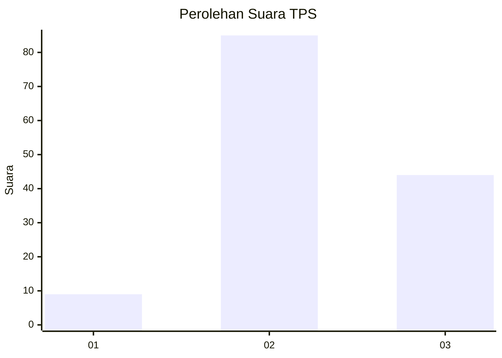
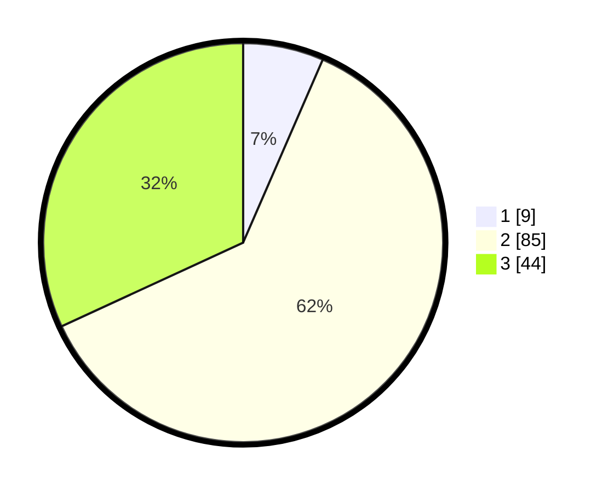

# Hasil

## Grafik

## Tabel

| No. | Nama Paslon    | Suara | Suara (raw) | Persentase |
|:--- |:-------------- | -----:| -----------:| ----------:|
| 1   | ANIES MUHAIMIN | 9     | [9][p-1]    | 6,52       |
| 2   | PRABOWO GIBRAN | 85    | [85][p-2]   | 61,59      |
| 3   | GANJAR MAHFUD  | 44    | [44][p-3]   | 31,88      |

[p-1]: https://github.com/gigit-pemilu/pemilu-2024-35-jawa-timur/blob/main/pilpres/hitung-suara/sub/35-jawa-timur/sub/09-jember/sub/18-tempurejo/sub/2001-sidodadi/sub/032-tps/sub/paslon-1.txt
[p-2]: https://github.com/gigit-pemilu/pemilu-2024-35-jawa-timur/blob/main/pilpres/hitung-suara/sub/35-jawa-timur/sub/09-jember/sub/18-tempurejo/sub/2001-sidodadi/sub/032-tps/sub/paslon-2.txt
[p-3]: https://github.com/gigit-pemilu/pemilu-2024-35-jawa-timur/blob/main/pilpres/hitung-suara/sub/35-jawa-timur/sub/09-jember/sub/18-tempurejo/sub/2001-sidodadi/sub/032-tps/sub/paslon-3.txt

## Foto C Plano

https://sirekap-obj-formc.kpu.go.id/6634/pemilu/ppwp/35/09/18/20/01/3509182001032-20240214-160156--5e532df3-6a30-45db-a84d-b663f74058da.jpg

https://sirekap-obj-formc.kpu.go.id/6634/pemilu/ppwp/35/09/18/20/01/3509182001032-20240214-141806--86c207ab-a8b3-4ba7-9c2b-c0bbfa858600.jpg

https://sirekap-obj-formc.kpu.go.id/6634/pemilu/ppwp/35/09/18/20/01/3509182001032-20240214-141906--94e41e5c-6aa8-4ec6-b52d-f4d8392edbe3.jpg

## Metadata

| Key        | Value               |
| ---------- | ------------------- |
| Time Stamp | 2024-02-15 17:00:25 |

