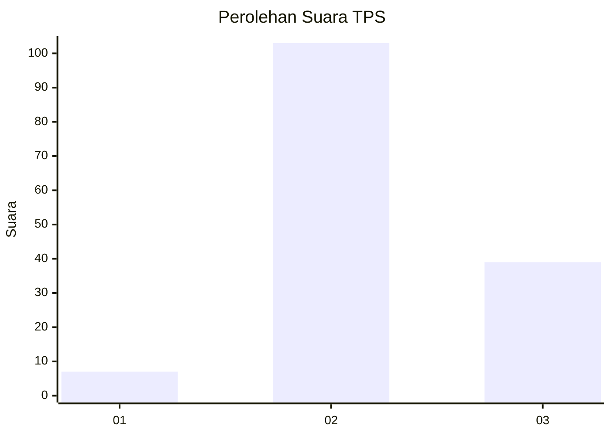

# Hasil

## Grafik

## Tabel

| No. | Nama Paslon    | Suara | Suara (raw) | Persentase |
|:--- |:-------------- | -----:| -----------:| ----------:|
| 1   | ANIES MUHAIMIN | 7     | [7][p-1]    | 4,70       |
| 2   | PRABOWO GIBRAN | 103   | [103][p-2]  | 69,13      |
| 3   | GANJAR MAHFUD  | 39    | [39][p-3]   | 26,17      |

[p-1]: https://github.com/gigit-pemilu/pemilu-2024-35-jawa-timur/blob/main/pilpres/hitung-suara/sub/35-jawa-timur/sub/09-jember/sub/18-tempurejo/sub/2001-sidodadi/sub/035-tps/sub/paslon-1.txt
[p-2]: https://github.com/gigit-pemilu/pemilu-2024-35-jawa-timur/blob/main/pilpres/hitung-suara/sub/35-jawa-timur/sub/09-jember/sub/18-tempurejo/sub/2001-sidodadi/sub/035-tps/sub/paslon-2.txt
[p-3]: https://github.com/gigit-pemilu/pemilu-2024-35-jawa-timur/blob/main/pilpres/hitung-suara/sub/35-jawa-timur/sub/09-jember/sub/18-tempurejo/sub/2001-sidodadi/sub/035-tps/sub/paslon-3.txt

## Foto C Plano

https://sirekap-obj-formc.kpu.go.id/b9ae/pemilu/ppwp/35/09/18/20/01/3509182001035-20240214-231153--31a6fee5-9c23-4ca7-abad-159749116181.jpg

https://sirekap-obj-formc.kpu.go.id/b9ae/pemilu/ppwp/35/09/18/20/01/3509182001035-20240214-231339--bdb87659-731f-4364-8516-7c6c492c5f65.jpg

https://sirekap-obj-formc.kpu.go.id/b9ae/pemilu/ppwp/35/09/18/20/01/3509182001035-20240214-231448--a4cfb2a8-c277-487e-9a7e-76b7c361f208.jpg

## Metadata

| Key        | Value               |
| ---------- | ------------------- |
| Time Stamp | 2024-02-15 19:30:26 |

