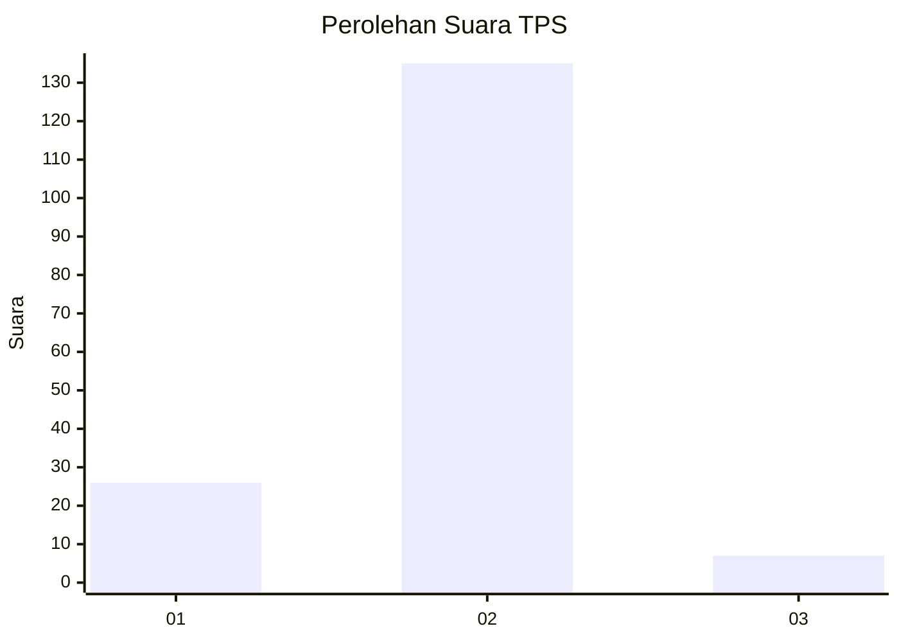
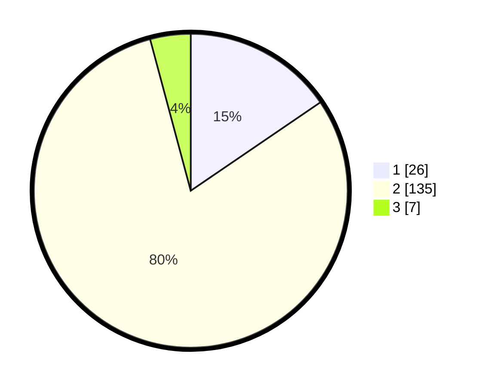

# Hasil

## Grafik

## Tabel

| No. | Nama Paslon    | Suara | Suara (raw) | Persentase |
|:--- |:-------------- | -----:| -----------:| ----------:|
| 1   | ANIES MUHAIMIN | 26    | [26][p-1]   | 15,48      |
| 2   | PRABOWO GIBRAN | 135   | [135][p-2]  | 80,36      |
| 3   | GANJAR MAHFUD  | 7     | [7][p-3]    | 4,17       |

[p-1]: https://github.com/gigit-pemilu/pemilu-2024/blob/main/pilpres/hitung-suara/sub/35-jawa-timur/sub/09-jember/sub/18-tempurejo/sub/2002-tempurejo/sub/002-tps/sub/paslon-1.txt
[p-2]: https://github.com/gigit-pemilu/pemilu-2024/blob/main/pilpres/hitung-suara/sub/35-jawa-timur/sub/09-jember/sub/18-tempurejo/sub/2002-tempurejo/sub/002-tps/sub/paslon-2.txt
[p-3]: https://github.com/gigit-pemilu/pemilu-2024/blob/main/pilpres/hitung-suara/sub/35-jawa-timur/sub/09-jember/sub/18-tempurejo/sub/2002-tempurejo/sub/002-tps/sub/paslon-3.txt

## Foto C Plano

https://sirekap-obj-formc.kpu.go.id/a132/pemilu/ppwp/35/09/18/20/02/3509182002002-20240214-192050--374f6859-a46b-4471-bf65-5195bf5dcc0e.jpg

https://sirekap-obj-formc.kpu.go.id/a132/pemilu/ppwp/35/09/18/20/02/3509182002002-20240214-192128--2797fbc8-cd78-4b47-abe0-b3c00b94bebe.jpg

https://sirekap-obj-formc.kpu.go.id/a132/pemilu/ppwp/35/09/18/20/02/3509182002002-20240214-192211--4df712db-2a4d-4d21-a07d-a535c5948832.jpg

## Metadata

| Key        | Value               |
| ---------- | ------------------- |
| Time Stamp | 2024-02-15 19:30:26 |

