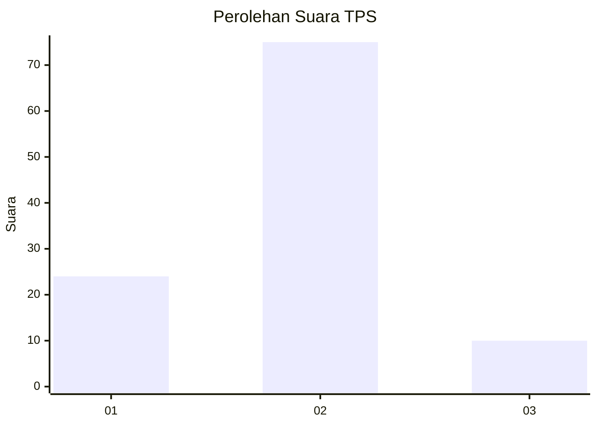
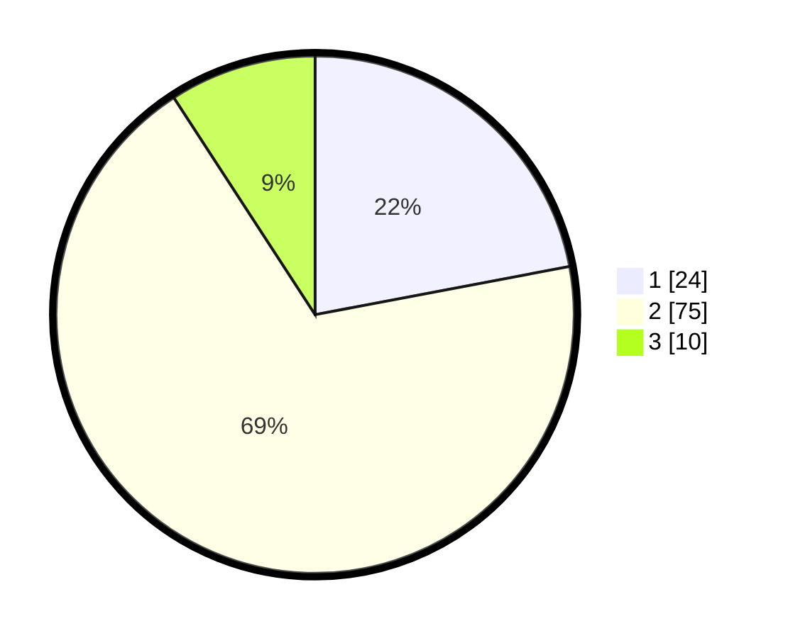

# Hasil

## Grafik

## Tabel

| No. | Nama Paslon    | Suara | Suara (raw) | Persentase |
|:--- |:-------------- | -----:| -----------:| ----------:|
| 1   | ANIES MUHAIMIN | 24    | [24][p-1]   | 22,02      |
| 2   | PRABOWO GIBRAN | 75    | [75][p-2]   | 68,81      |
| 3   | GANJAR MAHFUD  | 10    | [10][p-3]   | 9,17       |

[p-1]: https://github.com/gigit-pemilu/pemilu-2024-35-jawa-timur/blob/main/pilpres/hitung-suara/sub/35-jawa-timur/sub/09-jember/sub/18-tempurejo/sub/2002-tempurejo/sub/005-tps/sub/paslon-1.txt
[p-2]: https://github.com/gigit-pemilu/pemilu-2024-35-jawa-timur/blob/main/pilpres/hitung-suara/sub/35-jawa-timur/sub/09-jember/sub/18-tempurejo/sub/2002-tempurejo/sub/005-tps/sub/paslon-2.txt
[p-3]: https://github.com/gigit-pemilu/pemilu-2024-35-jawa-timur/blob/main/pilpres/hitung-suara/sub/35-jawa-timur/sub/09-jember/sub/18-tempurejo/sub/2002-tempurejo/sub/005-tps/sub/paslon-3.txt

## Foto C Plano

https://sirekap-obj-formc.kpu.go.id/7886/pemilu/ppwp/35/09/18/20/02/3509182002005-20240214-214753--3f1b8682-0674-41a9-9139-50873a80dcfb.jpg

https://sirekap-obj-formc.kpu.go.id/7886/pemilu/ppwp/35/09/18/20/02/3509182002005-20240214-214934--27ce61fb-ef6e-4ba0-ac28-abeaa3fa1896.jpg

https://sirekap-obj-formc.kpu.go.id/7886/pemilu/ppwp/35/09/18/20/02/3509182002005-20240214-214851--be6e2724-c196-490d-a103-683feb39775f.jpg

## Metadata

| Key        | Value               |
| ---------- | ------------------- |
| Time Stamp | 2024-02-16 00:00:26 |

