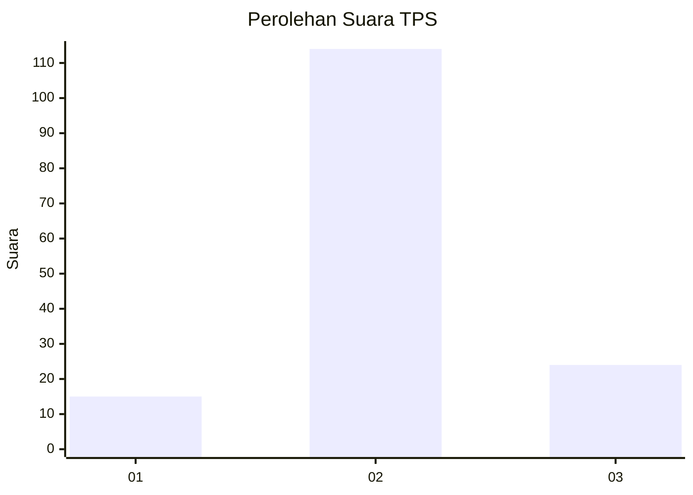
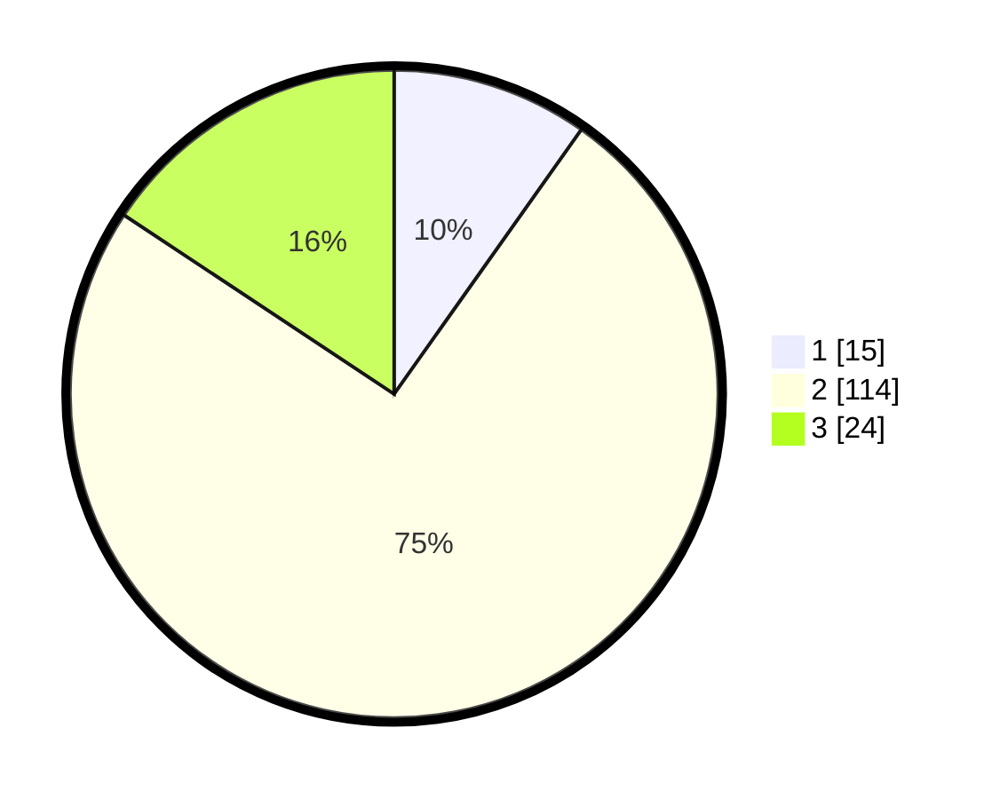

# Hasil

## Grafik

## Tabel

| No. | Nama Paslon    | Suara | Suara (raw) | Persentase |
|:--- |:-------------- | -----:| -----------:| ----------:|
| 1   | ANIES MUHAIMIN | 15    | [15][p-1]   | 9,80       |
| 2   | PRABOWO GIBRAN | 114   | [114][p-2]  | 74,51      |
| 3   | GANJAR MAHFUD  | 24    | [24][p-3]   | 15,69      |

[p-1]: https://github.com/gigit-pemilu/pemilu-2024/blob/main/pilpres/hitung-suara/sub/35-jawa-timur/sub/09-jember/sub/18-tempurejo/sub/2002-tempurejo/sub/032-tps/sub/paslon-1.txt
[p-2]: https://github.com/gigit-pemilu/pemilu-2024/blob/main/pilpres/hitung-suara/sub/35-jawa-timur/sub/09-jember/sub/18-tempurejo/sub/2002-tempurejo/sub/032-tps/sub/paslon-2.txt
[p-3]: https://github.com/gigit-pemilu/pemilu-2024/blob/main/pilpres/hitung-suara/sub/35-jawa-timur/sub/09-jember/sub/18-tempurejo/sub/2002-tempurejo/sub/032-tps/sub/paslon-3.txt

## Foto C Plano

https://sirekap-obj-formc.kpu.go.id/0da0/pemilu/ppwp/35/09/18/20/02/3509182002032-20240215-013724--1dd96afa-7949-451f-9f00-f0223faa3216.jpg

https://sirekap-obj-formc.kpu.go.id/0da0/pemilu/ppwp/35/09/18/20/02/3509182002032-20240215-014107--d53dd45d-1e29-4e32-92ab-b313648e72ab.jpg

https://sirekap-obj-formc.kpu.go.id/0da0/pemilu/ppwp/35/09/18/20/02/3509182002032-20240215-014210--e53af727-d623-4cab-adb3-4823d8313e1c.jpg

## Metadata

| Key        | Value               |
| ---------- | ------------------- |
| Time Stamp | 2024-02-15 19:30:26 |

