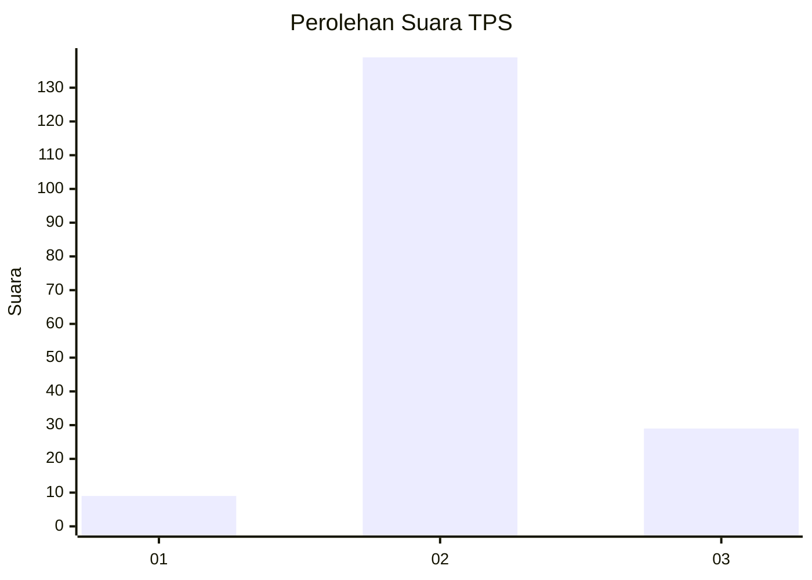
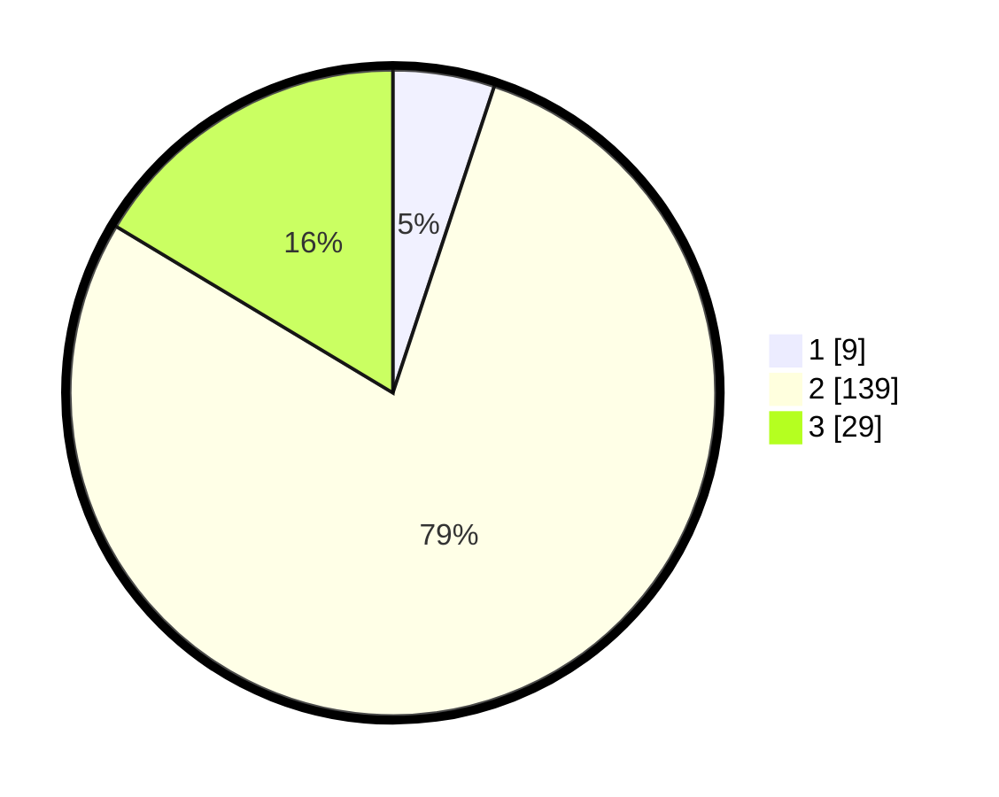

# Hasil

## Grafik

## Tabel

| No. | Nama Paslon    | Suara | Suara (raw) | Persentase |
|:--- |:-------------- | -----:| -----------:| ----------:|
| 1   | ANIES MUHAIMIN | 9     | [9][p-1]    | 5,08       |
| 2   | PRABOWO GIBRAN | 139   | [139][p-2]  | 78,53      |
| 3   | GANJAR MAHFUD  | 29    | [29][p-3]   | 16,38      |

[p-1]: https://github.com/gigit-pemilu/pemilu-2024-35-jawa-timur/blob/main/pilpres/hitung-suara/sub/35-jawa-timur/sub/09-jember/sub/18-tempurejo/sub/2005-wonoasri/sub/001-tps/sub/paslon-1.txt
[p-2]: https://github.com/gigit-pemilu/pemilu-2024-35-jawa-timur/blob/main/pilpres/hitung-suara/sub/35-jawa-timur/sub/09-jember/sub/18-tempurejo/sub/2005-wonoasri/sub/001-tps/sub/paslon-2.txt
[p-3]: https://github.com/gigit-pemilu/pemilu-2024-35-jawa-timur/blob/main/pilpres/hitung-suara/sub/35-jawa-timur/sub/09-jember/sub/18-tempurejo/sub/2005-wonoasri/sub/001-tps/sub/paslon-3.txt

## Foto C Plano

https://sirekap-obj-formc.kpu.go.id/b6bc/pemilu/ppwp/35/09/18/20/05/3509182005001-20240215-013034--246b5e00-93db-4959-ad79-ed5a7bd176dd.jpg

https://sirekap-obj-formc.kpu.go.id/b6bc/pemilu/ppwp/35/09/18/20/05/3509182005001-20240215-013903--0307abbd-6747-4343-8787-120303912702.jpg

https://sirekap-obj-formc.kpu.go.id/b6bc/pemilu/ppwp/35/09/18/20/05/3509182005001-20240215-014103--d6ccd8b1-9e6a-499d-83ce-56b8f8fc8107.jpg

## Metadata

| Key        | Value               |
| ---------- | ------------------- |
| Time Stamp | 2024-02-15 09:00:24 |

