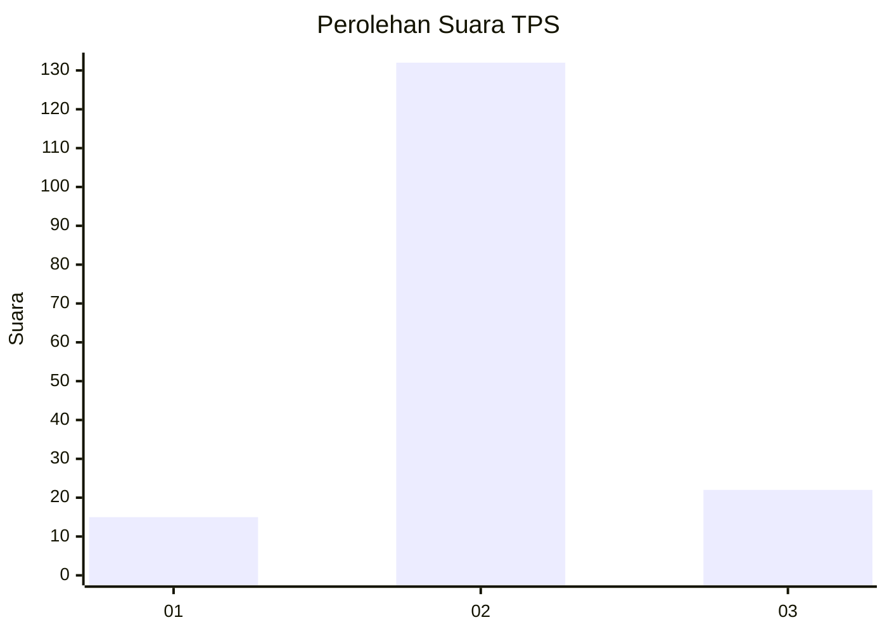
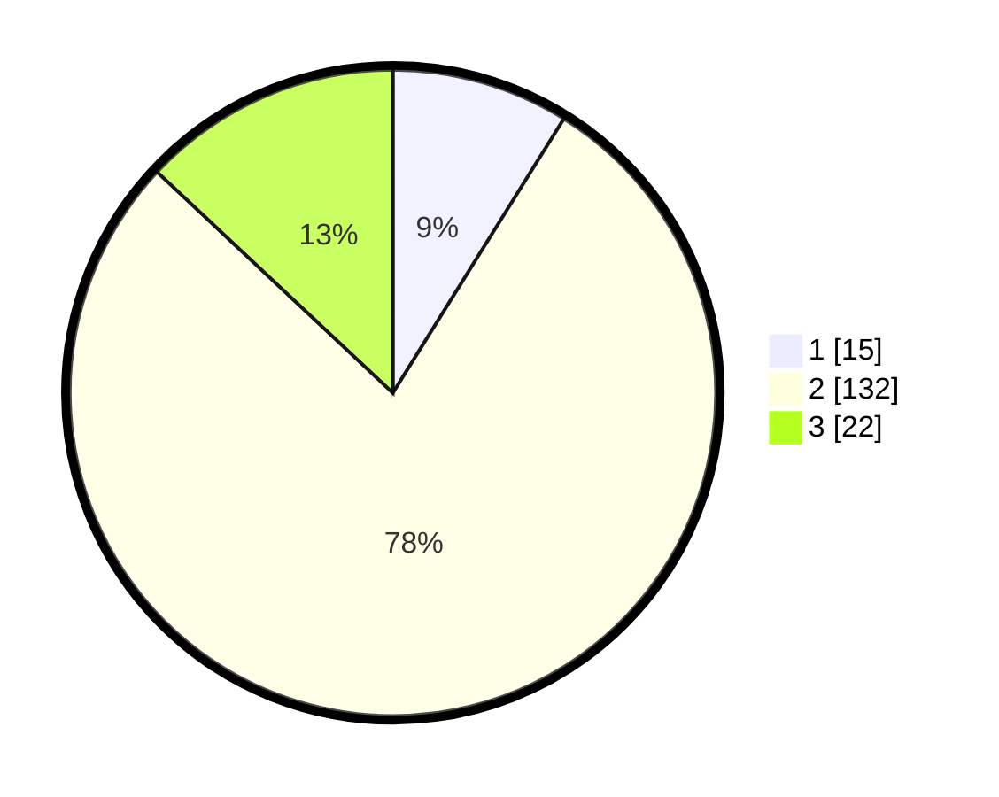

# Hasil

## Grafik

## Tabel

| No. | Nama Paslon    | Suara | Suara (raw) | Persentase |
|:--- |:-------------- | -----:| -----------:| ----------:|
| 1   | ANIES MUHAIMIN | 15    | [15][p-1]   | 8,88       |
| 2   | PRABOWO GIBRAN | 132   | [132][p-2]  | 78,11      |
| 3   | GANJAR MAHFUD  | 22    | [22][p-3]   | 13,02      |

[p-1]: https://github.com/gigit-pemilu/pemilu-2024-35-jawa-timur/blob/main/pilpres/hitung-suara/sub/35-jawa-timur/sub/09-jember/sub/18-tempurejo/sub/2005-wonoasri/sub/022-tps/sub/paslon-1.txt
[p-2]: https://github.com/gigit-pemilu/pemilu-2024-35-jawa-timur/blob/main/pilpres/hitung-suara/sub/35-jawa-timur/sub/09-jember/sub/18-tempurejo/sub/2005-wonoasri/sub/022-tps/sub/paslon-2.txt
[p-3]: https://github.com/gigit-pemilu/pemilu-2024-35-jawa-timur/blob/main/pilpres/hitung-suara/sub/35-jawa-timur/sub/09-jember/sub/18-tempurejo/sub/2005-wonoasri/sub/022-tps/sub/paslon-3.txt

## Foto C Plano

https://sirekap-obj-formc.kpu.go.id/e10e/pemilu/ppwp/35/09/18/20/05/3509182005022-20240214-225919--5d475355-65a7-4003-874b-0b47a4e8ebb5.jpg

https://sirekap-obj-formc.kpu.go.id/e10e/pemilu/ppwp/35/09/18/20/05/3509182005022-20240215-020829--ff293d1a-969b-4baf-b8f5-3882d0c5f894.jpg

https://sirekap-obj-formc.kpu.go.id/e10e/pemilu/ppwp/35/09/18/20/05/3509182005022-20240215-020954--df865c9a-dd4c-47af-ade7-3ae92069802a.jpg

## Metadata

| Key        | Value               |
| ---------- | ------------------- |
| Time Stamp | 2024-02-22 22:00:00 |

