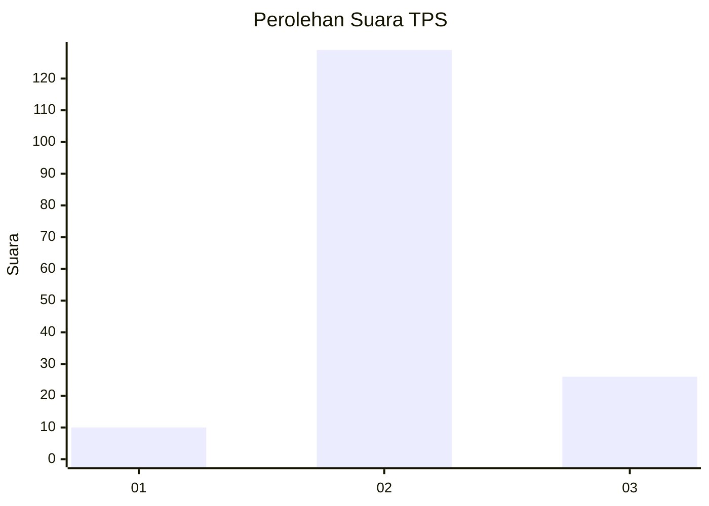
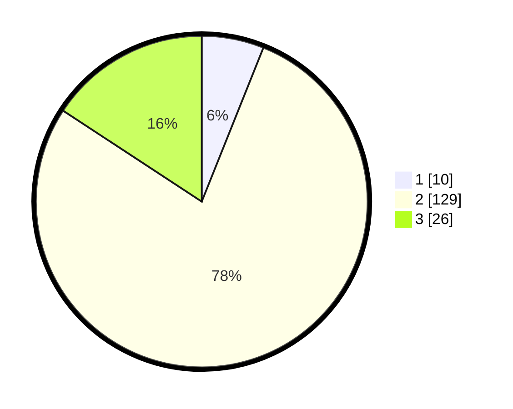

# Hasil

## Grafik

## Tabel

| No. | Nama Paslon    | Suara | Suara (raw) | Persentase |
|:--- |:-------------- | -----:| -----------:| ----------:|
| 1   | ANIES MUHAIMIN | 10    | [10][p-1]   | 6,06       |
| 2   | PRABOWO GIBRAN | 129   | [129][p-2]  | 78,18      |
| 3   | GANJAR MAHFUD  | 26    | [26][p-3]   | 15,76      |

[p-1]: https://github.com/gigit-pemilu/pemilu-2024/blob/main/pilpres/hitung-suara/sub/35-jawa-timur/sub/09-jember/sub/18-tempurejo/sub/2005-wonoasri/sub/023-tps/sub/paslon-1.txt
[p-2]: https://github.com/gigit-pemilu/pemilu-2024/blob/main/pilpres/hitung-suara/sub/35-jawa-timur/sub/09-jember/sub/18-tempurejo/sub/2005-wonoasri/sub/023-tps/sub/paslon-2.txt
[p-3]: https://github.com/gigit-pemilu/pemilu-2024/blob/main/pilpres/hitung-suara/sub/35-jawa-timur/sub/09-jember/sub/18-tempurejo/sub/2005-wonoasri/sub/023-tps/sub/paslon-3.txt

## Foto C Plano

https://sirekap-obj-formc.kpu.go.id/cba3/pemilu/ppwp/35/09/18/20/05/3509182005023-20240214-195231--cb8d1317-7832-4e70-8302-4a5830505f66.jpg

https://sirekap-obj-formc.kpu.go.id/cba3/pemilu/ppwp/35/09/18/20/05/3509182005023-20240214-195602--0b348285-6235-4a75-9d18-3ddb99ea9836.jpg

https://sirekap-obj-formc.kpu.go.id/cba3/pemilu/ppwp/35/09/18/20/05/3509182005023-20240214-200143--3c5bf0d2-ca4f-4c11-a5bf-1e0dee80ad3e.jpg

## Metadata

| Key        | Value               |
| ---------- | ------------------- |
| Time Stamp | 2024-02-15 20:00:44 |

