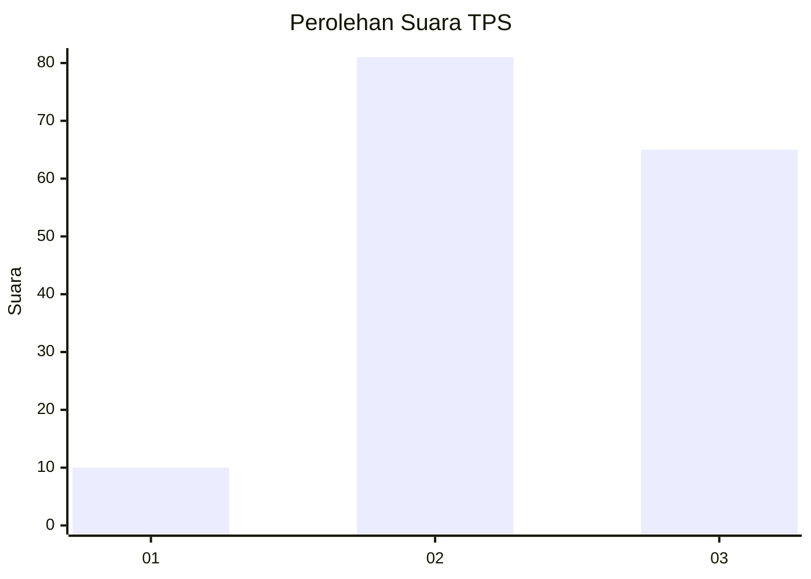
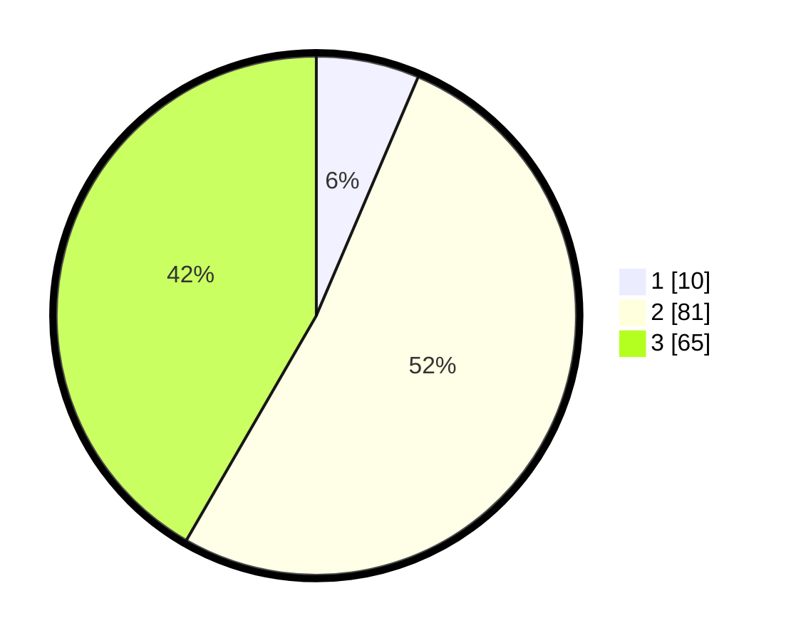

# Hasil

## Grafik

## Tabel

| No. | Nama Paslon    | Suara | Suara (raw) | Persentase |
|:--- |:-------------- | -----:| -----------:| ----------:|
| 1   | ANIES MUHAIMIN | 10    | [10][p-1]   | 6,41       |
| 2   | PRABOWO GIBRAN | 81    | [81][p-2]   | 51,92      |
| 3   | GANJAR MAHFUD  | 65    | [65][p-3]   | 41,67      |

[p-1]: https://github.com/gigit-pemilu/pemilu-2024-35-jawa-timur/blob/main/pilpres/hitung-suara/sub/35-jawa-timur/sub/09-jember/sub/18-tempurejo/sub/2006-curahnongko/sub/002-tps/sub/paslon-1.txt
[p-2]: https://github.com/gigit-pemilu/pemilu-2024-35-jawa-timur/blob/main/pilpres/hitung-suara/sub/35-jawa-timur/sub/09-jember/sub/18-tempurejo/sub/2006-curahnongko/sub/002-tps/sub/paslon-2.txt
[p-3]: https://github.com/gigit-pemilu/pemilu-2024-35-jawa-timur/blob/main/pilpres/hitung-suara/sub/35-jawa-timur/sub/09-jember/sub/18-tempurejo/sub/2006-curahnongko/sub/002-tps/sub/paslon-3.txt

## Foto C Plano

https://sirekap-obj-formc.kpu.go.id/38e0/pemilu/ppwp/35/09/18/20/06/3509182006002-20240214-234820--c7faf1b6-3b74-4cb5-b033-5b9584563501.jpg

https://sirekap-obj-formc.kpu.go.id/38e0/pemilu/ppwp/35/09/18/20/06/3509182006002-20240214-235035--7824a238-8823-44d4-9b07-9c3b9a6a2ff0.jpg

https://sirekap-obj-formc.kpu.go.id/38e0/pemilu/ppwp/35/09/18/20/06/3509182006002-20240214-235139--37ec0857-ce33-4663-8959-82faaac39339.jpg

## Metadata

| Key        | Value               |
| ---------- | ------------------- |
| Time Stamp | 2024-02-15 20:00:44 |

