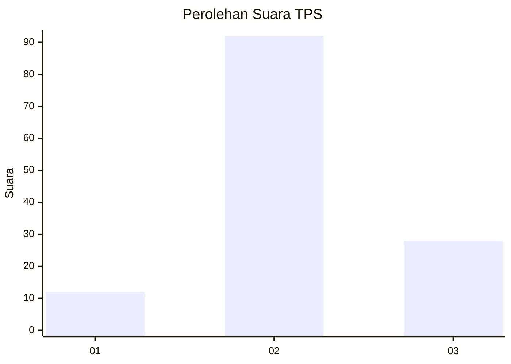
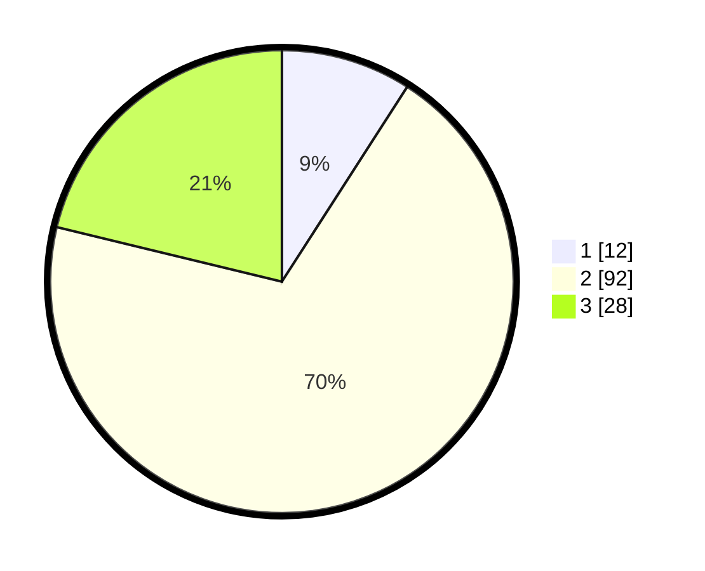

# Hasil

## Grafik

## Tabel

| No. | Nama Paslon    | Suara | Suara (raw) | Persentase |
|:--- |:-------------- | -----:| -----------:| ----------:|
| 1   | ANIES MUHAIMIN | 12    | [12][p-1]   | 9,09       |
| 2   | PRABOWO GIBRAN | 92    | [92][p-2]   | 69,70      |
| 3   | GANJAR MAHFUD  | 28    | [28][p-3]   | 21,21      |

[p-1]: https://github.com/gigit-pemilu/pemilu-2024-35-jawa-timur/blob/main/pilpres/hitung-suara/sub/35-jawa-timur/sub/09-jember/sub/18-tempurejo/sub/2008-sanenrejo/sub/003-tps/sub/paslon-1.txt
[p-2]: https://github.com/gigit-pemilu/pemilu-2024-35-jawa-timur/blob/main/pilpres/hitung-suara/sub/35-jawa-timur/sub/09-jember/sub/18-tempurejo/sub/2008-sanenrejo/sub/003-tps/sub/paslon-2.txt
[p-3]: https://github.com/gigit-pemilu/pemilu-2024-35-jawa-timur/blob/main/pilpres/hitung-suara/sub/35-jawa-timur/sub/09-jember/sub/18-tempurejo/sub/2008-sanenrejo/sub/003-tps/sub/paslon-3.txt

## Foto C Plano

https://sirekap-obj-formc.kpu.go.id/414f/pemilu/ppwp/35/09/18/20/08/3509182008003-20240214-190051--f83e0256-6c8c-4357-b471-c042a98fde78.jpg

https://sirekap-obj-formc.kpu.go.id/414f/pemilu/ppwp/35/09/18/20/08/3509182008003-20240214-190418--159dc6a9-6a27-4be8-be32-18d376a5ab4e.jpg

https://sirekap-obj-formc.kpu.go.id/414f/pemilu/ppwp/35/09/18/20/08/3509182008003-20240217-223453--9f2ed4ab-c0a7-4221-8851-afccb8e6ea03.jpg

## Metadata

| Key        | Value               |
| ---------- | ------------------- |
| Time Stamp | 2024-02-19 06:16:00 |

