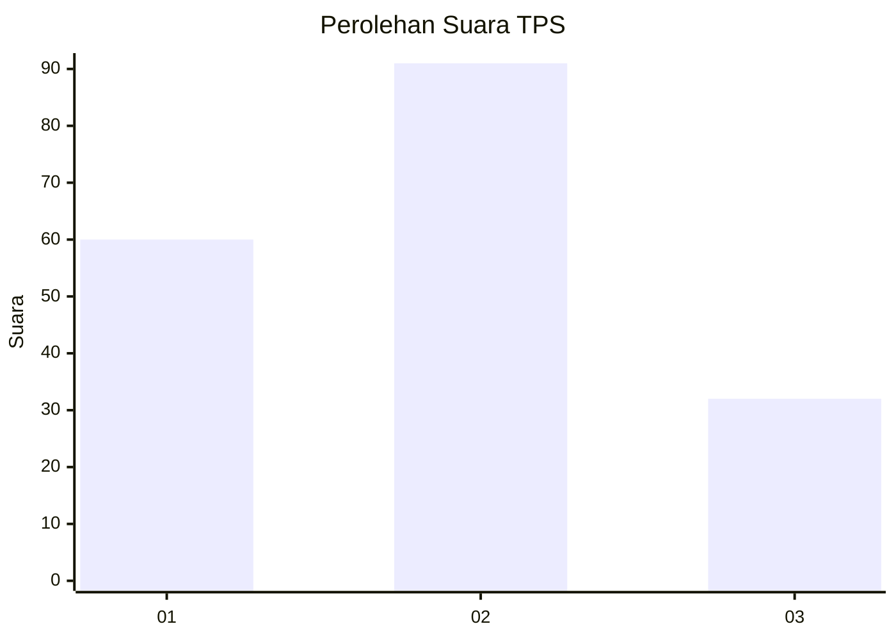
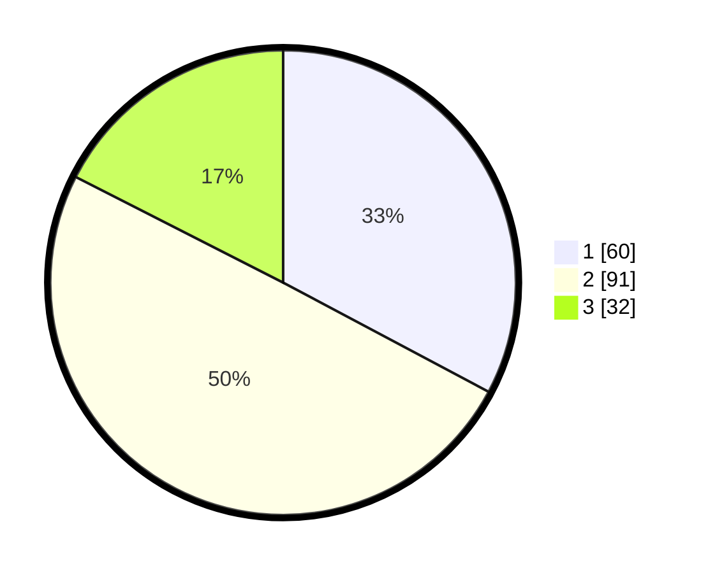

# Hasil

## Grafik

## Tabel

| No. | Nama Paslon    | Suara | Suara (raw) | Persentase |
|:--- |:-------------- | -----:| -----------:| ----------:|
| 1   | ANIES MUHAIMIN | 60    | [60][p-1]   | 32,79      |
| 2   | PRABOWO GIBRAN | 91    | [91][p-2]   | 49,73      |
| 3   | GANJAR MAHFUD  | 32    | [32][p-3]   | 17,49      |

[p-1]: https://github.com/gigit-pemilu/pemilu-2024/blob/main/pilpres/hitung-suara/sub/35-jawa-timur/sub/09-jember/sub/19-kaliwates/sub/1001-mangli/sub/002-tps/sub/paslon-1.txt
[p-2]: https://github.com/gigit-pemilu/pemilu-2024/blob/main/pilpres/hitung-suara/sub/35-jawa-timur/sub/09-jember/sub/19-kaliwates/sub/1001-mangli/sub/002-tps/sub/paslon-2.txt
[p-3]: https://github.com/gigit-pemilu/pemilu-2024/blob/main/pilpres/hitung-suara/sub/35-jawa-timur/sub/09-jember/sub/19-kaliwates/sub/1001-mangli/sub/002-tps/sub/paslon-3.txt

## Foto C Plano

https://sirekap-obj-formc.kpu.go.id/2315/pemilu/ppwp/35/09/19/10/01/3509191001002-20240215-230738--3dd24f56-6fd0-4746-849c-411ce9dff83c.jpg

https://sirekap-obj-formc.kpu.go.id/2315/pemilu/ppwp/35/09/19/10/01/3509191001002-20240215-234913--cee55be7-3977-44b5-b2a0-8752c030be16.jpg

https://sirekap-obj-formc.kpu.go.id/2315/pemilu/ppwp/35/09/19/10/01/3509191001002-20240215-235732--77e9bdd1-74ff-4386-81d6-3f19fe0b31fa.jpg

## Metadata

| Key        | Value               |
| ---------- | ------------------- |
| Time Stamp | 2024-02-16 12:51:22 |

## DATA PEMILIH TETAP

Jumlah pemilih dalam DPT: **273**.
 * L: **123**.
 * P: **150**.

## DATA PENGGUNA HAK PILIH

Jumlah pengguna hak pilih dalam DPT: **176**.
 * L: **78**.
 * P: **98**.

Jumlah pengguna hak pilih dalam DPTb: **273**.
 * L: **123**.
 * P: **150**.

Jumlah pengguna hak pilih dalam DPK: **0**.
 * L: **0**.
 * P: **0**.

Jumlah pengguna hak pilih: **449**.
 * L: **201**.
 * P: **248**.

## JUMLAH SUARA SAH DAN TIDAK SAH

JUMLAH SELURUH SUARA SAH: **183**.

JUMLAH SUARA TIDAK SAH: **1**.

JUMLAH SELURUH SUARA SAH DAN SUARA TIDAK SAH: **184**.

