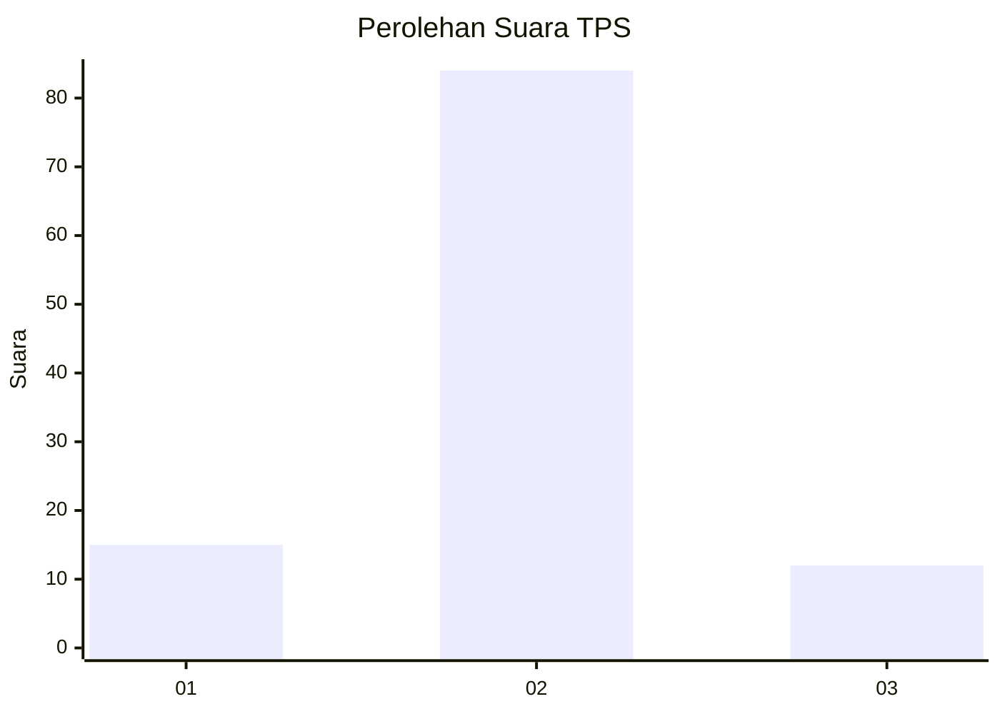
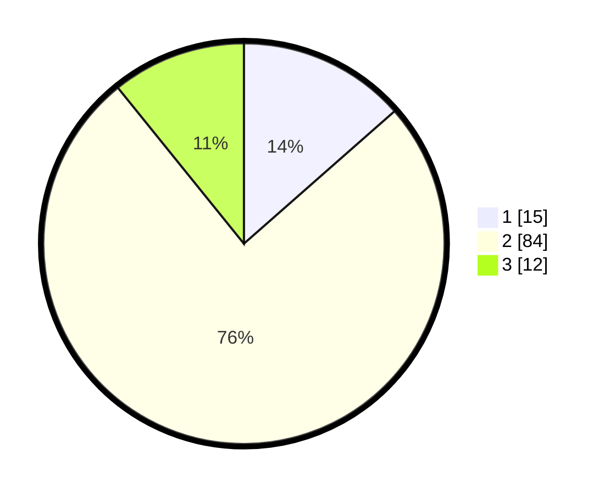

# Hasil

## Grafik

## Tabel

| No. | Nama Paslon    | Suara | Suara (raw) | Persentase |
|:--- |:-------------- | -----:| -----------:| ----------:|
| 1   | ANIES MUHAIMIN | 15    | [15][p-1]   | 13,51      |
| 2   | PRABOWO GIBRAN | 84    | [84][p-2]   | 75,68      |
| 3   | GANJAR MAHFUD  | 12    | [12][p-3]   | 10,81      |

[p-1]: https://github.com/gigit-pemilu/pemilu-2024/blob/main/pilpres/hitung-suara/sub/35-jawa-timur/sub/09-jember/sub/19-kaliwates/sub/1001-mangli/sub/009-tps/sub/paslon-1.txt
[p-2]: https://github.com/gigit-pemilu/pemilu-2024/blob/main/pilpres/hitung-suara/sub/35-jawa-timur/sub/09-jember/sub/19-kaliwates/sub/1001-mangli/sub/009-tps/sub/paslon-2.txt
[p-3]: https://github.com/gigit-pemilu/pemilu-2024/blob/main/pilpres/hitung-suara/sub/35-jawa-timur/sub/09-jember/sub/19-kaliwates/sub/1001-mangli/sub/009-tps/sub/paslon-3.txt

## Foto C Plano

https://sirekap-obj-formc.kpu.go.id/7770/pemilu/ppwp/35/09/19/10/01/3509191001009-20240221-071530--af2ef70e-8424-4fa1-b938-f58dd2ad41ed.jpg

https://sirekap-obj-formc.kpu.go.id/7770/pemilu/ppwp/35/09/19/10/01/3509191001009-20240221-014959--d683e6e7-162c-433e-95c6-45b4fefaba73.jpg

https://sirekap-obj-formc.kpu.go.id/7770/pemilu/ppwp/35/09/19/10/01/3509191001009-20240221-002945--ce1e0602-60f6-4eab-a7d4-6f1fe967149b.jpg

## Metadata

| Key        | Value               |
| ---------- | ------------------- |
| Time Stamp | 2024-02-22 07:00:00 |

