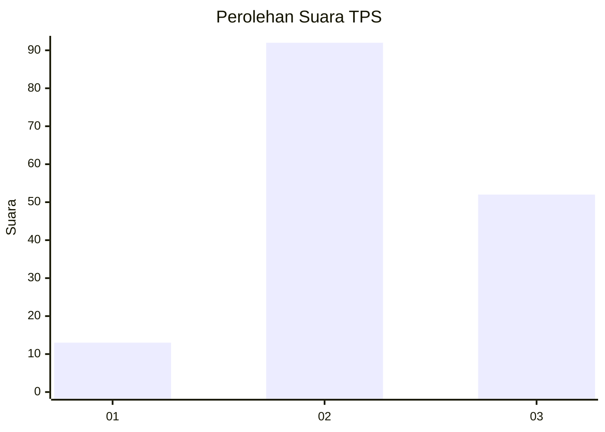
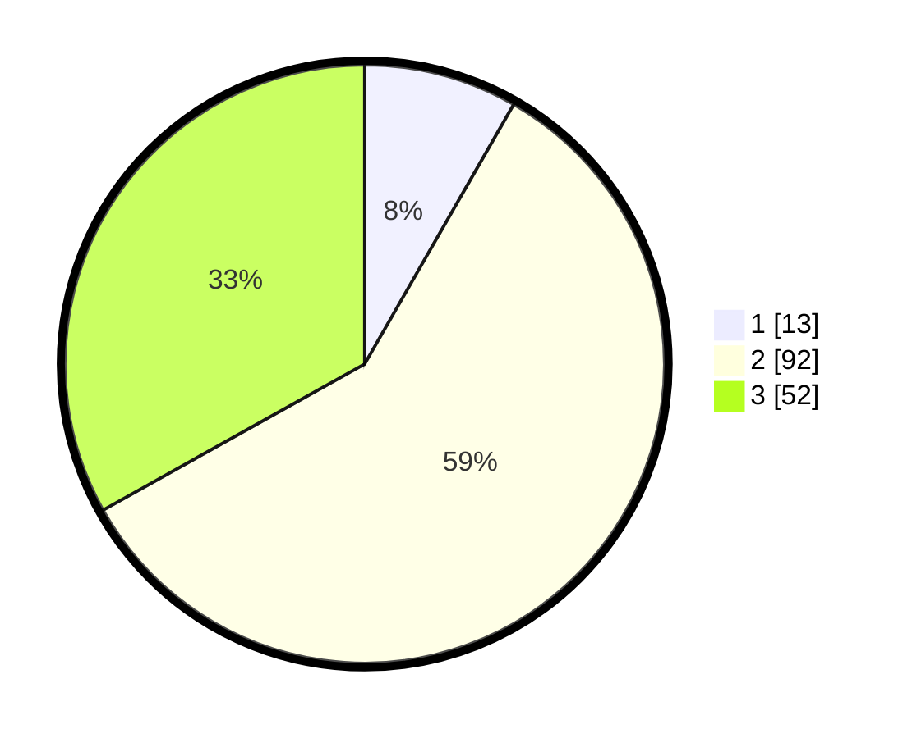

# Hasil

## Grafik

## Tabel

| No. | Nama Paslon    | Suara | Suara (raw) | Persentase |
|:--- |:-------------- | -----:| -----------:| ----------:|
| 1   | ANIES MUHAIMIN | 13    | [13][p-1]   | 8,28       |
| 2   | PRABOWO GIBRAN | 92    | [92][p-2]   | 58,60      |
| 3   | GANJAR MAHFUD  | 52    | [52][p-3]   | 33,12      |

[p-1]: https://github.com/gigit-pemilu/pemilu-2024-35-jawa-timur/blob/main/pilpres/hitung-suara/sub/35-jawa-timur/sub/09-jember/sub/19-kaliwates/sub/1001-mangli/sub/015-tps/sub/paslon-1.txt
[p-2]: https://github.com/gigit-pemilu/pemilu-2024-35-jawa-timur/blob/main/pilpres/hitung-suara/sub/35-jawa-timur/sub/09-jember/sub/19-kaliwates/sub/1001-mangli/sub/015-tps/sub/paslon-2.txt
[p-3]: https://github.com/gigit-pemilu/pemilu-2024-35-jawa-timur/blob/main/pilpres/hitung-suara/sub/35-jawa-timur/sub/09-jember/sub/19-kaliwates/sub/1001-mangli/sub/015-tps/sub/paslon-3.txt

## Foto C Plano

https://sirekap-obj-formc.kpu.go.id/8cd8/pemilu/ppwp/35/09/19/10/01/3509191001015-20240214-212455--e79d9e1a-b708-4e73-be9f-660108727679.jpg

https://sirekap-obj-formc.kpu.go.id/8cd8/pemilu/ppwp/35/09/19/10/01/3509191001015-20240214-212646--ed6f12d2-f377-4aa1-998c-7b2320c86269.jpg

https://sirekap-obj-formc.kpu.go.id/8cd8/pemilu/ppwp/35/09/19/10/01/3509191001015-20240214-212855--c6b6d228-6894-4e37-a8a1-8720bb35c8b5.jpg

## Metadata

| Key        | Value               |
| ---------- | ------------------- |
| Time Stamp | 2024-02-15 12:00:28 |

