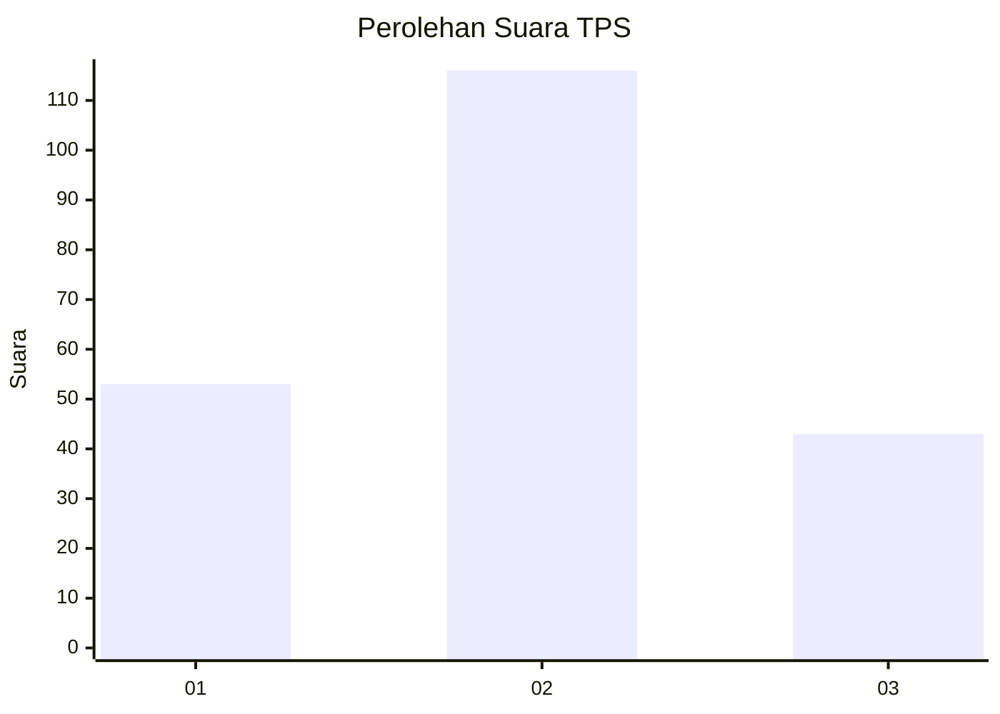
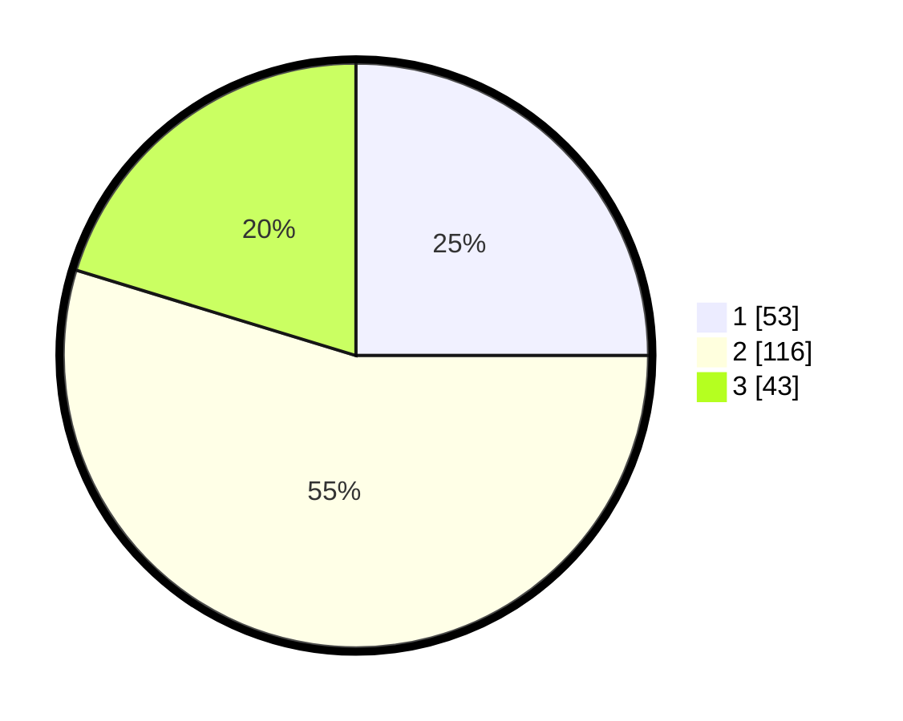

# Hasil

## Grafik

## Tabel

| No. | Nama Paslon    | Suara | Suara (raw) | Persentase |
|:--- |:-------------- | -----:| -----------:| ----------:|
| 1   | ANIES MUHAIMIN | 53    | [53][p-1]   | 25,00      |
| 2   | PRABOWO GIBRAN | 116   | [116][p-2]  | 54,72      |
| 3   | GANJAR MAHFUD  | 43    | [43][p-3]   | 20,28      |

[p-1]: https://github.com/gigit-pemilu/pemilu-2024/blob/main/pilpres/hitung-suara/sub/35-jawa-timur/sub/09-jember/sub/19-kaliwates/sub/1001-mangli/sub/042-tps/sub/paslon-1.txt
[p-2]: https://github.com/gigit-pemilu/pemilu-2024/blob/main/pilpres/hitung-suara/sub/35-jawa-timur/sub/09-jember/sub/19-kaliwates/sub/1001-mangli/sub/042-tps/sub/paslon-2.txt
[p-3]: https://github.com/gigit-pemilu/pemilu-2024/blob/main/pilpres/hitung-suara/sub/35-jawa-timur/sub/09-jember/sub/19-kaliwates/sub/1001-mangli/sub/042-tps/sub/paslon-3.txt

## Foto C Plano

https://sirekap-obj-formc.kpu.go.id/5c7d/pemilu/ppwp/35/09/19/10/01/3509191001042-20240217-134653--6ab68e4b-d4bc-40d6-a645-fe030521a026.jpg

https://sirekap-obj-formc.kpu.go.id/5c7d/pemilu/ppwp/35/09/19/10/01/3509191001042-20240217-134713--ca2615d3-97f0-474a-8fb8-ecd66fce3e1e.jpg

https://sirekap-obj-formc.kpu.go.id/5c7d/pemilu/ppwp/35/09/19/10/01/3509191001042-20240217-134729--39b169e4-6cd2-45bc-93d1-831f05a0770c.jpg

## Metadata

| Key        | Value               |
| ---------- | ------------------- |
| Time Stamp | 2024-02-17 14:45:18 |

