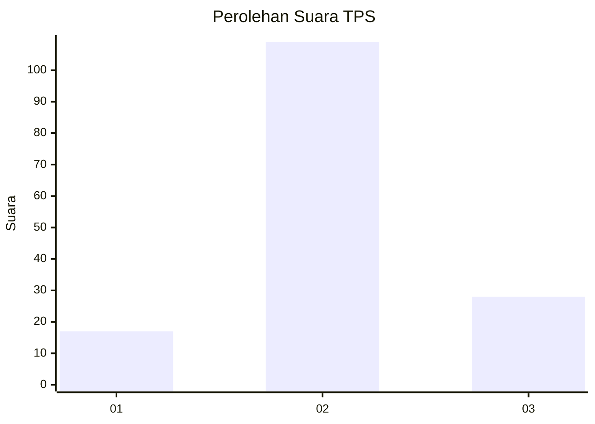
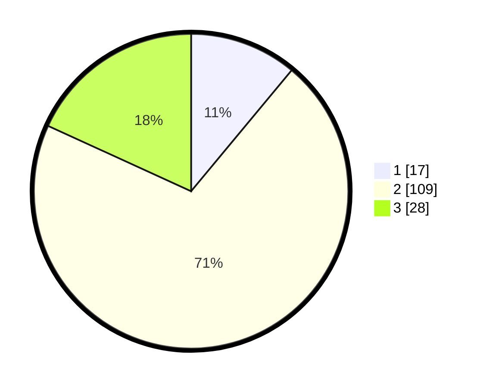

# Hasil

## Grafik

## Tabel

| No. | Nama Paslon    | Suara | Suara (raw) | Persentase |
|:--- |:-------------- | -----:| -----------:| ----------:|
| 1   | ANIES MUHAIMIN | 17    | [17][p-1]   | 11,04      |
| 2   | PRABOWO GIBRAN | 109   | [109][p-2]  | 70,78      |
| 3   | GANJAR MAHFUD  | 28    | [28][p-3]   | 18,18      |

[p-1]: https://github.com/gigit-pemilu/pemilu-2024-35-jawa-timur/blob/main/pilpres/hitung-suara/sub/35-jawa-timur/sub/09-jember/sub/19-kaliwates/sub/1003-kebonagung/sub/004-tps/sub/paslon-1.txt
[p-2]: https://github.com/gigit-pemilu/pemilu-2024-35-jawa-timur/blob/main/pilpres/hitung-suara/sub/35-jawa-timur/sub/09-jember/sub/19-kaliwates/sub/1003-kebonagung/sub/004-tps/sub/paslon-2.txt
[p-3]: https://github.com/gigit-pemilu/pemilu-2024-35-jawa-timur/blob/main/pilpres/hitung-suara/sub/35-jawa-timur/sub/09-jember/sub/19-kaliwates/sub/1003-kebonagung/sub/004-tps/sub/paslon-3.txt

## Foto C Plano

https://sirekap-obj-formc.kpu.go.id/10e9/pemilu/ppwp/35/09/19/10/03/3509191003004-20240214-234511--dc4bf098-315d-490a-9f9c-06b34326ee12.jpg

https://sirekap-obj-formc.kpu.go.id/10e9/pemilu/ppwp/35/09/19/10/03/3509191003004-20240215-003916--a99deb03-f60a-40fd-9d30-c2cca2142494.jpg

https://sirekap-obj-formc.kpu.go.id/10e9/pemilu/ppwp/35/09/19/10/03/3509191003004-20240215-003941--2e2552a5-26c5-4f35-95d6-cce2a8f6ce9e.jpg

## Metadata

| Key        | Value               |
| ---------- | ------------------- |
| Time Stamp | 2024-02-16 12:51:22 |

