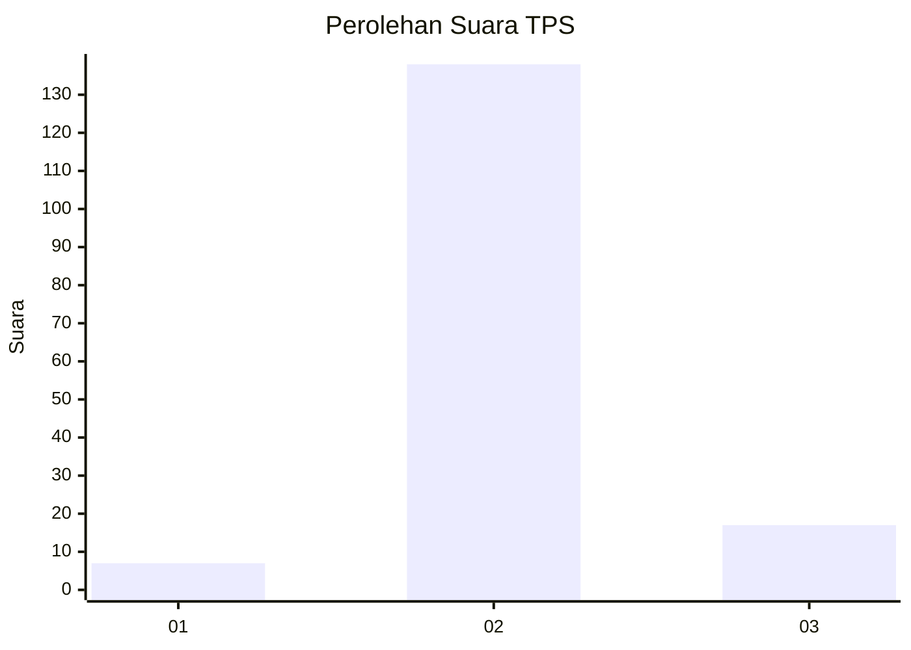
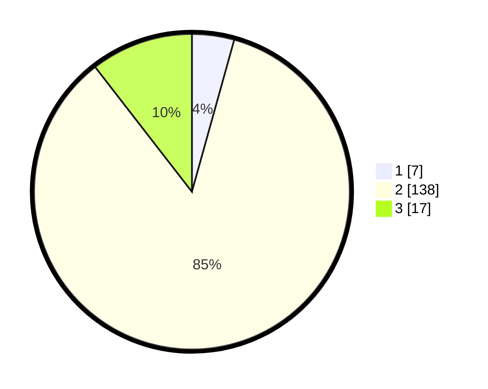

# Hasil

## Grafik

## Tabel

| No. | Nama Paslon    | Suara | Suara (raw) | Persentase |
|:--- |:-------------- | -----:| -----------:| ----------:|
| 1   | ANIES MUHAIMIN | 7     | [7][p-1]    | 4,32       |
| 2   | PRABOWO GIBRAN | 138   | [138][p-2]  | 85,19      |
| 3   | GANJAR MAHFUD  | 17    | [17][p-3]   | 10,49      |

[p-1]: https://github.com/gigit-pemilu/pemilu-2024-35-jawa-timur/blob/main/pilpres/hitung-suara/sub/35-jawa-timur/sub/09-jember/sub/19-kaliwates/sub/1003-kebonagung/sub/006-tps/sub/paslon-1.txt
[p-2]: https://github.com/gigit-pemilu/pemilu-2024-35-jawa-timur/blob/main/pilpres/hitung-suara/sub/35-jawa-timur/sub/09-jember/sub/19-kaliwates/sub/1003-kebonagung/sub/006-tps/sub/paslon-2.txt
[p-3]: https://github.com/gigit-pemilu/pemilu-2024-35-jawa-timur/blob/main/pilpres/hitung-suara/sub/35-jawa-timur/sub/09-jember/sub/19-kaliwates/sub/1003-kebonagung/sub/006-tps/sub/paslon-3.txt

## Foto C Plano

https://sirekap-obj-formc.kpu.go.id/7afc/pemilu/ppwp/35/09/19/10/03/3509191003006-20240218-205853--8f198ac6-3ba9-4e75-8002-79be659e3f77.jpg

https://sirekap-obj-formc.kpu.go.id/7afc/pemilu/ppwp/35/09/19/10/03/3509191003006-20240218-205954--168b5bfc-f325-49b8-bf7d-3bebda17fb74.jpg

https://sirekap-obj-formc.kpu.go.id/7afc/pemilu/ppwp/35/09/19/10/03/3509191003006-20240214-233354--5ac42f3e-c861-452f-822e-6ace004b3b42.jpg

## Metadata

| Key        | Value               |
| ---------- | ------------------- |
| Time Stamp | 2024-02-24 22:31:28 |

