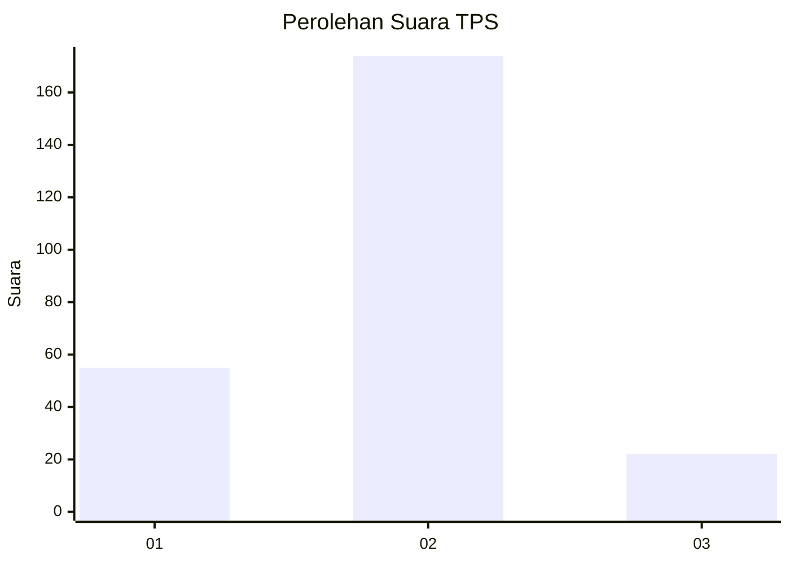
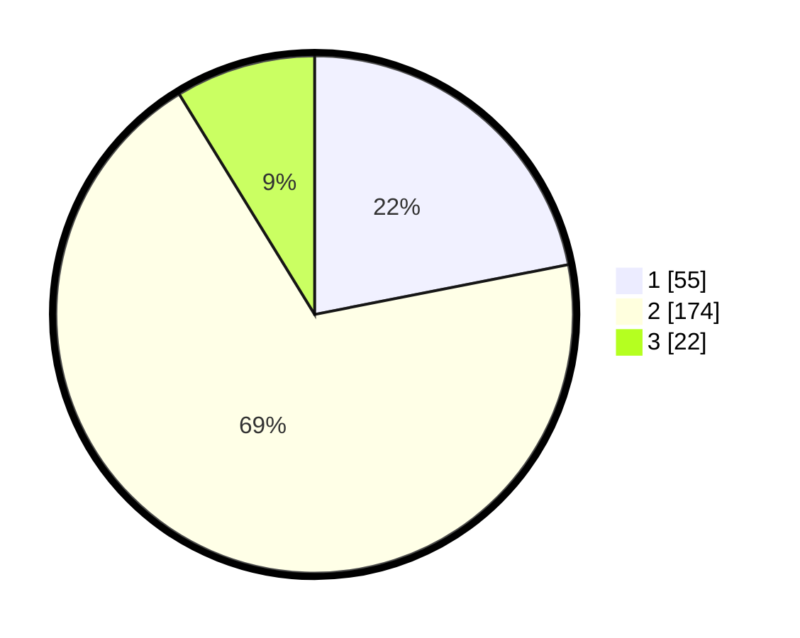

# Hasil

## Grafik

## Tabel

| No. | Nama Paslon    | Suara | Suara (raw) | Persentase |
|:--- |:-------------- | -----:| -----------:| ----------:|
| 1   | ANIES MUHAIMIN | 55    | [55][p-1]   | 21,91      |
| 2   | PRABOWO GIBRAN | 174   | [174][p-2]  | 69,32      |
| 3   | GANJAR MAHFUD  | 22    | [22][p-3]   | 8,76       |

[p-1]: https://github.com/gigit-pemilu/pemilu-2024/blob/main/pilpres/hitung-suara/sub/35-jawa-timur/sub/09-jember/sub/19-kaliwates/sub/1004-kaliwates/sub/002-tps/sub/paslon-1.txt
[p-2]: https://github.com/gigit-pemilu/pemilu-2024/blob/main/pilpres/hitung-suara/sub/35-jawa-timur/sub/09-jember/sub/19-kaliwates/sub/1004-kaliwates/sub/002-tps/sub/paslon-2.txt
[p-3]: https://github.com/gigit-pemilu/pemilu-2024/blob/main/pilpres/hitung-suara/sub/35-jawa-timur/sub/09-jember/sub/19-kaliwates/sub/1004-kaliwates/sub/002-tps/sub/paslon-3.txt

## Foto C Plano

https://sirekap-obj-formc.kpu.go.id/2bfd/pemilu/ppwp/35/09/19/10/04/3509191004002-20240214-210635--e4805745-4b2b-4bb8-acff-8fa7957b9363.jpg

https://sirekap-obj-formc.kpu.go.id/2bfd/pemilu/ppwp/35/09/19/10/04/3509191004002-20240214-210740--a3c90d35-dfe3-4930-b851-3cb63d1d57e2.jpg

https://sirekap-obj-formc.kpu.go.id/2bfd/pemilu/ppwp/35/09/19/10/04/3509191004002-20240214-210901--61ae654a-d542-46f1-9386-87ea5a53ec6e.jpg

## Metadata

| Key        | Value               |
| ---------- | ------------------- |
| Time Stamp | 2024-02-15 15:30:25 |

