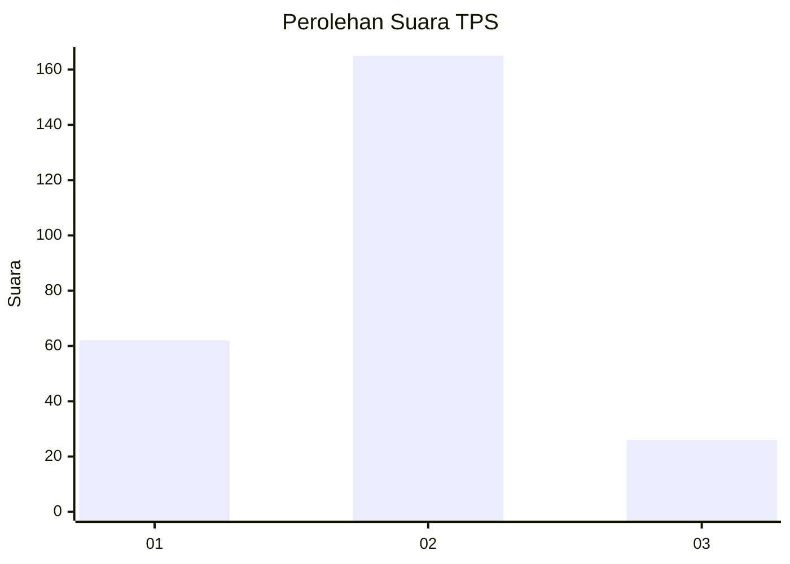

# Hasil

## Grafik

## Tabel

| No. | Nama Paslon    | Suara | Suara (raw) | Persentase |
|:--- |:-------------- | -----:| -----------:| ----------:|
| 1   | ANIES MUHAIMIN | 62    | [62][p-1]   | 24,51      |
| 2   | PRABOWO GIBRAN | 165   | [165][p-2]  | 65,22      |
| 3   | GANJAR MAHFUD  | 26    | [26][p-3]   | 10,28      |

[p-1]: https://github.com/gigit-pemilu/pemilu-2024/blob/main/pilpres/hitung-suara/sub/35-jawa-timur/sub/09-jember/sub/19-kaliwates/sub/1004-kaliwates/sub/004-tps/sub/paslon-1.txt
[p-2]: https://github.com/gigit-pemilu/pemilu-2024/blob/main/pilpres/hitung-suara/sub/35-jawa-timur/sub/09-jember/sub/19-kaliwates/sub/1004-kaliwates/sub/004-tps/sub/paslon-2.txt
[p-3]: https://github.com/gigit-pemilu/pemilu-2024/blob/main/pilpres/hitung-suara/sub/35-jawa-timur/sub/09-jember/sub/19-kaliwates/sub/1004-kaliwates/sub/004-tps/sub/paslon-3.txt

## Foto C Plano

https://sirekap-obj-formc.kpu.go.id/ac7d/pemilu/ppwp/35/09/19/10/04/3509191004004-20240214-141437--8c181025-37bd-4b8c-98e4-364dac2448dc.jpg

https://sirekap-obj-formc.kpu.go.id/ac7d/pemilu/ppwp/35/09/19/10/04/3509191004004-20240214-141544--4b879678-2e60-4dee-b31a-3f94b48cf28b.jpg

https://sirekap-obj-formc.kpu.go.id/ac7d/pemilu/ppwp/35/09/19/10/04/3509191004004-20240214-141634--0b3e3cf6-df12-45de-b1df-409c4c47b028.jpg

## Metadata

| Key        | Value               |
| ---------- | ------------------- |
| Time Stamp | 2024-02-15 16:00:26 |

