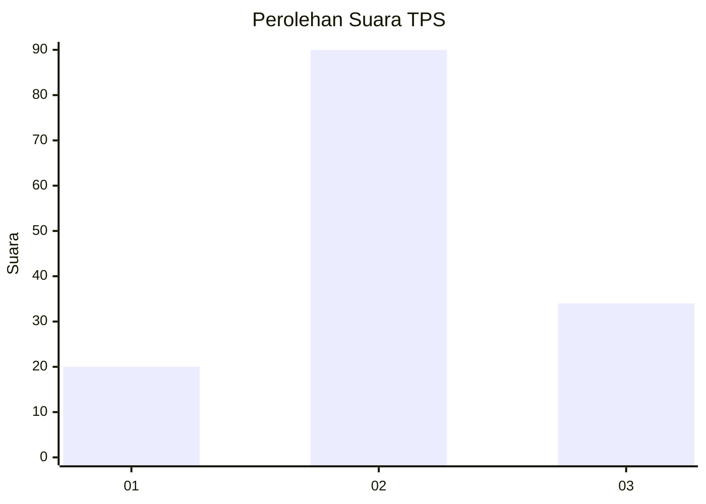
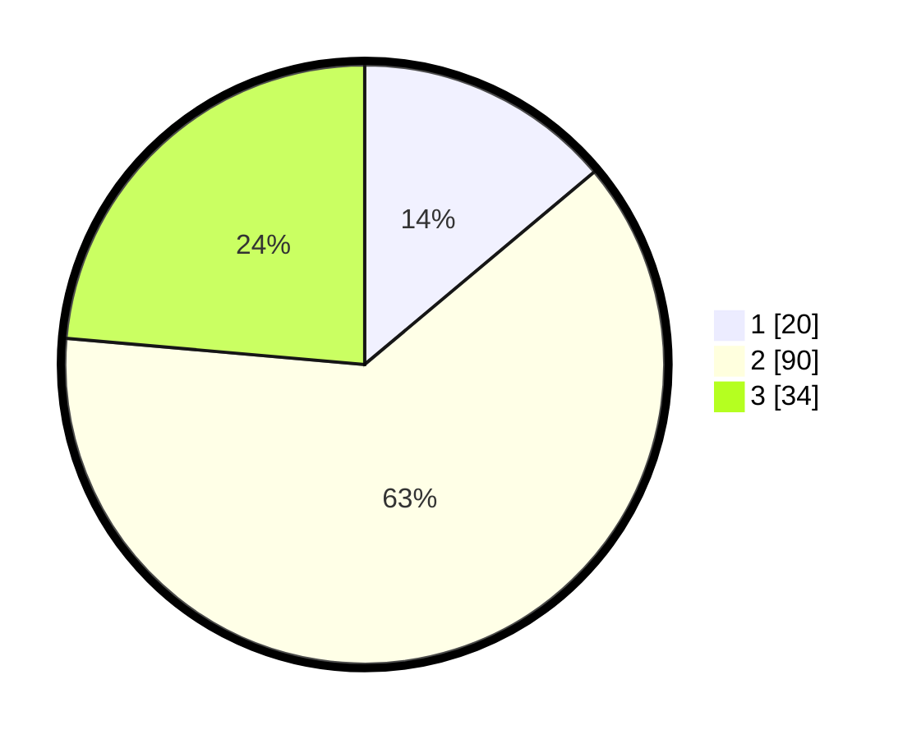

# Hasil

## Grafik

## Tabel

| No. | Nama Paslon    | Suara | Suara (raw) | Persentase |
|:--- |:-------------- | -----:| -----------:| ----------:|
| 1   | ANIES MUHAIMIN | 20    | [20][p-1]   | 13,89      |
| 2   | PRABOWO GIBRAN | 90    | [90][p-2]   | 62,50      |
| 3   | GANJAR MAHFUD  | 34    | [34][p-3]   | 23,61      |

[p-1]: https://github.com/gigit-pemilu/pemilu-2024/blob/main/pilpres/hitung-suara/sub/35-jawa-timur/sub/09-jember/sub/19-kaliwates/sub/1004-kaliwates/sub/010-tps/sub/paslon-1.txt
[p-2]: https://github.com/gigit-pemilu/pemilu-2024/blob/main/pilpres/hitung-suara/sub/35-jawa-timur/sub/09-jember/sub/19-kaliwates/sub/1004-kaliwates/sub/010-tps/sub/paslon-2.txt
[p-3]: https://github.com/gigit-pemilu/pemilu-2024/blob/main/pilpres/hitung-suara/sub/35-jawa-timur/sub/09-jember/sub/19-kaliwates/sub/1004-kaliwates/sub/010-tps/sub/paslon-3.txt

## Foto C Plano

https://sirekap-obj-formc.kpu.go.id/a7aa/pemilu/ppwp/35/09/19/10/04/3509191004010-20240214-233710--a08f15cb-e6c9-4faf-b37d-42fe7a2de2a4.jpg

https://sirekap-obj-formc.kpu.go.id/a7aa/pemilu/ppwp/35/09/19/10/04/3509191004010-20240214-233817--dc4afd16-31f8-4cc3-b618-ff0f246b4eed.jpg

https://sirekap-obj-formc.kpu.go.id/a7aa/pemilu/ppwp/35/09/19/10/04/3509191004010-20240214-233910--0c8e93f1-e1b7-4aad-a678-41d18aff5187.jpg

## Metadata

| Key        | Value               |
| ---------- | ------------------- |
| Time Stamp | 2024-02-15 16:00:26 |

