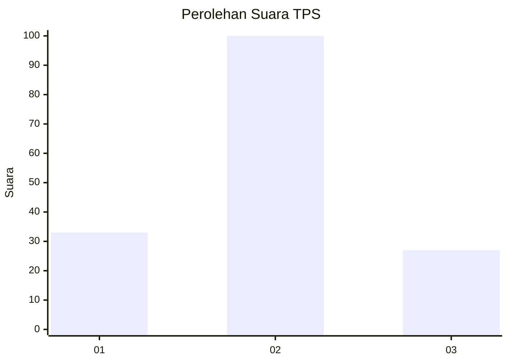

# Hasil

## Grafik

## Tabel

| No. | Nama Paslon    | Suara | Suara (raw) | Persentase |
|:--- |:-------------- | -----:| -----------:| ----------:|
| 1   | ANIES MUHAIMIN | 33    | [33][p-1]   | 20,63      |
| 2   | PRABOWO GIBRAN | 100   | [100][p-2]  | 62,50      |
| 3   | GANJAR MAHFUD  | 27    | [27][p-3]   | 16,88      |

[p-1]: https://github.com/gigit-pemilu/pemilu-2024/blob/main/pilpres/hitung-suara/sub/35-jawa-timur/sub/09-jember/sub/19-kaliwates/sub/1004-kaliwates/sub/014-tps/sub/paslon-1.txt
[p-2]: https://github.com/gigit-pemilu/pemilu-2024/blob/main/pilpres/hitung-suara/sub/35-jawa-timur/sub/09-jember/sub/19-kaliwates/sub/1004-kaliwates/sub/014-tps/sub/paslon-2.txt
[p-3]: https://github.com/gigit-pemilu/pemilu-2024/blob/main/pilpres/hitung-suara/sub/35-jawa-timur/sub/09-jember/sub/19-kaliwates/sub/1004-kaliwates/sub/014-tps/sub/paslon-3.txt

## Foto C Plano

https://sirekap-obj-formc.kpu.go.id/1c48/pemilu/ppwp/35/09/19/10/04/3509191004014-20240214-232203--1d48c8e3-8678-40f6-9572-ea5bcc83a776.jpg

https://sirekap-obj-formc.kpu.go.id/1c48/pemilu/ppwp/35/09/19/10/04/3509191004014-20240214-155459--29f02b9a-c2e7-4801-8359-8bfe7c45e1d5.jpg

https://sirekap-obj-formc.kpu.go.id/1c48/pemilu/ppwp/35/09/19/10/04/3509191004014-20240214-155517--895d7a8c-87ee-4b92-9248-77c9c5ee9086.jpg

## Metadata

| Key        | Value               |
| ---------- | ------------------- |
| Time Stamp | 2024-02-15 12:00:28 |

