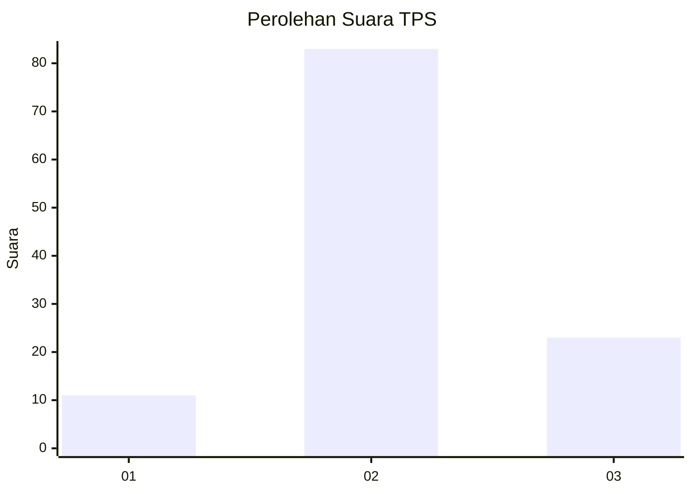
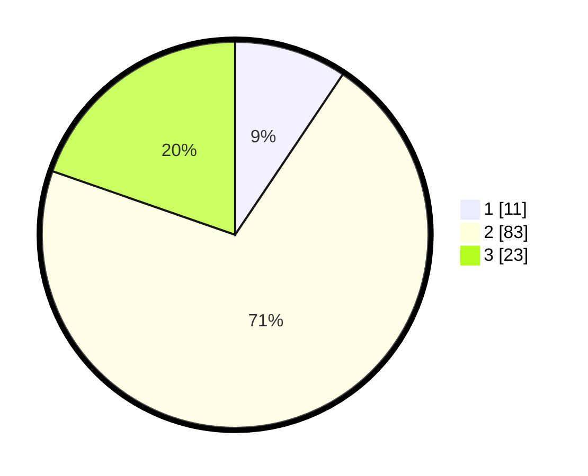

# Hasil

## Grafik

## Tabel

| No. | Nama Paslon    | Suara | Suara (raw) | Persentase |
|:--- |:-------------- | -----:| -----------:| ----------:|
| 1   | ANIES MUHAIMIN | 11    | [11][p-1]   | 9,40       |
| 2   | PRABOWO GIBRAN | 83    | [83][p-2]   | 70,94      |
| 3   | GANJAR MAHFUD  | 23    | [23][p-3]   | 19,66      |

[p-1]: https://github.com/gigit-pemilu/pemilu-2024/blob/main/pilpres/hitung-suara/sub/35-jawa-timur/sub/09-jember/sub/19-kaliwates/sub/1004-kaliwates/sub/031-tps/sub/paslon-1.txt
[p-2]: https://github.com/gigit-pemilu/pemilu-2024/blob/main/pilpres/hitung-suara/sub/35-jawa-timur/sub/09-jember/sub/19-kaliwates/sub/1004-kaliwates/sub/031-tps/sub/paslon-2.txt
[p-3]: https://github.com/gigit-pemilu/pemilu-2024/blob/main/pilpres/hitung-suara/sub/35-jawa-timur/sub/09-jember/sub/19-kaliwates/sub/1004-kaliwates/sub/031-tps/sub/paslon-3.txt

## Foto C Plano

https://sirekap-obj-formc.kpu.go.id/4cdf/pemilu/ppwp/35/09/19/10/04/3509191004031-20240214-224648--0aa33ae8-ea06-4fc6-b08b-35889de580bd.jpg

https://sirekap-obj-formc.kpu.go.id/4cdf/pemilu/ppwp/35/09/19/10/04/3509191004031-20240214-224758--d4505009-325a-40b3-a075-889757c6533f.jpg

https://sirekap-obj-formc.kpu.go.id/4cdf/pemilu/ppwp/35/09/19/10/04/3509191004031-20240214-224843--0a22de99-ad24-42d8-b6a3-b2d7265e4218.jpg

## Metadata

| Key        | Value               |
| ---------- | ------------------- |
| Time Stamp | 2024-02-15 16:00:26 |

