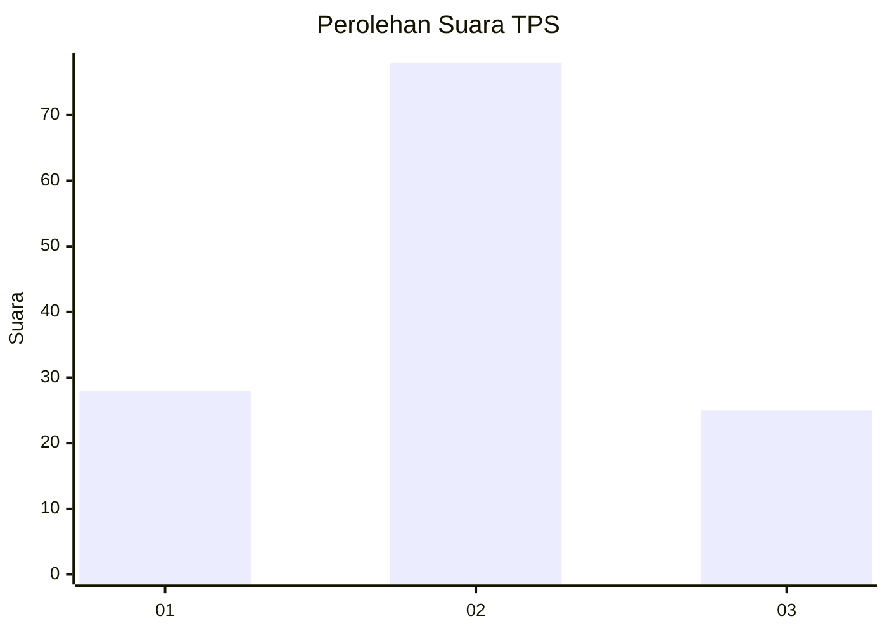
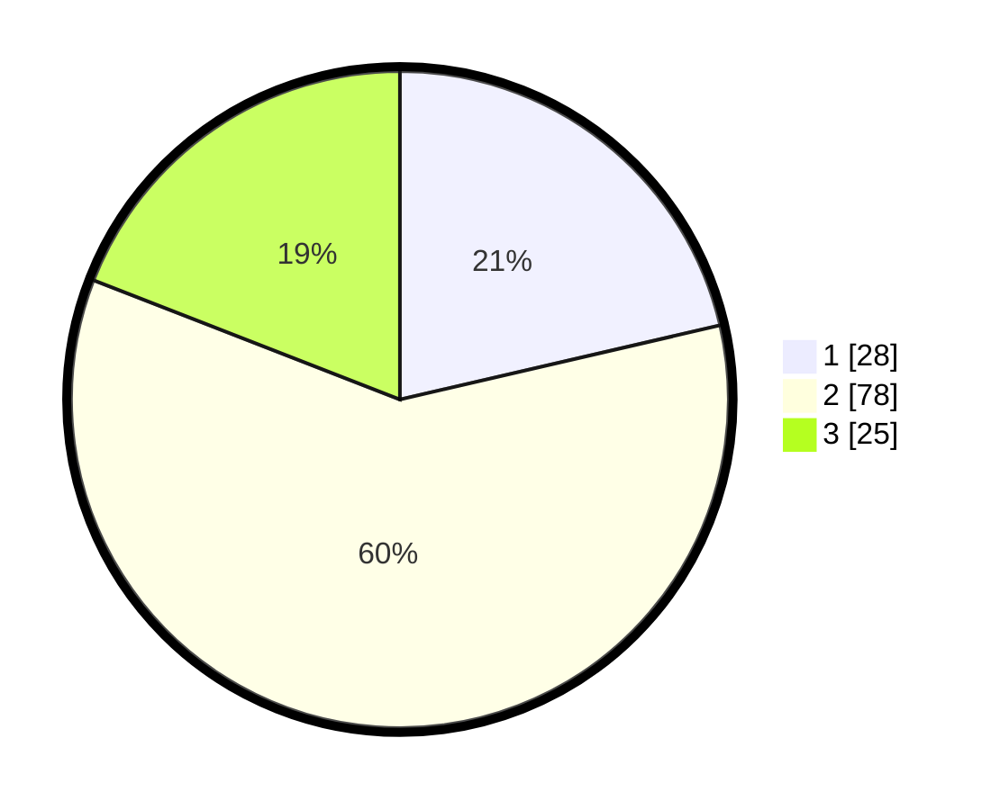

# Hasil

## Grafik

## Tabel

| No. | Nama Paslon    | Suara | Suara (raw) | Persentase |
|:--- |:-------------- | -----:| -----------:| ----------:|
| 1   | ANIES MUHAIMIN | 28    | [28][p-1]   | 21,37      |
| 2   | PRABOWO GIBRAN | 78    | [78][p-2]   | 59,54      |
| 3   | GANJAR MAHFUD  | 25    | [25][p-3]   | 19,08      |

[p-1]: https://github.com/gigit-pemilu/pemilu-2024-35-jawa-timur/blob/main/pilpres/hitung-suara/sub/35-jawa-timur/sub/09-jember/sub/19-kaliwates/sub/1004-kaliwates/sub/034-tps/sub/paslon-1.txt
[p-2]: https://github.com/gigit-pemilu/pemilu-2024-35-jawa-timur/blob/main/pilpres/hitung-suara/sub/35-jawa-timur/sub/09-jember/sub/19-kaliwates/sub/1004-kaliwates/sub/034-tps/sub/paslon-2.txt
[p-3]: https://github.com/gigit-pemilu/pemilu-2024-35-jawa-timur/blob/main/pilpres/hitung-suara/sub/35-jawa-timur/sub/09-jember/sub/19-kaliwates/sub/1004-kaliwates/sub/034-tps/sub/paslon-3.txt

## Foto C Plano

https://sirekap-obj-formc.kpu.go.id/dd8c/pemilu/ppwp/35/09/19/10/04/3509191004034-20240214-211910--1de7dd96-c376-4f4c-86d4-15b1058c89ab.jpg

https://sirekap-obj-formc.kpu.go.id/dd8c/pemilu/ppwp/35/09/19/10/04/3509191004034-20240215-205039--04008644-2954-4fc6-9fda-b6617b61182b.jpg

https://sirekap-obj-formc.kpu.go.id/dd8c/pemilu/ppwp/35/09/19/10/04/3509191004034-20240214-212512--7dea3c50-d1da-4238-8adf-f6bc795f23ed.jpg

## Metadata

| Key        | Value               |
| ---------- | ------------------- |
| Time Stamp | 2024-02-16 12:51:22 |

## DATA PEMILIH TETAP

Jumlah pemilih dalam DPT: **214**.
 * L: **104**.
 * P: **110**.

## DATA PENGGUNA HAK PILIH

Jumlah pengguna hak pilih dalam DPT: **128**.
 * L: **62**.
 * P: **66**.

Jumlah pengguna hak pilih dalam DPTb: **8**.
 * L: **805**.
 * P: **883**.

Jumlah pengguna hak pilih dalam DPK: **0**.
 * L: **0**.
 * P: **0**.

Jumlah pengguna hak pilih: **136**.
 * L: **67**.
 * P: **69**.

## JUMLAH SUARA SAH DAN TIDAK SAH

JUMLAH SELURUH SUARA SAH: **131**.

JUMLAH SUARA TIDAK SAH: **5**.

JUMLAH SELURUH SUARA SAH DAN SUARA TIDAK SAH: **136**.

