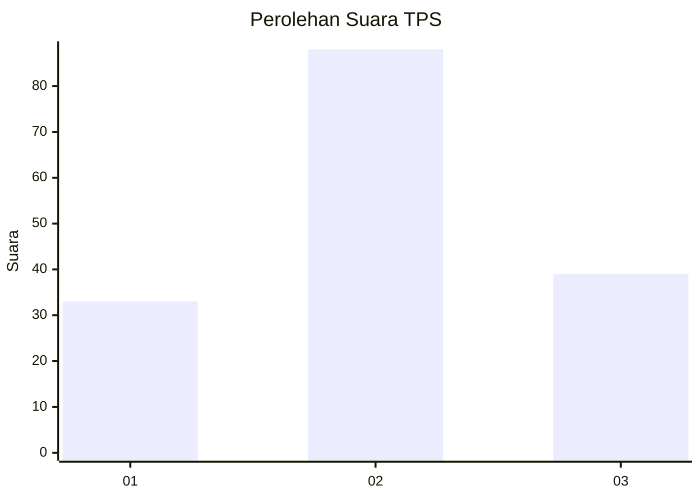
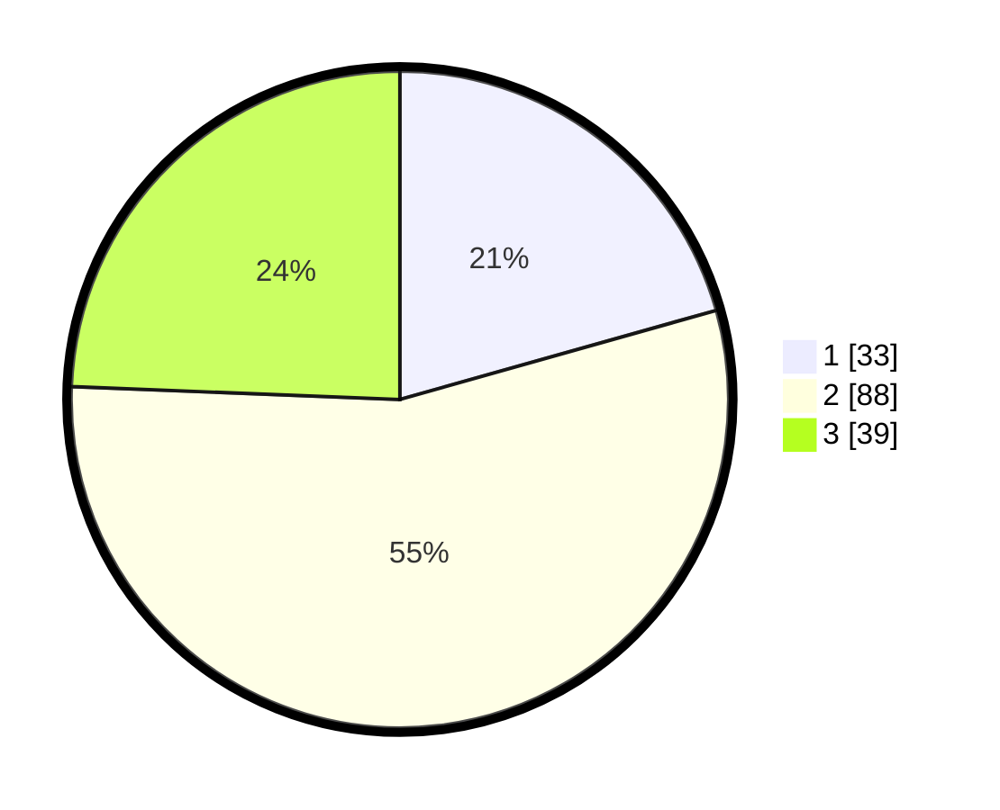

# Hasil

## Grafik

## Tabel

| No. | Nama Paslon    | Suara | Suara (raw) | Persentase |
|:--- |:-------------- | -----:| -----------:| ----------:|
| 1   | ANIES MUHAIMIN | 33    | [33][p-1]   | 20,63      |
| 2   | PRABOWO GIBRAN | 88    | [88][p-2]   | 55,00      |
| 3   | GANJAR MAHFUD  | 39    | [39][p-3]   | 24,38      |

[p-1]: https://github.com/gigit-pemilu/pemilu-2024-35-jawa-timur/blob/main/pilpres/hitung-suara/sub/35-jawa-timur/sub/09-jember/sub/19-kaliwates/sub/1004-kaliwates/sub/040-tps/sub/paslon-1.txt
[p-2]: https://github.com/gigit-pemilu/pemilu-2024-35-jawa-timur/blob/main/pilpres/hitung-suara/sub/35-jawa-timur/sub/09-jember/sub/19-kaliwates/sub/1004-kaliwates/sub/040-tps/sub/paslon-2.txt
[p-3]: https://github.com/gigit-pemilu/pemilu-2024-35-jawa-timur/blob/main/pilpres/hitung-suara/sub/35-jawa-timur/sub/09-jember/sub/19-kaliwates/sub/1004-kaliwates/sub/040-tps/sub/paslon-3.txt

## Foto C Plano

https://sirekap-obj-formc.kpu.go.id/0cec/pemilu/ppwp/35/09/19/10/04/3509191004040-20240214-235438--ecde38cc-670e-4298-8232-014f2888cb7f.jpg

https://sirekap-obj-formc.kpu.go.id/0cec/pemilu/ppwp/35/09/19/10/04/3509191004040-20240214-235535--f3cb1565-5053-44c2-874c-0b04b2a1ca9d.jpg

https://sirekap-obj-formc.kpu.go.id/0cec/pemilu/ppwp/35/09/19/10/04/3509191004040-20240214-235550--e60da2d7-3e22-4369-97b0-a5c555f449d8.jpg

## Metadata

| Key        | Value               |
| ---------- | ------------------- |
| Time Stamp | 2024-02-16 12:51:22 |

