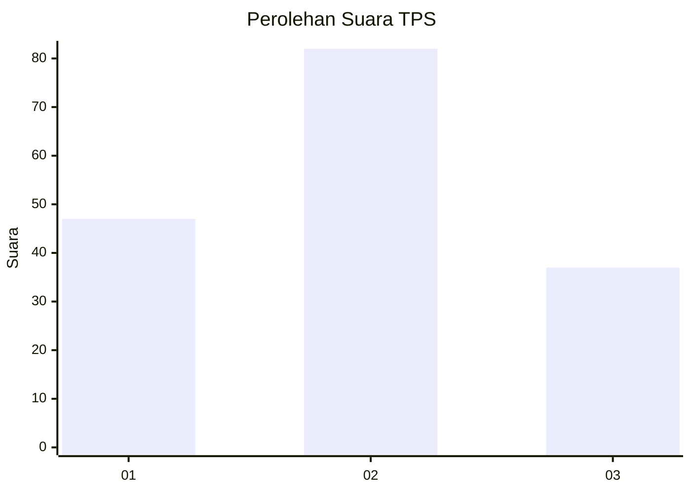
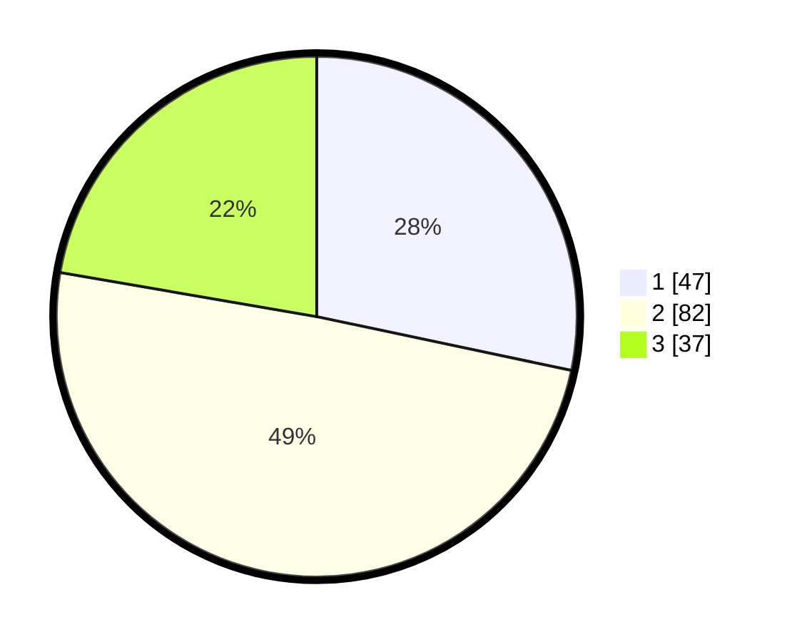

# Hasil

## Grafik

## Tabel

| No. | Nama Paslon    | Suara | Suara (raw) | Persentase |
|:--- |:-------------- | -----:| -----------:| ----------:|
| 1   | ANIES MUHAIMIN | 47    | [47][p-1]   | 28,31      |
| 2   | PRABOWO GIBRAN | 82    | [82][p-2]   | 49,40      |
| 3   | GANJAR MAHFUD  | 37    | [37][p-3]   | 22,29      |

[p-1]: https://github.com/gigit-pemilu/pemilu-2024/blob/main/pilpres/hitung-suara/sub/35-jawa-timur/sub/09-jember/sub/19-kaliwates/sub/1004-kaliwates/sub/041-tps/sub/paslon-1.txt
[p-2]: https://github.com/gigit-pemilu/pemilu-2024/blob/main/pilpres/hitung-suara/sub/35-jawa-timur/sub/09-jember/sub/19-kaliwates/sub/1004-kaliwates/sub/041-tps/sub/paslon-2.txt
[p-3]: https://github.com/gigit-pemilu/pemilu-2024/blob/main/pilpres/hitung-suara/sub/35-jawa-timur/sub/09-jember/sub/19-kaliwates/sub/1004-kaliwates/sub/041-tps/sub/paslon-3.txt

## Foto C Plano

https://sirekap-obj-formc.kpu.go.id/8816/pemilu/ppwp/35/09/19/10/04/3509191004041-20240215-110248--ced2deda-2fd0-4356-ad9e-d32f53f806ee.jpg

https://sirekap-obj-formc.kpu.go.id/8816/pemilu/ppwp/35/09/19/10/04/3509191004041-20240215-123947--1dcb087b-b348-4d3a-b38f-7828e090d289.jpg

https://sirekap-obj-formc.kpu.go.id/8816/pemilu/ppwp/35/09/19/10/04/3509191004041-20240215-124023--22a74f12-ecfa-4329-a134-7915b77465bb.jpg

## Metadata

| Key        | Value               |
| ---------- | ------------------- |
| Time Stamp | 2024-02-16 12:51:22 |

