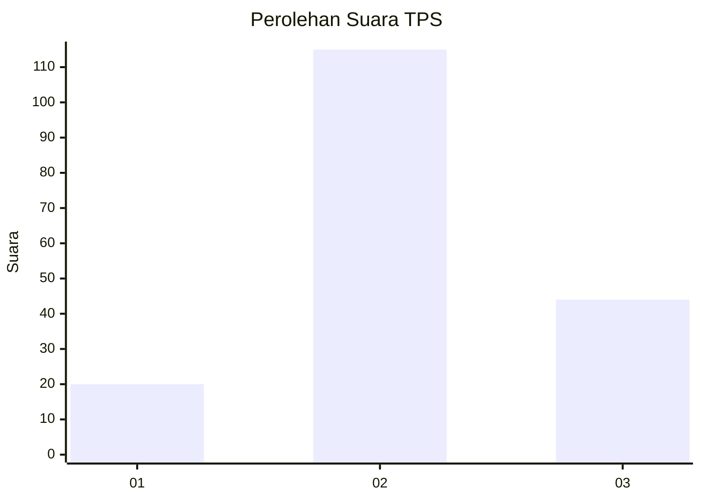
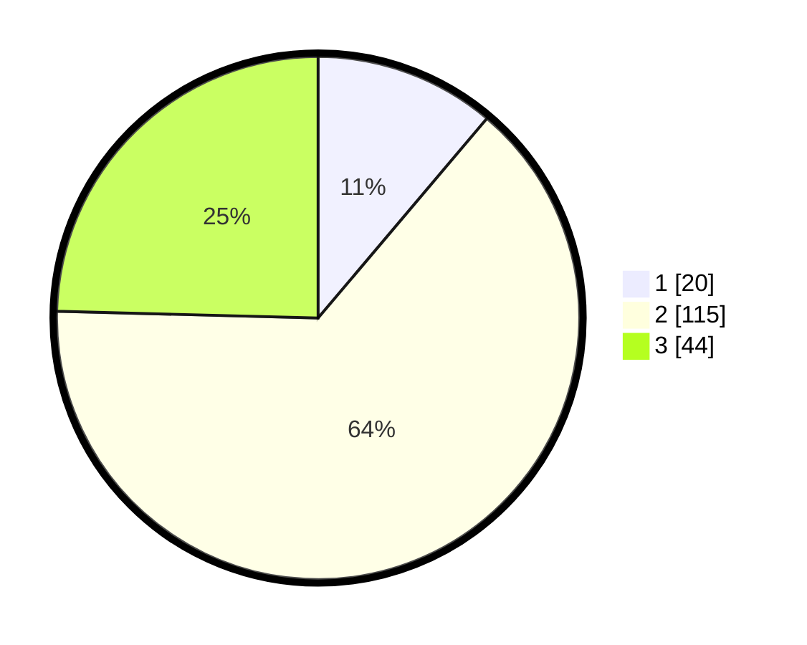

# Hasil

## Grafik

## Tabel

| No. | Nama Paslon    | Suara | Suara (raw) | Persentase |
|:--- |:-------------- | -----:| -----------:| ----------:|
| 1   | ANIES MUHAIMIN | 20    | [20][p-1]   | 11,17      |
| 2   | PRABOWO GIBRAN | 115   | [115][p-2]  | 64,25      |
| 3   | GANJAR MAHFUD  | 44    | [44][p-3]   | 24,58      |

[p-1]: https://github.com/gigit-pemilu/pemilu-2024/blob/main/pilpres/hitung-suara/sub/35-jawa-timur/sub/09-jember/sub/19-kaliwates/sub/1005-jemberkidul/sub/011-tps/sub/paslon-1.txt
[p-2]: https://github.com/gigit-pemilu/pemilu-2024/blob/main/pilpres/hitung-suara/sub/35-jawa-timur/sub/09-jember/sub/19-kaliwates/sub/1005-jemberkidul/sub/011-tps/sub/paslon-2.txt
[p-3]: https://github.com/gigit-pemilu/pemilu-2024/blob/main/pilpres/hitung-suara/sub/35-jawa-timur/sub/09-jember/sub/19-kaliwates/sub/1005-jemberkidul/sub/011-tps/sub/paslon-3.txt

## Foto C Plano

https://sirekap-obj-formc.kpu.go.id/0a37/pemilu/ppwp/35/09/19/10/05/3509191005011-20240214-205929--7fdfbc33-88ed-433d-afd2-30938167c9c3.jpg

https://sirekap-obj-formc.kpu.go.id/0a37/pemilu/ppwp/35/09/19/10/05/3509191005011-20240214-210643--6402777e-3b82-4447-adb1-8ff3e732df15.jpg

https://sirekap-obj-formc.kpu.go.id/0a37/pemilu/ppwp/35/09/19/10/05/3509191005011-20240214-210825--455a18b4-59be-426c-8a6b-086e2ae87f5b.jpg

## Metadata

| Key        | Value               |
| ---------- | ------------------- |
| Time Stamp | 2024-02-15 12:00:28 |

