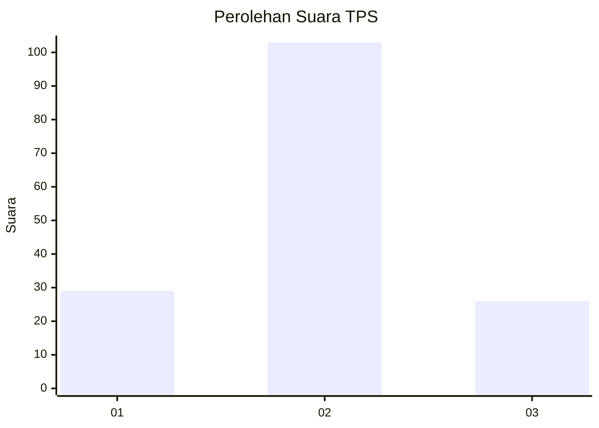
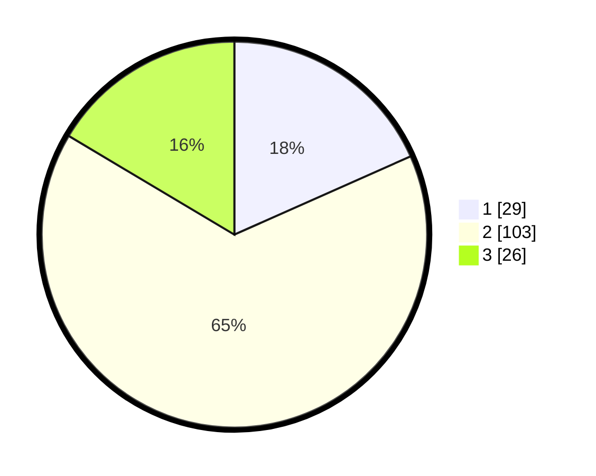

# Hasil

## Grafik

## Tabel

| No. | Nama Paslon    | Suara | Suara (raw) | Persentase |
|:--- |:-------------- | -----:| -----------:| ----------:|
| 1   | ANIES MUHAIMIN | 29    | [29][p-1]   | 18,35      |
| 2   | PRABOWO GIBRAN | 103   | [103][p-2]  | 65,19      |
| 3   | GANJAR MAHFUD  | 26    | [26][p-3]   | 16,46      |

[p-1]: https://github.com/gigit-pemilu/pemilu-2024-35-jawa-timur/blob/main/pilpres/hitung-suara/sub/35-jawa-timur/sub/09-jember/sub/19-kaliwates/sub/1005-jemberkidul/sub/033-tps/sub/paslon-1.txt
[p-2]: https://github.com/gigit-pemilu/pemilu-2024-35-jawa-timur/blob/main/pilpres/hitung-suara/sub/35-jawa-timur/sub/09-jember/sub/19-kaliwates/sub/1005-jemberkidul/sub/033-tps/sub/paslon-2.txt
[p-3]: https://github.com/gigit-pemilu/pemilu-2024-35-jawa-timur/blob/main/pilpres/hitung-suara/sub/35-jawa-timur/sub/09-jember/sub/19-kaliwates/sub/1005-jemberkidul/sub/033-tps/sub/paslon-3.txt

## Foto C Plano

https://sirekap-obj-formc.kpu.go.id/9ea6/pemilu/ppwp/35/09/19/10/05/3509191005033-20240214-140947--3c09e266-bd50-4d31-a2af-c8c719e60163.jpg

https://sirekap-obj-formc.kpu.go.id/9ea6/pemilu/ppwp/35/09/19/10/05/3509191005033-20240214-141111--c8698fc7-aba1-4e03-a734-37cff3150fd7.jpg

https://sirekap-obj-formc.kpu.go.id/9ea6/pemilu/ppwp/35/09/19/10/05/3509191005033-20240214-141742--a5c88834-9387-4364-a5f1-4bf18bb6a870.jpg

## Metadata

| Key        | Value               |
| ---------- | ------------------- |
| Time Stamp | 2024-02-15 16:00:26 |

