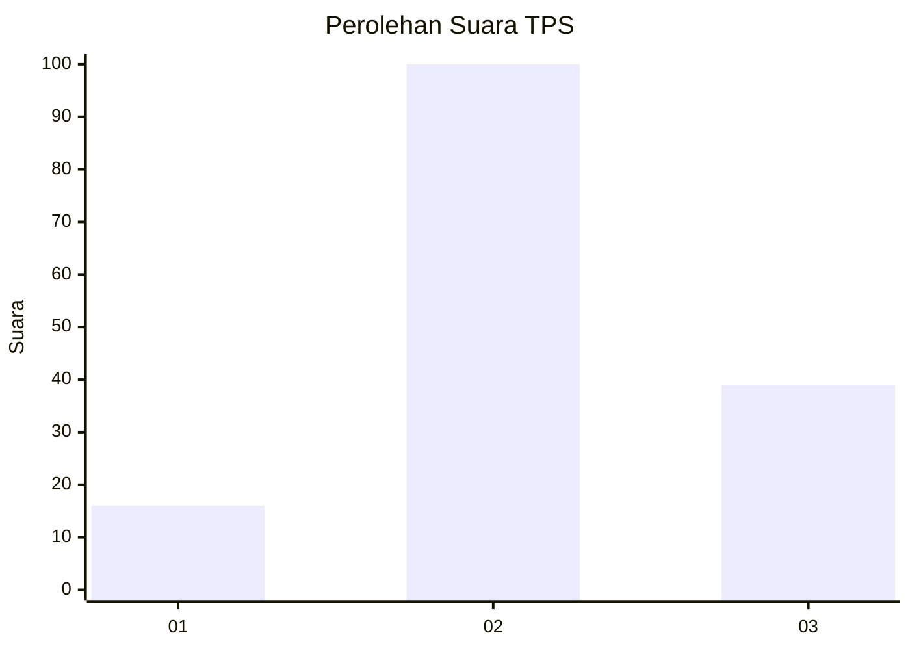
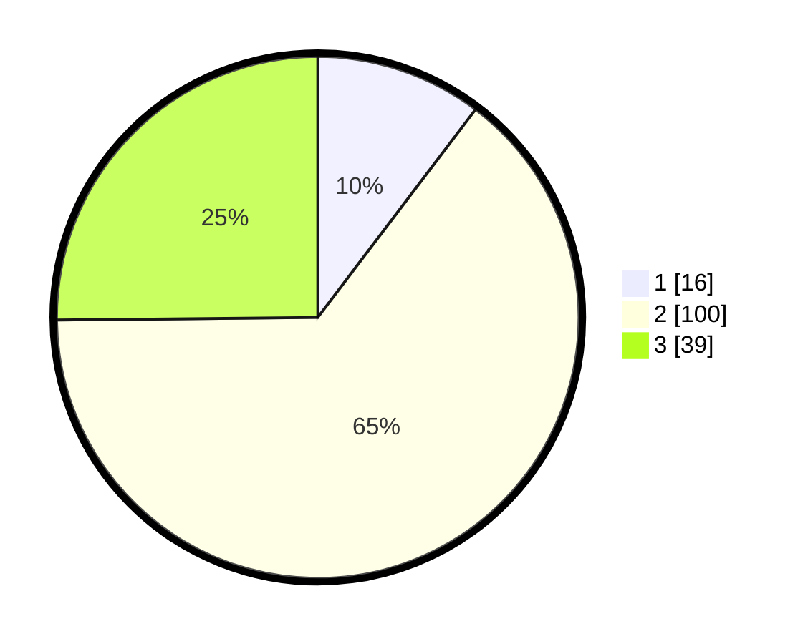

# Hasil

## Grafik

## Tabel

| No. | Nama Paslon    | Suara | Suara (raw) | Persentase |
|:--- |:-------------- | -----:| -----------:| ----------:|
| 1   | ANIES MUHAIMIN | 16    | [16][p-1]   | 10,32      |
| 2   | PRABOWO GIBRAN | 100   | [100][p-2]  | 64,52      |
| 3   | GANJAR MAHFUD  | 39    | [39][p-3]   | 25,16      |

[p-1]: https://github.com/gigit-pemilu/pemilu-2024-35-jawa-timur/blob/main/pilpres/hitung-suara/sub/35-jawa-timur/sub/09-jember/sub/19-kaliwates/sub/1005-jemberkidul/sub/048-tps/sub/paslon-1.txt
[p-2]: https://github.com/gigit-pemilu/pemilu-2024-35-jawa-timur/blob/main/pilpres/hitung-suara/sub/35-jawa-timur/sub/09-jember/sub/19-kaliwates/sub/1005-jemberkidul/sub/048-tps/sub/paslon-2.txt
[p-3]: https://github.com/gigit-pemilu/pemilu-2024-35-jawa-timur/blob/main/pilpres/hitung-suara/sub/35-jawa-timur/sub/09-jember/sub/19-kaliwates/sub/1005-jemberkidul/sub/048-tps/sub/paslon-3.txt

## Foto C Plano

https://sirekap-obj-formc.kpu.go.id/5034/pemilu/ppwp/35/09/19/10/05/3509191005048-20240214-220300--fbbf642c-6f11-4eeb-8eb2-cf8b6af16cbc.jpg

https://sirekap-obj-formc.kpu.go.id/5034/pemilu/ppwp/35/09/19/10/05/3509191005048-20240214-220410--83c36468-2674-4179-a783-c9813fccc817.jpg

https://sirekap-obj-formc.kpu.go.id/5034/pemilu/ppwp/35/09/19/10/05/3509191005048-20240214-220448--7c729f52-e36b-4f3b-8afb-603f90e2be2f.jpg

## Metadata

| Key        | Value               |
| ---------- | ------------------- |
| Time Stamp | 2024-02-15 16:30:25 |

