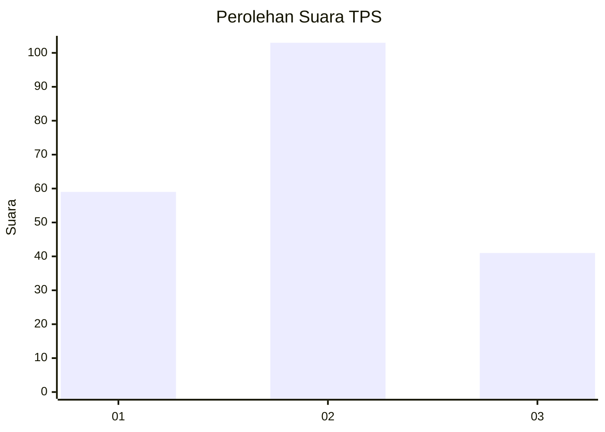
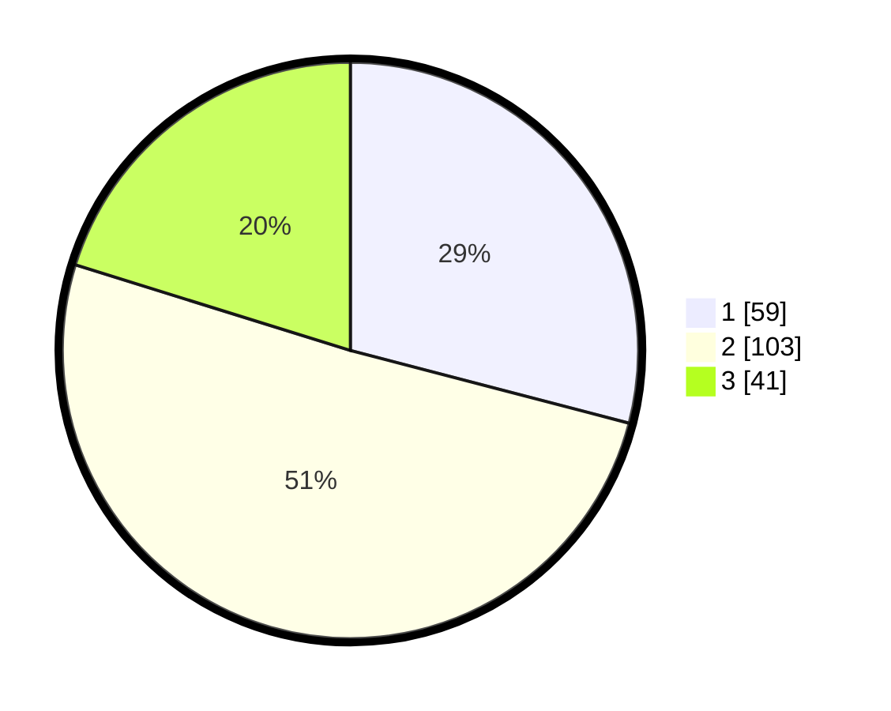

# Hasil

## Grafik

## Tabel

| No. | Nama Paslon    | Suara | Suara (raw) | Persentase |
|:--- |:-------------- | -----:| -----------:| ----------:|
| 1   | ANIES MUHAIMIN | 59    | [59][p-1]   | 29,06      |
| 2   | PRABOWO GIBRAN | 103   | [103][p-2]  | 50,74      |
| 3   | GANJAR MAHFUD  | 41    | [41][p-3]   | 20,20      |

[p-1]: https://github.com/gigit-pemilu/pemilu-2024-35-jawa-timur/blob/main/pilpres/hitung-suara/sub/35-jawa-timur/sub/09-jember/sub/19-kaliwates/sub/1005-jemberkidul/sub/056-tps/sub/paslon-1.txt
[p-2]: https://github.com/gigit-pemilu/pemilu-2024-35-jawa-timur/blob/main/pilpres/hitung-suara/sub/35-jawa-timur/sub/09-jember/sub/19-kaliwates/sub/1005-jemberkidul/sub/056-tps/sub/paslon-2.txt
[p-3]: https://github.com/gigit-pemilu/pemilu-2024-35-jawa-timur/blob/main/pilpres/hitung-suara/sub/35-jawa-timur/sub/09-jember/sub/19-kaliwates/sub/1005-jemberkidul/sub/056-tps/sub/paslon-3.txt

## Foto C Plano

https://sirekap-obj-formc.kpu.go.id/16f0/pemilu/ppwp/35/09/19/10/05/3509191005056-20240214-224357--4b7692bf-c612-4ee9-8740-b04b008572d1.jpg

https://sirekap-obj-formc.kpu.go.id/16f0/pemilu/ppwp/35/09/19/10/05/3509191005056-20240214-224524--2748f4b8-b299-4767-a322-2134dabad9b9.jpg

https://sirekap-obj-formc.kpu.go.id/16f0/pemilu/ppwp/35/09/19/10/05/3509191005056-20240214-224743--8e9920ab-b3a6-4ef4-8ad8-c81b7c579296.jpg

## Metadata

| Key        | Value               |
| ---------- | ------------------- |
| Time Stamp | 2024-02-15 16:30:25 |

