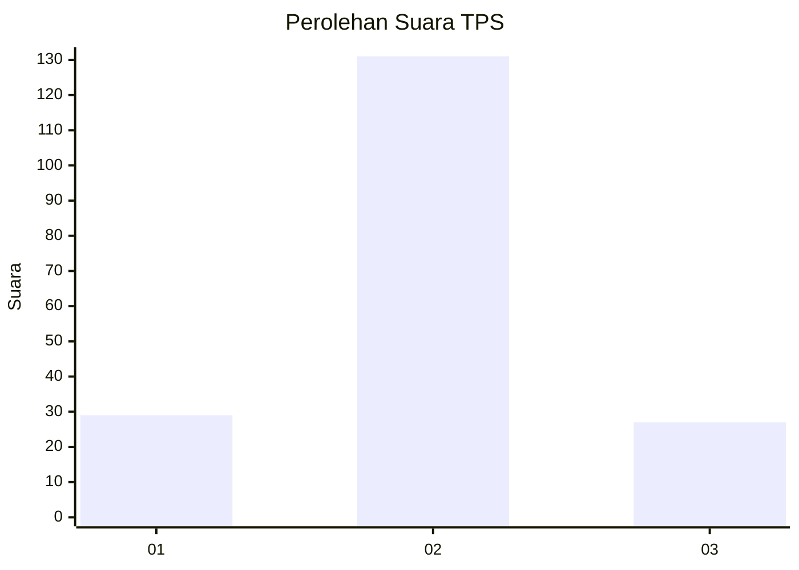

# Hasil

## Grafik

## Tabel

| No. | Nama Paslon    | Suara | Suara (raw) | Persentase |
|:--- |:-------------- | -----:| -----------:| ----------:|
| 1   | ANIES MUHAIMIN | 29    | [29][p-1]   | 15,51      |
| 2   | PRABOWO GIBRAN | 131   | [131][p-2]  | 70,05      |
| 3   | GANJAR MAHFUD  | 27    | [27][p-3]   | 14,44      |

[p-1]: https://github.com/gigit-pemilu/pemilu-2024/blob/main/pilpres/hitung-suara/sub/35-jawa-timur/sub/09-jember/sub/19-kaliwates/sub/1005-jemberkidul/sub/061-tps/sub/paslon-1.txt
[p-2]: https://github.com/gigit-pemilu/pemilu-2024/blob/main/pilpres/hitung-suara/sub/35-jawa-timur/sub/09-jember/sub/19-kaliwates/sub/1005-jemberkidul/sub/061-tps/sub/paslon-2.txt
[p-3]: https://github.com/gigit-pemilu/pemilu-2024/blob/main/pilpres/hitung-suara/sub/35-jawa-timur/sub/09-jember/sub/19-kaliwates/sub/1005-jemberkidul/sub/061-tps/sub/paslon-3.txt

## Foto C Plano

https://sirekap-obj-formc.kpu.go.id/0034/pemilu/ppwp/35/09/19/10/05/3509191005061-20240214-191738--2f40a999-9059-4688-8415-3ddfdb46aa6c.jpg

https://sirekap-obj-formc.kpu.go.id/0034/pemilu/ppwp/35/09/19/10/05/3509191005061-20240214-191749--75b4572a-0b23-444d-953c-077f271e3eba.jpg

https://sirekap-obj-formc.kpu.go.id/0034/pemilu/ppwp/35/09/19/10/05/3509191005061-20240214-191757--cf858f08-9c84-41c5-ae20-9601882cc735.jpg

## Metadata

| Key        | Value               |
| ---------- | ------------------- |
| Time Stamp | 2024-02-15 16:30:25 |

