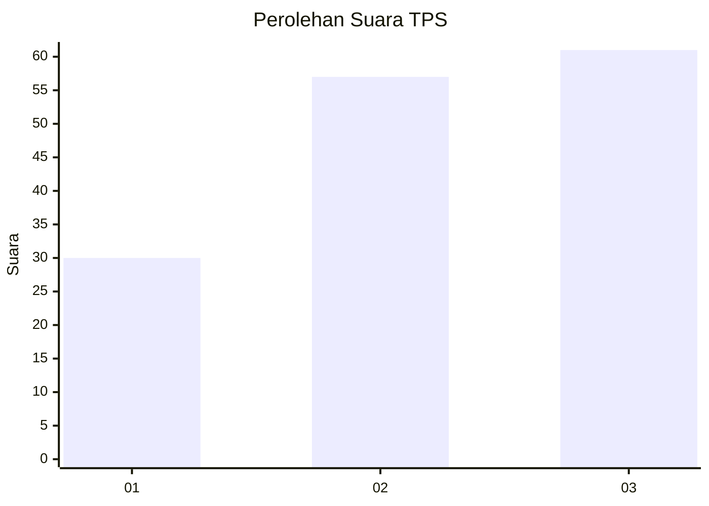
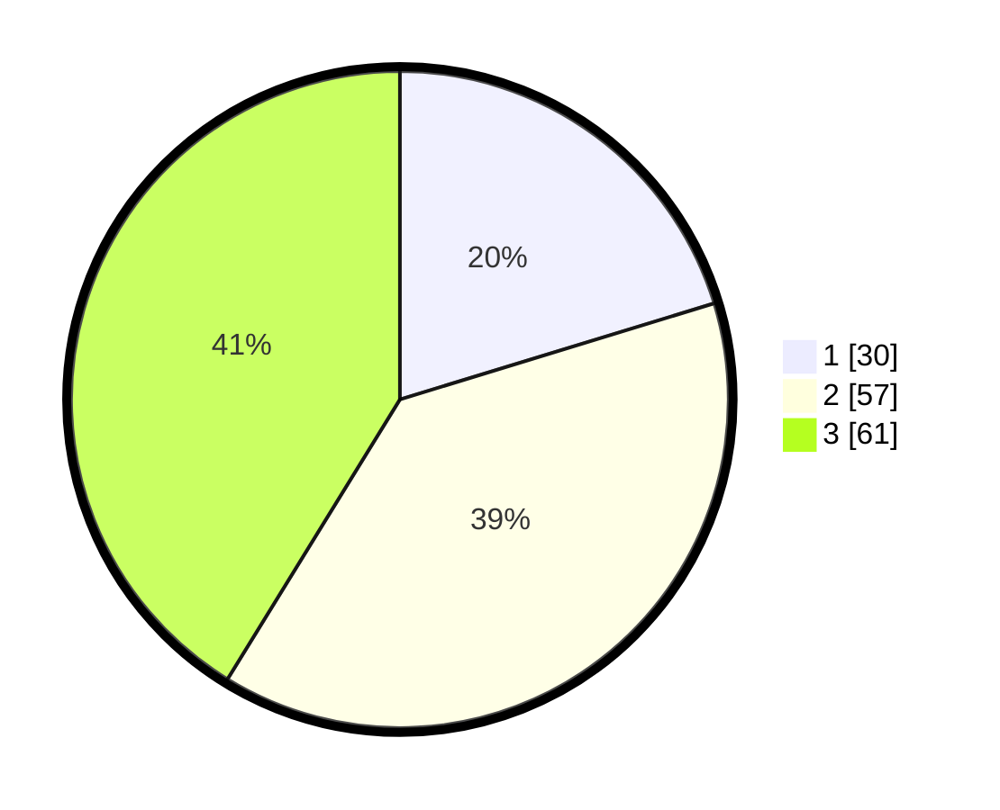

# Hasil

## Grafik

## Tabel

| No. | Nama Paslon    | Suara | Suara (raw) | Persentase |
|:--- |:-------------- | -----:| -----------:| ----------:|
| 1   | ANIES MUHAIMIN | 30    | [30][p-1]   | 20,27      |
| 2   | PRABOWO GIBRAN | 57    | [57][p-2]   | 38,51      |
| 3   | GANJAR MAHFUD  | 61    | [61][p-3]   | 41,22      |

[p-1]: https://github.com/gigit-pemilu/pemilu-2024/blob/main/pilpres/hitung-suara/sub/35-jawa-timur/sub/09-jember/sub/19-kaliwates/sub/1006-kepatihan/sub/002-tps/sub/paslon-1.txt
[p-2]: https://github.com/gigit-pemilu/pemilu-2024/blob/main/pilpres/hitung-suara/sub/35-jawa-timur/sub/09-jember/sub/19-kaliwates/sub/1006-kepatihan/sub/002-tps/sub/paslon-2.txt
[p-3]: https://github.com/gigit-pemilu/pemilu-2024/blob/main/pilpres/hitung-suara/sub/35-jawa-timur/sub/09-jember/sub/19-kaliwates/sub/1006-kepatihan/sub/002-tps/sub/paslon-3.txt

## Foto C Plano

https://sirekap-obj-formc.kpu.go.id/2320/pemilu/ppwp/35/09/19/10/06/3509191006002-20240215-023519--70e9e676-c5de-47ea-ae94-93c3f74ec31e.jpg

https://sirekap-obj-formc.kpu.go.id/2320/pemilu/ppwp/35/09/19/10/06/3509191006002-20240215-012223--036241a7-4f77-4997-b890-e02219041a6d.jpg

https://sirekap-obj-formc.kpu.go.id/2320/pemilu/ppwp/35/09/19/10/06/3509191006002-20240215-012326--8b11822c-2e56-4e93-91b7-fef60f5ec823.jpg

## Metadata

| Key        | Value               |
| ---------- | ------------------- |
| Time Stamp | 2024-02-15 15:00:29 |

