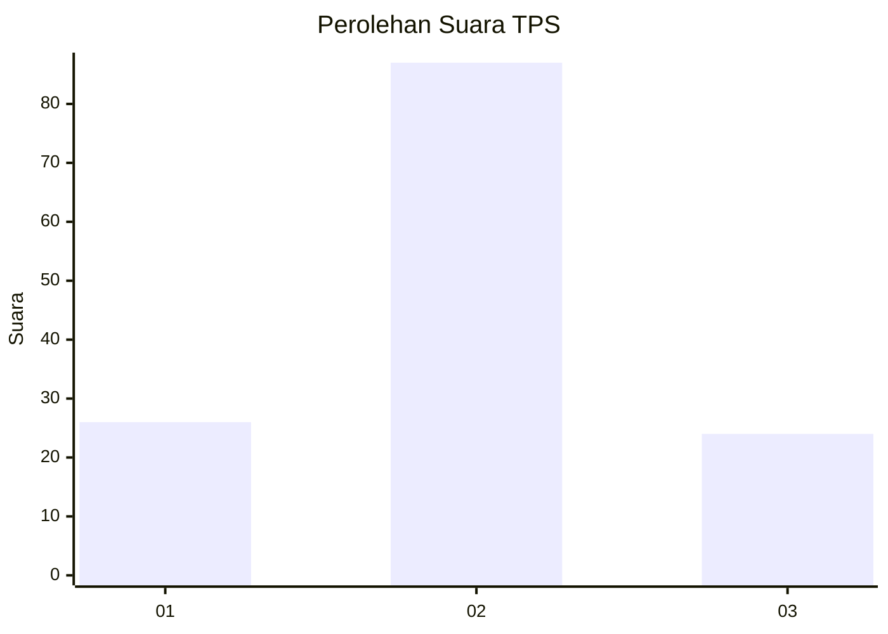
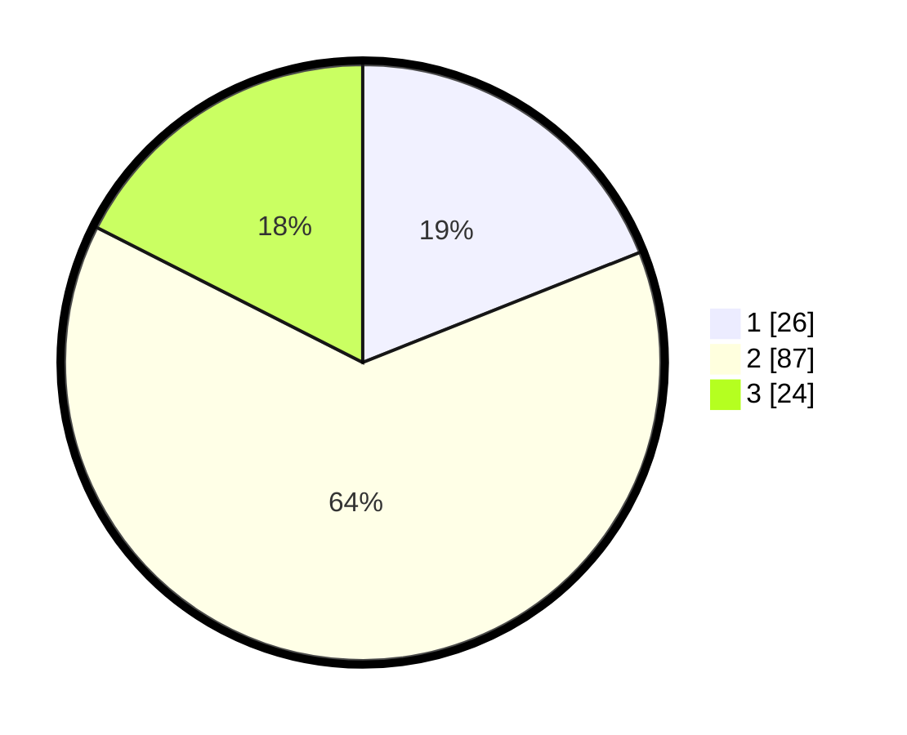

# Hasil

## Grafik

## Tabel

| No. | Nama Paslon    | Suara | Suara (raw) | Persentase |
|:--- |:-------------- | -----:| -----------:| ----------:|
| 1   | ANIES MUHAIMIN | 26    | [26][p-1]   | 18,98      |
| 2   | PRABOWO GIBRAN | 87    | [87][p-2]   | 63,50      |
| 3   | GANJAR MAHFUD  | 24    | [24][p-3]   | 17,52      |

[p-1]: https://github.com/gigit-pemilu/pemilu-2024/blob/main/pilpres/hitung-suara/sub/35-jawa-timur/sub/09-jember/sub/19-kaliwates/sub/1006-kepatihan/sub/004-tps/sub/paslon-1.txt
[p-2]: https://github.com/gigit-pemilu/pemilu-2024/blob/main/pilpres/hitung-suara/sub/35-jawa-timur/sub/09-jember/sub/19-kaliwates/sub/1006-kepatihan/sub/004-tps/sub/paslon-2.txt
[p-3]: https://github.com/gigit-pemilu/pemilu-2024/blob/main/pilpres/hitung-suara/sub/35-jawa-timur/sub/09-jember/sub/19-kaliwates/sub/1006-kepatihan/sub/004-tps/sub/paslon-3.txt

## Foto C Plano

https://sirekap-obj-formc.kpu.go.id/dfca/pemilu/ppwp/35/09/19/10/06/3509191006004-20240216-144100--e962d9c6-e646-4918-9979-069c5e9d7007.jpg

https://sirekap-obj-formc.kpu.go.id/dfca/pemilu/ppwp/35/09/19/10/06/3509191006004-20240216-143238--cea5f9c5-be2e-48bf-8b15-1877d619a016.jpg

https://sirekap-obj-formc.kpu.go.id/dfca/pemilu/ppwp/35/09/19/10/06/3509191006004-20240216-143325--5c269a6a-c7e8-4245-8cdd-f2e6b12a2b02.jpg

## Metadata

| Key        | Value               |
| ---------- | ------------------- |
| Time Stamp | 2024-02-25 21:00:00 |

