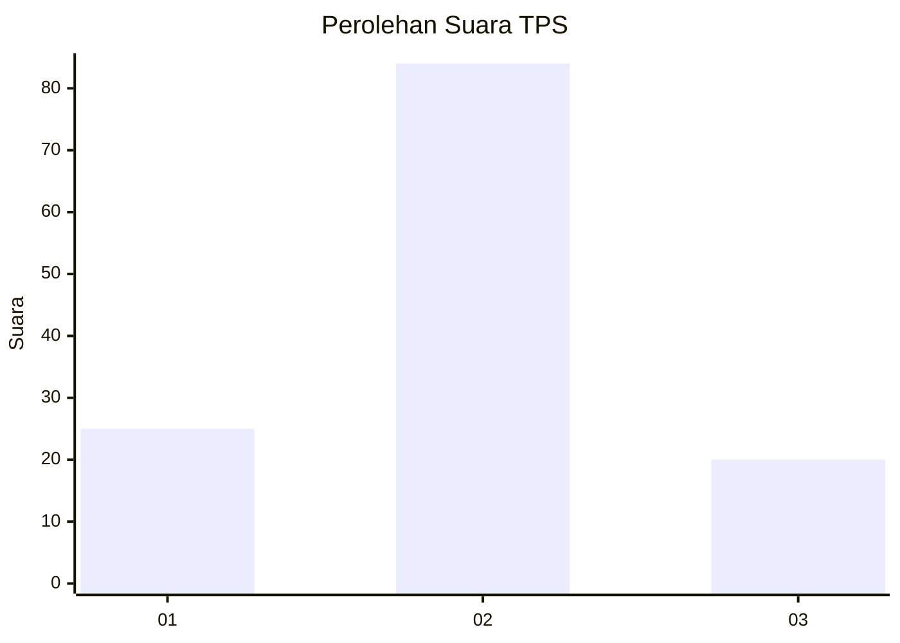
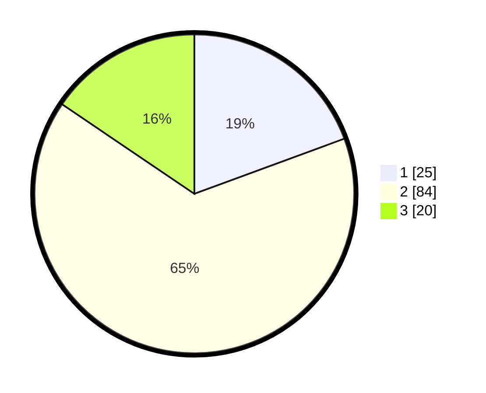

# Hasil

## Grafik

## Tabel

| No. | Nama Paslon    | Suara | Suara (raw) | Persentase |
|:--- |:-------------- | -----:| -----------:| ----------:|
| 1   | ANIES MUHAIMIN | 25    | [25][p-1]   | 19,38      |
| 2   | PRABOWO GIBRAN | 84    | [84][p-2]   | 65,12      |
| 3   | GANJAR MAHFUD  | 20    | [20][p-3]   | 15,50      |

[p-1]: https://github.com/gigit-pemilu/pemilu-2024-35-jawa-timur/blob/main/pilpres/hitung-suara/sub/35-jawa-timur/sub/09-jember/sub/19-kaliwates/sub/1006-kepatihan/sub/012-tps/sub/paslon-1.txt
[p-2]: https://github.com/gigit-pemilu/pemilu-2024-35-jawa-timur/blob/main/pilpres/hitung-suara/sub/35-jawa-timur/sub/09-jember/sub/19-kaliwates/sub/1006-kepatihan/sub/012-tps/sub/paslon-2.txt
[p-3]: https://github.com/gigit-pemilu/pemilu-2024-35-jawa-timur/blob/main/pilpres/hitung-suara/sub/35-jawa-timur/sub/09-jember/sub/19-kaliwates/sub/1006-kepatihan/sub/012-tps/sub/paslon-3.txt

## Foto C Plano

https://sirekap-obj-formc.kpu.go.id/bacb/pemilu/ppwp/35/09/19/10/06/3509191006012-20240214-235755--c74489f6-2e9a-48a2-95fc-fe6ac2397a98.jpg

https://sirekap-obj-formc.kpu.go.id/bacb/pemilu/ppwp/35/09/19/10/06/3509191006012-20240214-235934--a8bf8e44-0f7d-4592-b1f5-952572d70af5.jpg

https://sirekap-obj-formc.kpu.go.id/bacb/pemilu/ppwp/35/09/19/10/06/3509191006012-20240215-000115--904e794d-2d0a-4f49-9218-55afc3630a53.jpg

## Metadata

| Key        | Value               |
| ---------- | ------------------- |
| Time Stamp | 2024-02-16 14:30:33 |

