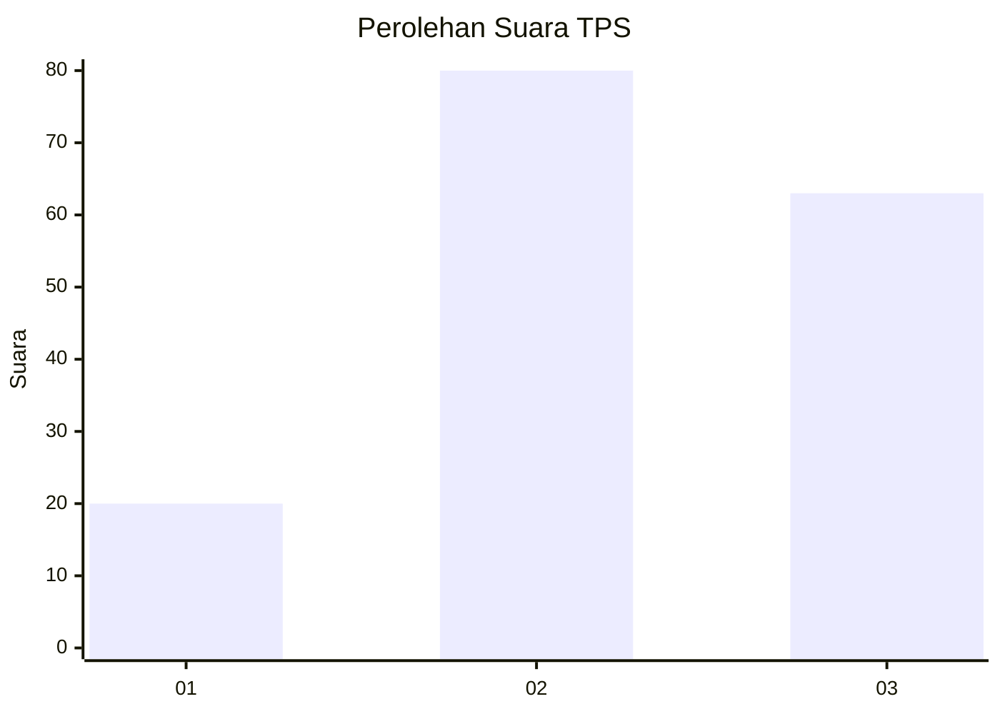
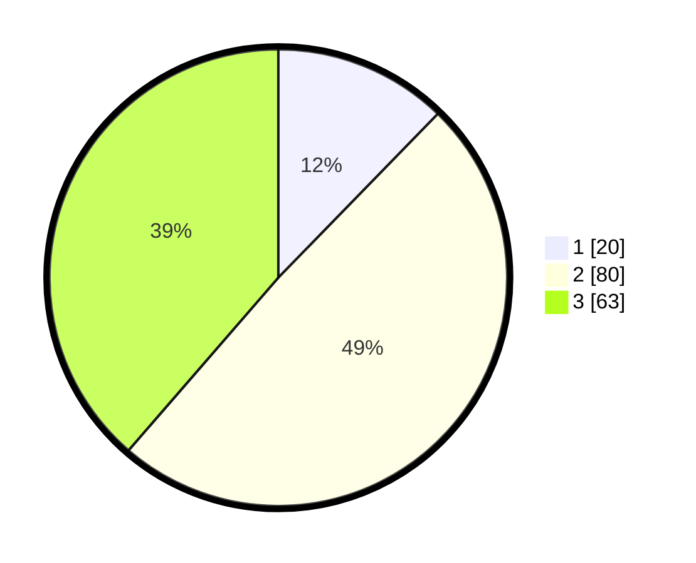

# Hasil

## Grafik

## Tabel

| No. | Nama Paslon    | Suara | Suara (raw) | Persentase |
|:--- |:-------------- | -----:| -----------:| ----------:|
| 1   | ANIES MUHAIMIN | 20    | [20][p-1]   | 12,27      |
| 2   | PRABOWO GIBRAN | 80    | [80][p-2]   | 49,08      |
| 3   | GANJAR MAHFUD  | 63    | [63][p-3]   | 38,65      |

[p-1]: https://github.com/gigit-pemilu/pemilu-2024/blob/main/pilpres/hitung-suara/sub/35-jawa-timur/sub/09-jember/sub/19-kaliwates/sub/1006-kepatihan/sub/026-tps/sub/paslon-1.txt
[p-2]: https://github.com/gigit-pemilu/pemilu-2024/blob/main/pilpres/hitung-suara/sub/35-jawa-timur/sub/09-jember/sub/19-kaliwates/sub/1006-kepatihan/sub/026-tps/sub/paslon-2.txt
[p-3]: https://github.com/gigit-pemilu/pemilu-2024/blob/main/pilpres/hitung-suara/sub/35-jawa-timur/sub/09-jember/sub/19-kaliwates/sub/1006-kepatihan/sub/026-tps/sub/paslon-3.txt

## Foto C Plano

https://sirekap-obj-formc.kpu.go.id/b77a/pemilu/ppwp/35/09/19/10/06/3509191006026-20240214-204951--98193960-692f-4f41-9990-2d8f3f35597b.jpg

https://sirekap-obj-formc.kpu.go.id/b77a/pemilu/ppwp/35/09/19/10/06/3509191006026-20240214-205107--f0b4e274-4e93-4495-b0cb-3a32ef02f69f.jpg

https://sirekap-obj-formc.kpu.go.id/b77a/pemilu/ppwp/35/09/19/10/06/3509191006026-20240214-205200--37bb7226-d991-42f2-8006-3797a9a37b74.jpg

## Metadata

| Key        | Value               |
| ---------- | ------------------- |
| Time Stamp | 2024-02-15 15:00:29 |

