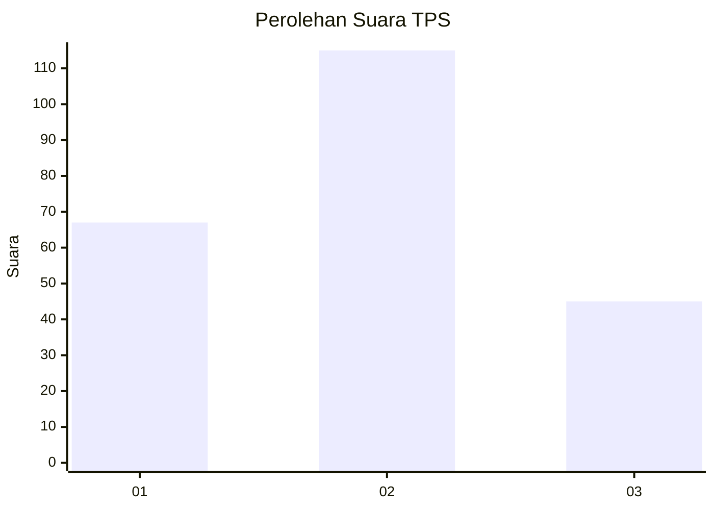
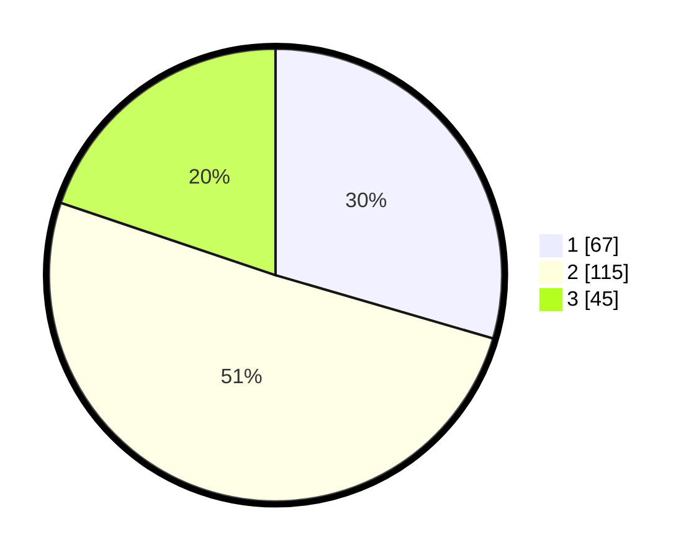

# Hasil

## Grafik

## Tabel

| No. | Nama Paslon    | Suara | Suara (raw) | Persentase |
|:--- |:-------------- | -----:| -----------:| ----------:|
| 1   | ANIES MUHAIMIN | 67    | [67][p-1]   | 29,52      |
| 2   | PRABOWO GIBRAN | 115   | [115][p-2]  | 50,66      |
| 3   | GANJAR MAHFUD  | 45    | [45][p-3]   | 19,82      |

[p-1]: https://github.com/gigit-pemilu/pemilu-2024/blob/main/pilpres/hitung-suara/sub/35-jawa-timur/sub/09-jember/sub/19-kaliwates/sub/1006-kepatihan/sub/033-tps/sub/paslon-1.txt
[p-2]: https://github.com/gigit-pemilu/pemilu-2024/blob/main/pilpres/hitung-suara/sub/35-jawa-timur/sub/09-jember/sub/19-kaliwates/sub/1006-kepatihan/sub/033-tps/sub/paslon-2.txt
[p-3]: https://github.com/gigit-pemilu/pemilu-2024/blob/main/pilpres/hitung-suara/sub/35-jawa-timur/sub/09-jember/sub/19-kaliwates/sub/1006-kepatihan/sub/033-tps/sub/paslon-3.txt

## Foto C Plano

https://sirekap-obj-formc.kpu.go.id/fea9/pemilu/ppwp/35/09/19/10/06/3509191006033-20240214-231402--20456758-9e3d-4c06-afa7-ff40e420181e.jpg

https://sirekap-obj-formc.kpu.go.id/fea9/pemilu/ppwp/35/09/19/10/06/3509191006033-20240214-231457--22ee8c81-7476-453a-b6cd-9887499f7046.jpg

https://sirekap-obj-formc.kpu.go.id/fea9/pemilu/ppwp/35/09/19/10/06/3509191006033-20240214-231543--2c2428a0-daa3-4917-98c5-f4a6849bf973.jpg

## Metadata

| Key        | Value               |
| ---------- | ------------------- |
| Time Stamp | 2024-02-15 16:30:25 |

