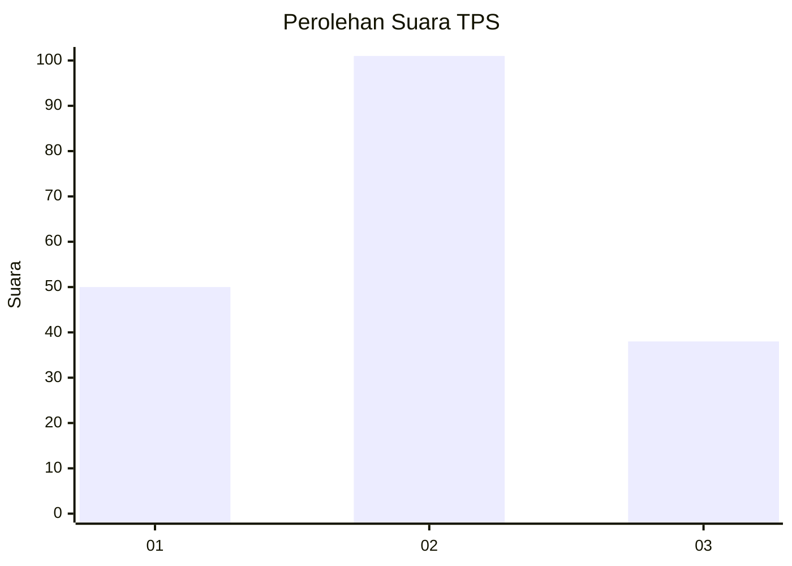
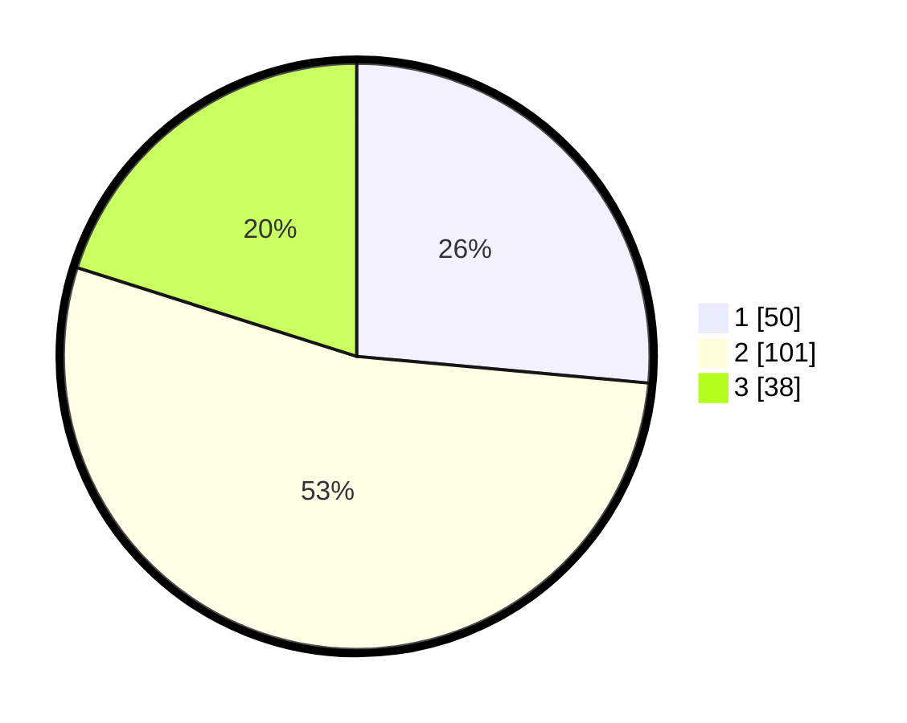

# Hasil

## Grafik

## Tabel

| No. | Nama Paslon    | Suara | Suara (raw) | Persentase |
|:--- |:-------------- | -----:| -----------:| ----------:|
| 1   | ANIES MUHAIMIN | 50    | [50][p-1]   | 26,46      |
| 2   | PRABOWO GIBRAN | 101   | [101][p-2]  | 53,44      |
| 3   | GANJAR MAHFUD  | 38    | [38][p-3]   | 20,11      |

[p-1]: https://github.com/gigit-pemilu/pemilu-2024-35-jawa-timur/blob/main/pilpres/hitung-suara/sub/35-jawa-timur/sub/09-jember/sub/19-kaliwates/sub/1006-kepatihan/sub/037-tps/sub/paslon-1.txt
[p-2]: https://github.com/gigit-pemilu/pemilu-2024-35-jawa-timur/blob/main/pilpres/hitung-suara/sub/35-jawa-timur/sub/09-jember/sub/19-kaliwates/sub/1006-kepatihan/sub/037-tps/sub/paslon-2.txt
[p-3]: https://github.com/gigit-pemilu/pemilu-2024-35-jawa-timur/blob/main/pilpres/hitung-suara/sub/35-jawa-timur/sub/09-jember/sub/19-kaliwates/sub/1006-kepatihan/sub/037-tps/sub/paslon-3.txt

## Foto C Plano

https://sirekap-obj-formc.kpu.go.id/caaf/pemilu/ppwp/35/09/19/10/06/3509191006037-20240215-015637--4c0423cf-aac8-44cd-9fc7-425b38095c99.jpg

https://sirekap-obj-formc.kpu.go.id/caaf/pemilu/ppwp/35/09/19/10/06/3509191006037-20240214-203834--da55d892-fa0d-4f6d-b724-00ba0dff035d.jpg

https://sirekap-obj-formc.kpu.go.id/caaf/pemilu/ppwp/35/09/19/10/06/3509191006037-20240214-203845--82480cc6-1caa-4759-8e65-676b3091bc31.jpg

## Metadata

| Key        | Value               |
| ---------- | ------------------- |
| Time Stamp | 2024-02-15 03:06:03 |

