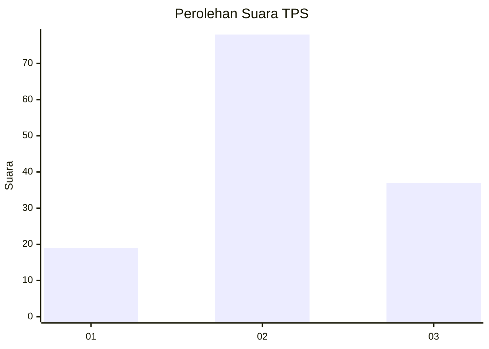
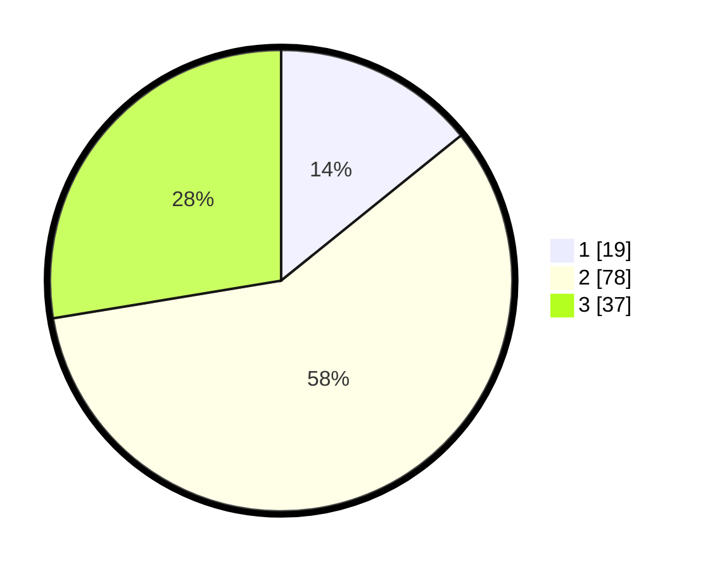

# Hasil

## Grafik

## Tabel

| No. | Nama Paslon    | Suara | Suara (raw) | Persentase |
|:--- |:-------------- | -----:| -----------:| ----------:|
| 1   | ANIES MUHAIMIN | 19    | [19][p-1]   | 14,18      |
| 2   | PRABOWO GIBRAN | 78    | [78][p-2]   | 58,21      |
| 3   | GANJAR MAHFUD  | 37    | [37][p-3]   | 27,61      |

[p-1]: https://github.com/gigit-pemilu/pemilu-2024-35-jawa-timur/blob/main/pilpres/hitung-suara/sub/35-jawa-timur/sub/09-jember/sub/19-kaliwates/sub/1006-kepatihan/sub/049-tps/sub/paslon-1.txt
[p-2]: https://github.com/gigit-pemilu/pemilu-2024-35-jawa-timur/blob/main/pilpres/hitung-suara/sub/35-jawa-timur/sub/09-jember/sub/19-kaliwates/sub/1006-kepatihan/sub/049-tps/sub/paslon-2.txt
[p-3]: https://github.com/gigit-pemilu/pemilu-2024-35-jawa-timur/blob/main/pilpres/hitung-suara/sub/35-jawa-timur/sub/09-jember/sub/19-kaliwates/sub/1006-kepatihan/sub/049-tps/sub/paslon-3.txt

## Foto C Plano

https://sirekap-obj-formc.kpu.go.id/f872/pemilu/ppwp/35/09/19/10/06/3509191006049-20240216-175635--0de61057-5b04-4eb4-b12a-1985d6b0c790.jpg

https://sirekap-obj-formc.kpu.go.id/f872/pemilu/ppwp/35/09/19/10/06/3509191006049-20240217-153121--2f9a1e6e-1ff3-411c-8229-f1857f2d7924.jpg

https://sirekap-obj-formc.kpu.go.id/f872/pemilu/ppwp/35/09/19/10/06/3509191006049-20240216-133411--7b1f38bd-f313-485e-9a82-74850d9e02dd.jpg

## Metadata

| Key        | Value               |
| ---------- | ------------------- |
| Time Stamp | 2024-02-21 18:00:00 |

