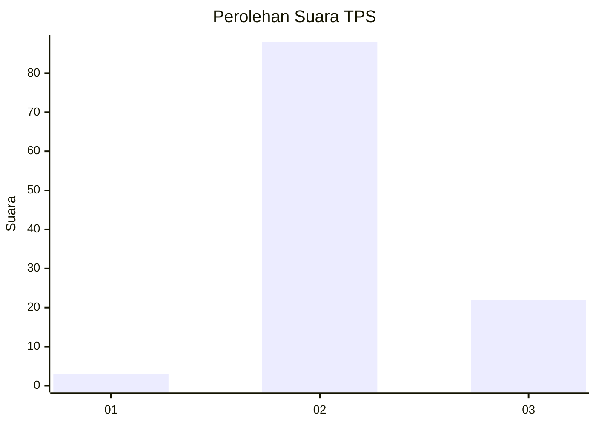
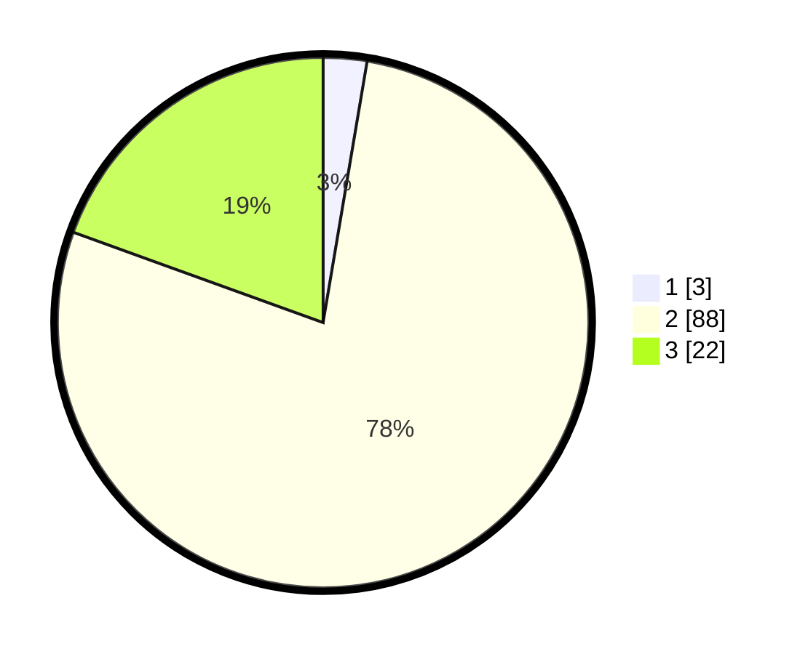

# Hasil

## Grafik

## Tabel

| No. | Nama Paslon    | Suara | Suara (raw) | Persentase |
|:--- |:-------------- | -----:| -----------:| ----------:|
| 1   | ANIES MUHAIMIN | 3     | [3][p-1]    | 2,65       |
| 2   | PRABOWO GIBRAN | 88    | [88][p-2]   | 77,88      |
| 3   | GANJAR MAHFUD  | 22    | [22][p-3]   | 19,47      |

[p-1]: https://github.com/gigit-pemilu/pemilu-2024-35-jawa-timur/blob/main/pilpres/hitung-suara/sub/35-jawa-timur/sub/09-jember/sub/19-kaliwates/sub/1006-kepatihan/sub/050-tps/sub/paslon-1.txt
[p-2]: https://github.com/gigit-pemilu/pemilu-2024-35-jawa-timur/blob/main/pilpres/hitung-suara/sub/35-jawa-timur/sub/09-jember/sub/19-kaliwates/sub/1006-kepatihan/sub/050-tps/sub/paslon-2.txt
[p-3]: https://github.com/gigit-pemilu/pemilu-2024-35-jawa-timur/blob/main/pilpres/hitung-suara/sub/35-jawa-timur/sub/09-jember/sub/19-kaliwates/sub/1006-kepatihan/sub/050-tps/sub/paslon-3.txt

## Foto C Plano

https://sirekap-obj-formc.kpu.go.id/605d/pemilu/ppwp/35/09/19/10/06/3509191006050-20240214-224333--52fc23ea-5d75-4a1a-9707-e9352559746e.jpg

https://sirekap-obj-formc.kpu.go.id/605d/pemilu/ppwp/35/09/19/10/06/3509191006050-20240214-224506--5aaba893-384e-4754-a7e9-e9ed3a15fc04.jpg

https://sirekap-obj-formc.kpu.go.id/605d/pemilu/ppwp/35/09/19/10/06/3509191006050-20240214-224724--a9472bff-b47e-4c1a-86d9-c040d3edf6cc.jpg

## Metadata

| Key        | Value               |
| ---------- | ------------------- |
| Time Stamp | 2024-02-15 20:30:46 |

