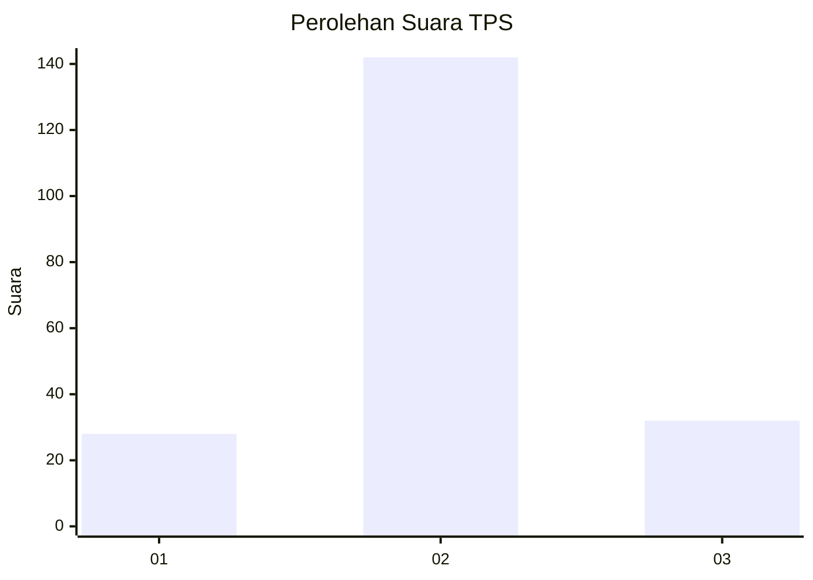

# Hasil

## Grafik

## Tabel

| No. | Nama Paslon    | Suara | Suara (raw) | Persentase |
|:--- |:-------------- | -----:| -----------:| ----------:|
| 1   | ANIES MUHAIMIN | 28    | [28][p-1]   | 13,86      |
| 2   | PRABOWO GIBRAN | 142   | [142][p-2]  | 70,30      |
| 3   | GANJAR MAHFUD  | 32    | [32][p-3]   | 15,84      |

[p-1]: https://github.com/gigit-pemilu/pemilu-2024/blob/main/pilpres/hitung-suara/sub/35-jawa-timur/sub/09-jember/sub/19-kaliwates/sub/1007-tegalbesar/sub/003-tps/sub/paslon-1.txt
[p-2]: https://github.com/gigit-pemilu/pemilu-2024/blob/main/pilpres/hitung-suara/sub/35-jawa-timur/sub/09-jember/sub/19-kaliwates/sub/1007-tegalbesar/sub/003-tps/sub/paslon-2.txt
[p-3]: https://github.com/gigit-pemilu/pemilu-2024/blob/main/pilpres/hitung-suara/sub/35-jawa-timur/sub/09-jember/sub/19-kaliwates/sub/1007-tegalbesar/sub/003-tps/sub/paslon-3.txt

## Foto C Plano

https://sirekap-obj-formc.kpu.go.id/7912/pemilu/ppwp/35/09/19/10/07/3509191007003-20240214-223554--e3e0c269-204f-4a00-8aad-18be32cfab20.jpg

https://sirekap-obj-formc.kpu.go.id/7912/pemilu/ppwp/35/09/19/10/07/3509191007003-20240215-082838--d4c5b21b-748c-4cfe-b2a7-bb26be0d10da.jpg

https://sirekap-obj-formc.kpu.go.id/7912/pemilu/ppwp/35/09/19/10/07/3509191007003-20240214-223723--87b2429b-52b2-458d-877a-8dee0cb71296.jpg

## Metadata

| Key        | Value               |
| ---------- | ------------------- |
| Time Stamp | 2024-02-17 09:00:02 |

