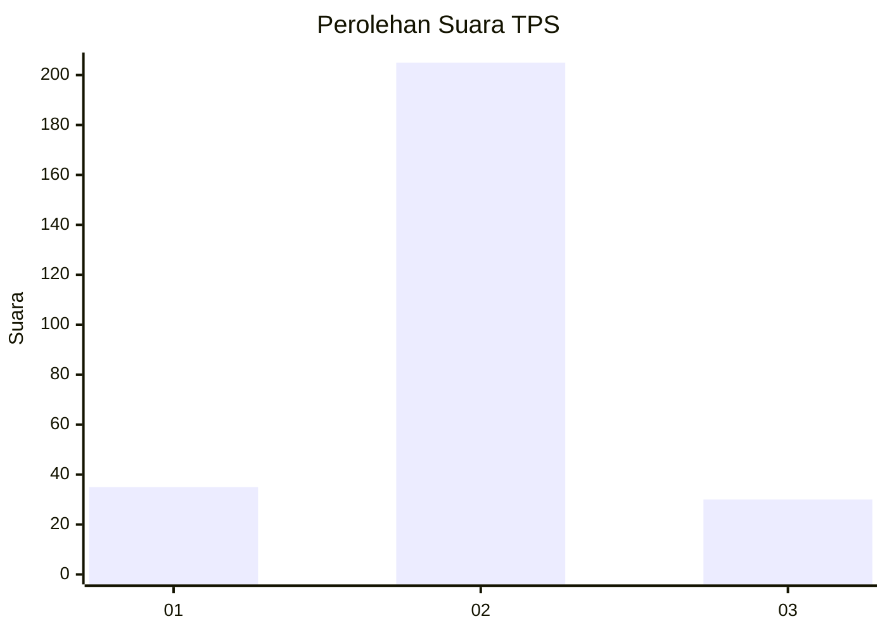
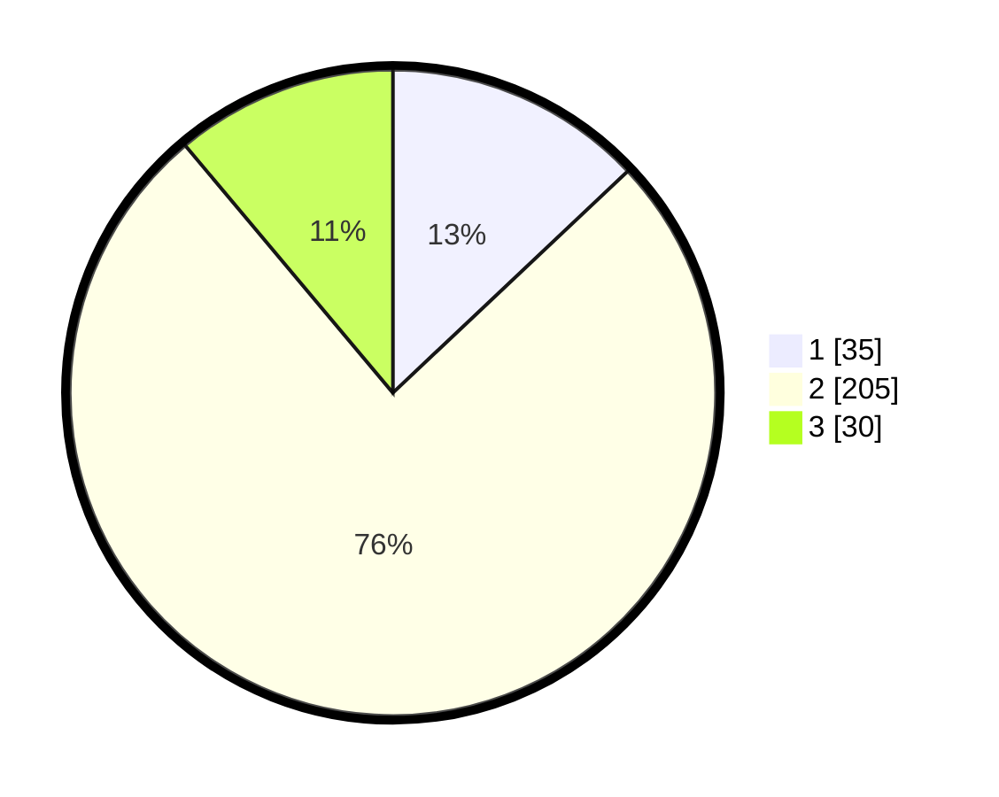

# Hasil

## Grafik

## Tabel

| No. | Nama Paslon    | Suara | Suara (raw) | Persentase |
|:--- |:-------------- | -----:| -----------:| ----------:|
| 1   | ANIES MUHAIMIN | 35    | [35][p-1]   | 12,96      |
| 2   | PRABOWO GIBRAN | 205   | [205][p-2]  | 75,93      |
| 3   | GANJAR MAHFUD  | 30    | [30][p-3]   | 11,11      |

[p-1]: https://github.com/gigit-pemilu/pemilu-2024/blob/main/pilpres/hitung-suara/sub/35-jawa-timur/sub/09-jember/sub/19-kaliwates/sub/1007-tegalbesar/sub/031-tps/sub/paslon-1.txt
[p-2]: https://github.com/gigit-pemilu/pemilu-2024/blob/main/pilpres/hitung-suara/sub/35-jawa-timur/sub/09-jember/sub/19-kaliwates/sub/1007-tegalbesar/sub/031-tps/sub/paslon-2.txt
[p-3]: https://github.com/gigit-pemilu/pemilu-2024/blob/main/pilpres/hitung-suara/sub/35-jawa-timur/sub/09-jember/sub/19-kaliwates/sub/1007-tegalbesar/sub/031-tps/sub/paslon-3.txt

## Foto C Plano

https://sirekap-obj-formc.kpu.go.id/cee6/pemilu/ppwp/35/09/19/10/07/3509191007031-20240215-055600--483c6f14-ec9a-4cbc-af70-5160c1534122.jpg

https://sirekap-obj-formc.kpu.go.id/cee6/pemilu/ppwp/35/09/19/10/07/3509191007031-20240215-055659--a2f0ca11-fdfd-4341-845b-029c9c7c63f7.jpg

https://sirekap-obj-formc.kpu.go.id/cee6/pemilu/ppwp/35/09/19/10/07/3509191007031-20240215-055829--574b0c6e-107e-4271-94d8-90061956524c.jpg

## Metadata

| Key        | Value               |
| ---------- | ------------------- |
| Time Stamp | 2024-02-15 19:00:26 |

