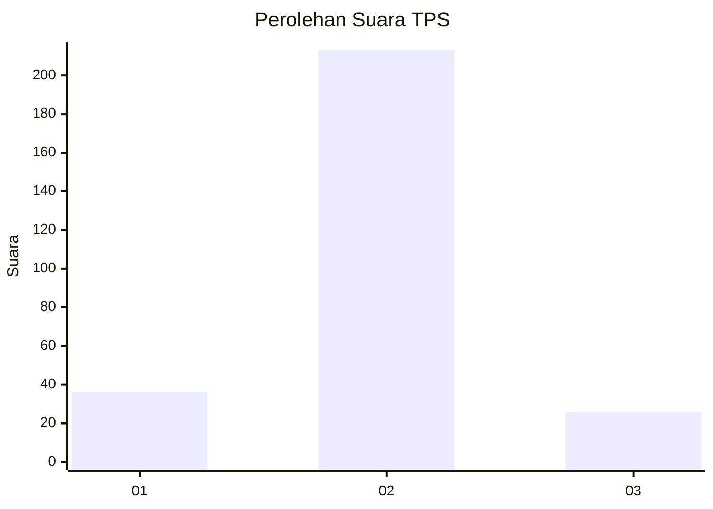
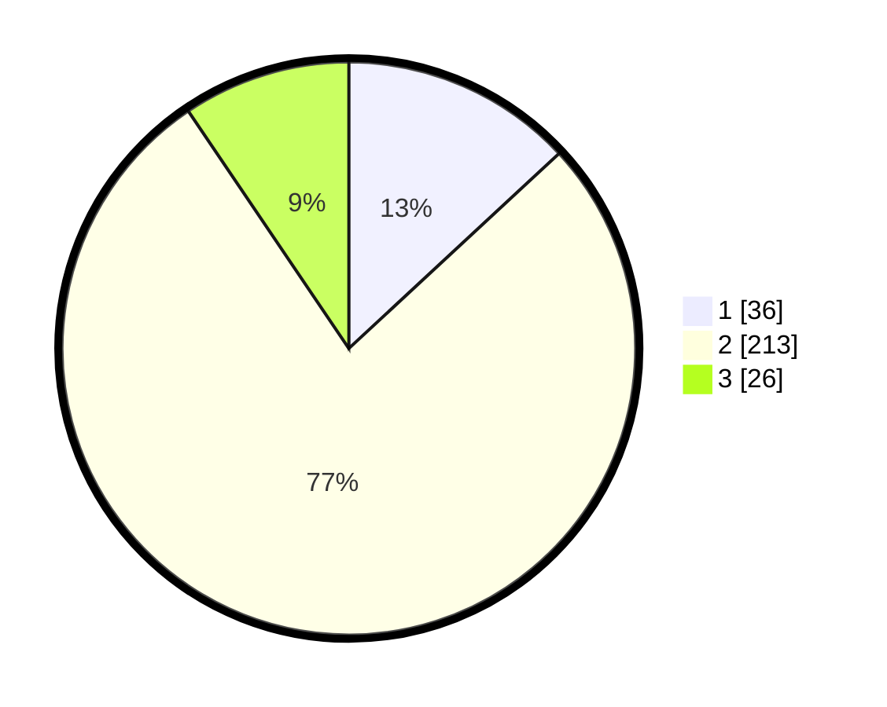

# Hasil

## Grafik

## Tabel

| No. | Nama Paslon    | Suara | Suara (raw) | Persentase |
|:--- |:-------------- | -----:| -----------:| ----------:|
| 1   | ANIES MUHAIMIN | 36    | [36][p-1]   | 13,09      |
| 2   | PRABOWO GIBRAN | 213   | [213][p-2]  | 77,45      |
| 3   | GANJAR MAHFUD  | 26    | [26][p-3]   | 9,45       |

[p-1]: https://github.com/gigit-pemilu/pemilu-2024/blob/main/pilpres/hitung-suara/sub/35-jawa-timur/sub/09-jember/sub/19-kaliwates/sub/1007-tegalbesar/sub/033-tps/sub/paslon-1.txt
[p-2]: https://github.com/gigit-pemilu/pemilu-2024/blob/main/pilpres/hitung-suara/sub/35-jawa-timur/sub/09-jember/sub/19-kaliwates/sub/1007-tegalbesar/sub/033-tps/sub/paslon-2.txt
[p-3]: https://github.com/gigit-pemilu/pemilu-2024/blob/main/pilpres/hitung-suara/sub/35-jawa-timur/sub/09-jember/sub/19-kaliwates/sub/1007-tegalbesar/sub/033-tps/sub/paslon-3.txt

## Foto C Plano

https://sirekap-obj-formc.kpu.go.id/067e/pemilu/ppwp/35/09/19/10/07/3509191007033-20240214-204714--99e0b2c5-3173-4e13-b4d6-764c951d13ae.jpg

https://sirekap-obj-formc.kpu.go.id/067e/pemilu/ppwp/35/09/19/10/07/3509191007033-20240214-204853--8f67f7ec-3437-4240-98c1-f10db7538005.jpg

https://sirekap-obj-formc.kpu.go.id/067e/pemilu/ppwp/35/09/19/10/07/3509191007033-20240214-204856--7d90a711-2cc3-4047-bf3c-c840117bb452.jpg

## Metadata

| Key        | Value               |
| ---------- | ------------------- |
| Time Stamp | 2024-02-15 17:00:25 |

