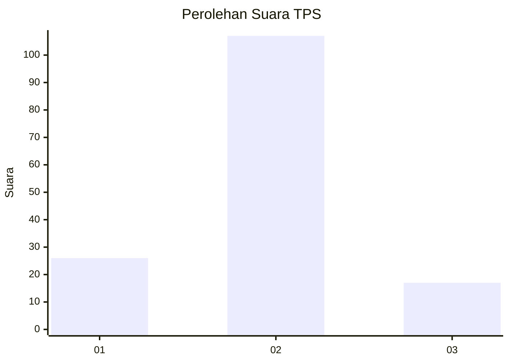
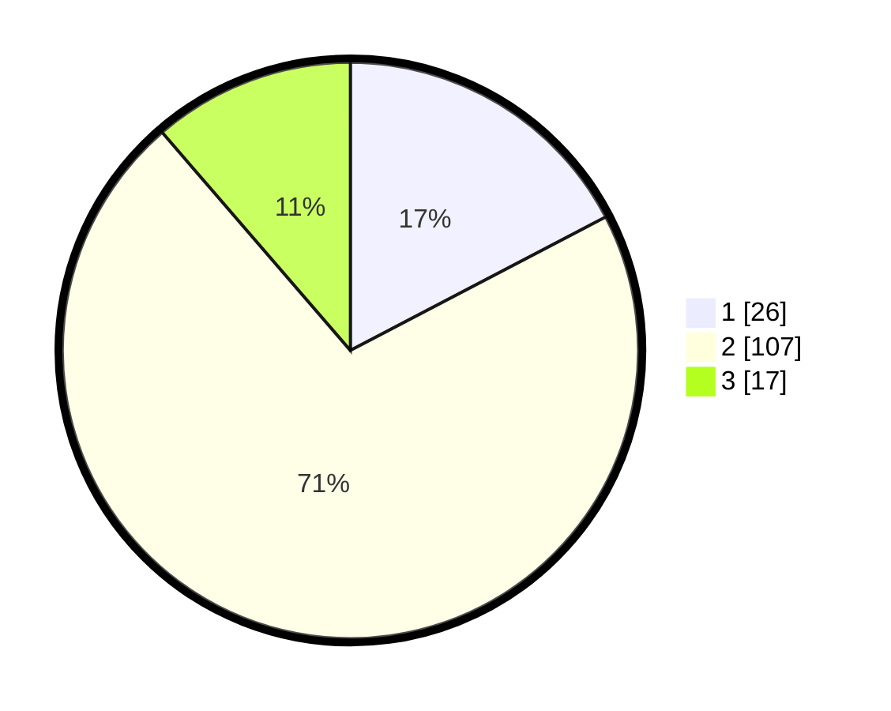

# Hasil

## Grafik

## Tabel

| No. | Nama Paslon    | Suara | Suara (raw) | Persentase |
|:--- |:-------------- | -----:| -----------:| ----------:|
| 1   | ANIES MUHAIMIN | 26    | [26][p-1]   | 17,33      |
| 2   | PRABOWO GIBRAN | 107   | [107][p-2]  | 71,33      |
| 3   | GANJAR MAHFUD  | 17    | [17][p-3]   | 11,33      |

[p-1]: https://github.com/gigit-pemilu/pemilu-2024/blob/main/pilpres/hitung-suara/sub/35-jawa-timur/sub/09-jember/sub/19-kaliwates/sub/1007-tegalbesar/sub/039-tps/sub/paslon-1.txt
[p-2]: https://github.com/gigit-pemilu/pemilu-2024/blob/main/pilpres/hitung-suara/sub/35-jawa-timur/sub/09-jember/sub/19-kaliwates/sub/1007-tegalbesar/sub/039-tps/sub/paslon-2.txt
[p-3]: https://github.com/gigit-pemilu/pemilu-2024/blob/main/pilpres/hitung-suara/sub/35-jawa-timur/sub/09-jember/sub/19-kaliwates/sub/1007-tegalbesar/sub/039-tps/sub/paslon-3.txt

## Foto C Plano

https://sirekap-obj-formc.kpu.go.id/82e3/pemilu/ppwp/35/09/19/10/07/3509191007039-20240214-231826--ff6cf62c-294a-4059-b671-71128cc4d0b1.jpg

https://sirekap-obj-formc.kpu.go.id/82e3/pemilu/ppwp/35/09/19/10/07/3509191007039-20240214-225310--0d932339-175b-4b4d-9142-9b049a2b6e65.jpg

https://sirekap-obj-formc.kpu.go.id/82e3/pemilu/ppwp/35/09/19/10/07/3509191007039-20240214-225537--aa83118e-e497-4a13-9b56-6c2a28b19470.jpg

## Metadata

| Key        | Value               |
| ---------- | ------------------- |
| Time Stamp | 2024-02-15 15:00:29 |

