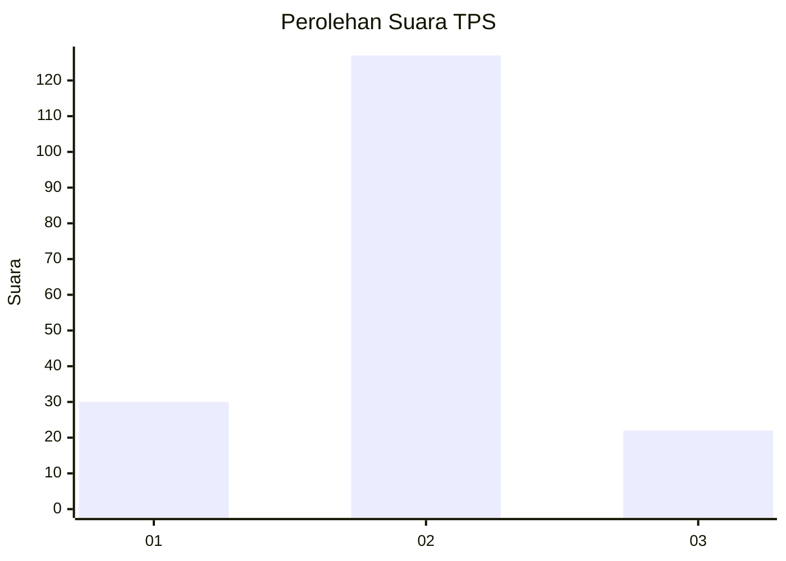
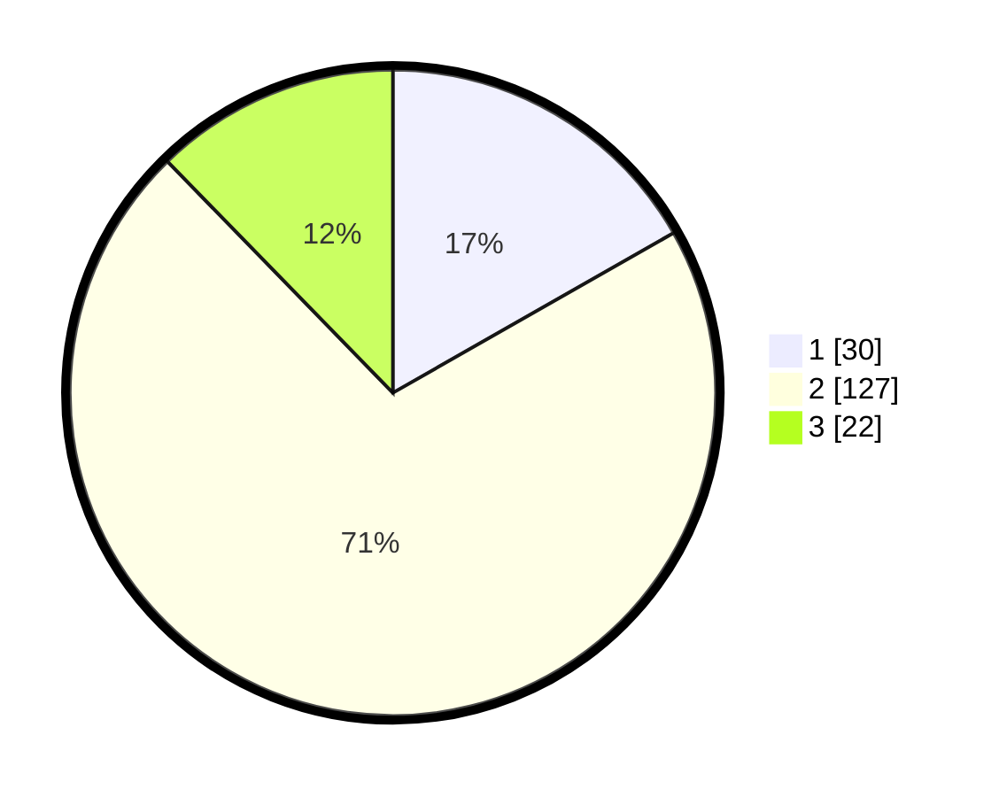

# Hasil

## Grafik

## Tabel

| No. | Nama Paslon    | Suara | Suara (raw) | Persentase |
|:--- |:-------------- | -----:| -----------:| ----------:|
| 1   | ANIES MUHAIMIN | 30    | [30][p-1]   | 16,76      |
| 2   | PRABOWO GIBRAN | 127   | [127][p-2]  | 70,95      |
| 3   | GANJAR MAHFUD  | 22    | [22][p-3]   | 12,29      |

[p-1]: https://github.com/gigit-pemilu/pemilu-2024-35-jawa-timur/blob/main/pilpres/hitung-suara/sub/35-jawa-timur/sub/09-jember/sub/19-kaliwates/sub/1007-tegalbesar/sub/041-tps/sub/paslon-1.txt
[p-2]: https://github.com/gigit-pemilu/pemilu-2024-35-jawa-timur/blob/main/pilpres/hitung-suara/sub/35-jawa-timur/sub/09-jember/sub/19-kaliwates/sub/1007-tegalbesar/sub/041-tps/sub/paslon-2.txt
[p-3]: https://github.com/gigit-pemilu/pemilu-2024-35-jawa-timur/blob/main/pilpres/hitung-suara/sub/35-jawa-timur/sub/09-jember/sub/19-kaliwates/sub/1007-tegalbesar/sub/041-tps/sub/paslon-3.txt

## Foto C Plano

https://sirekap-obj-formc.kpu.go.id/33d6/pemilu/ppwp/35/09/19/10/07/3509191007041-20240216-234647--594764c7-c192-4aed-a53f-7eb600bf2ccc.jpg

https://sirekap-obj-formc.kpu.go.id/33d6/pemilu/ppwp/35/09/19/10/07/3509191007041-20240214-225941--2b140245-051c-4200-b983-ec070a5ef438.jpg

https://sirekap-obj-formc.kpu.go.id/33d6/pemilu/ppwp/35/09/19/10/07/3509191007041-20240214-225831--8650de86-2c8b-4717-8cca-1e1d0071760f.jpg

## Metadata

| Key        | Value               |
| ---------- | ------------------- |
| Time Stamp | 2024-02-17 00:00:00 |

