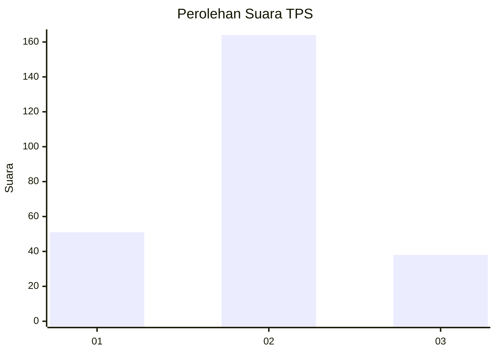
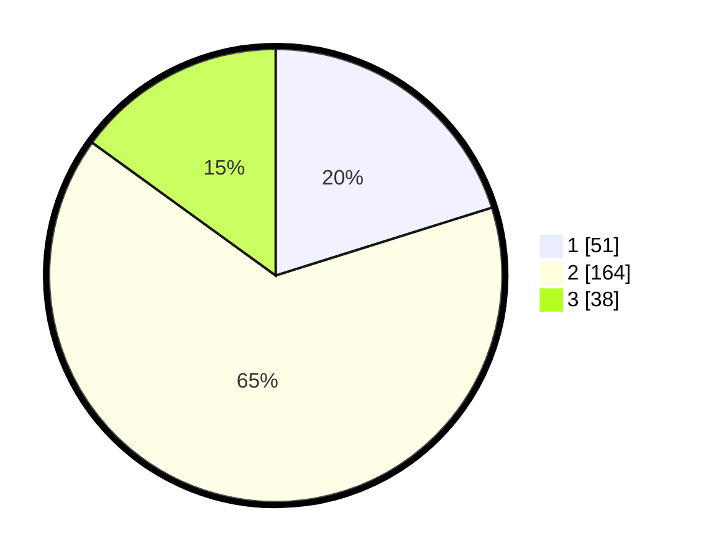

# Hasil

## Grafik

## Tabel

| No. | Nama Paslon    | Suara | Suara (raw) | Persentase |
|:--- |:-------------- | -----:| -----------:| ----------:|
| 1   | ANIES MUHAIMIN | 51    | [51][p-1]   | 20,16      |
| 2   | PRABOWO GIBRAN | 164   | [164][p-2]  | 64,82      |
| 3   | GANJAR MAHFUD  | 38    | [38][p-3]   | 15,02      |

[p-1]: https://github.com/gigit-pemilu/pemilu-2024-35-jawa-timur/blob/main/pilpres/hitung-suara/sub/35-jawa-timur/sub/09-jember/sub/19-kaliwates/sub/1007-tegalbesar/sub/043-tps/sub/paslon-1.txt
[p-2]: https://github.com/gigit-pemilu/pemilu-2024-35-jawa-timur/blob/main/pilpres/hitung-suara/sub/35-jawa-timur/sub/09-jember/sub/19-kaliwates/sub/1007-tegalbesar/sub/043-tps/sub/paslon-2.txt
[p-3]: https://github.com/gigit-pemilu/pemilu-2024-35-jawa-timur/blob/main/pilpres/hitung-suara/sub/35-jawa-timur/sub/09-jember/sub/19-kaliwates/sub/1007-tegalbesar/sub/043-tps/sub/paslon-3.txt

## Foto C Plano

https://sirekap-obj-formc.kpu.go.id/eed2/pemilu/ppwp/35/09/19/10/07/3509191007043-20240214-233029--454b0cbd-4e79-4030-af6b-7fb2fd6ef056.jpg

https://sirekap-obj-formc.kpu.go.id/eed2/pemilu/ppwp/35/09/19/10/07/3509191007043-20240214-233113--e0611748-30dd-4202-aac7-4cef325ac4c4.jpg

https://sirekap-obj-formc.kpu.go.id/eed2/pemilu/ppwp/35/09/19/10/07/3509191007043-20240214-233244--66083ffd-a83a-48a4-9b41-248cd4198ae1.jpg

## Metadata

| Key        | Value               |
| ---------- | ------------------- |
| Time Stamp | 2024-02-15 17:00:25 |

