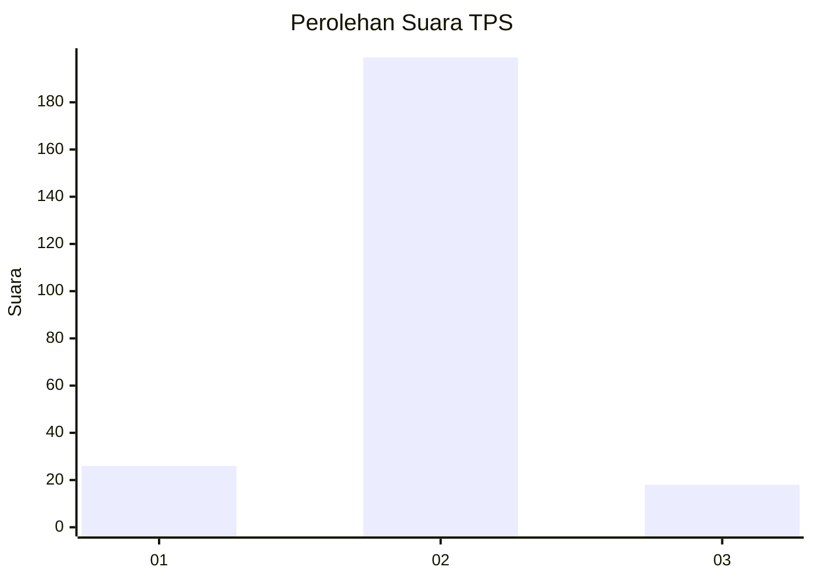
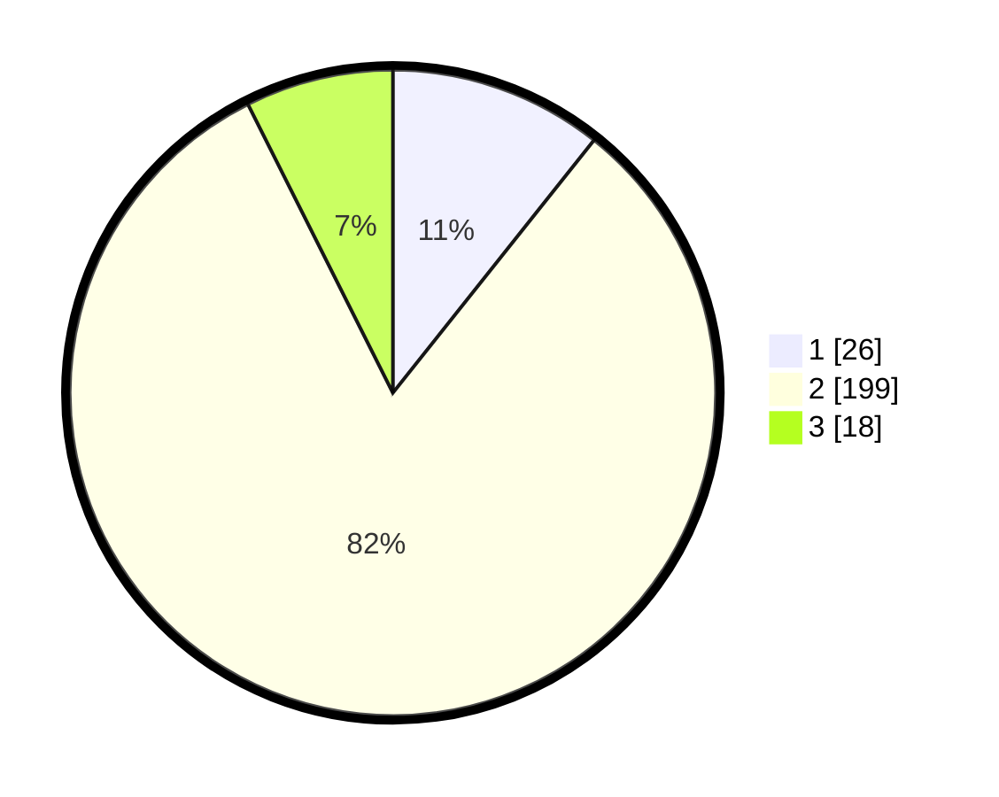

# Hasil

## Grafik

## Tabel

| No. | Nama Paslon    | Suara | Suara (raw) | Persentase |
|:--- |:-------------- | -----:| -----------:| ----------:|
| 1   | ANIES MUHAIMIN | 26    | [26][p-1]   | 10,70      |
| 2   | PRABOWO GIBRAN | 199   | [199][p-2]  | 81,89      |
| 3   | GANJAR MAHFUD  | 18    | [18][p-3]   | 7,41       |

[p-1]: https://github.com/gigit-pemilu/pemilu-2024-35-jawa-timur/blob/main/pilpres/hitung-suara/sub/35-jawa-timur/sub/09-jember/sub/19-kaliwates/sub/1007-tegalbesar/sub/054-tps/sub/paslon-1.txt
[p-2]: https://github.com/gigit-pemilu/pemilu-2024-35-jawa-timur/blob/main/pilpres/hitung-suara/sub/35-jawa-timur/sub/09-jember/sub/19-kaliwates/sub/1007-tegalbesar/sub/054-tps/sub/paslon-2.txt
[p-3]: https://github.com/gigit-pemilu/pemilu-2024-35-jawa-timur/blob/main/pilpres/hitung-suara/sub/35-jawa-timur/sub/09-jember/sub/19-kaliwates/sub/1007-tegalbesar/sub/054-tps/sub/paslon-3.txt

## Foto C Plano

https://sirekap-obj-formc.kpu.go.id/c528/pemilu/ppwp/35/09/19/10/07/3509191007054-20240217-070219--acd645e1-beca-4726-957c-deb764d51fc3.jpg

https://sirekap-obj-formc.kpu.go.id/c528/pemilu/ppwp/35/09/19/10/07/3509191007054-20240217-070257--0f729cbd-4f15-41f8-92ec-c1c5ef67e463.jpg

https://sirekap-obj-formc.kpu.go.id/c528/pemilu/ppwp/35/09/19/10/07/3509191007054-20240217-070402--37d229c8-0c61-4825-a02c-652575eef2ab.jpg

## Metadata

| Key        | Value               |
| ---------- | ------------------- |
| Time Stamp | 2024-02-25 15:00:00 |

