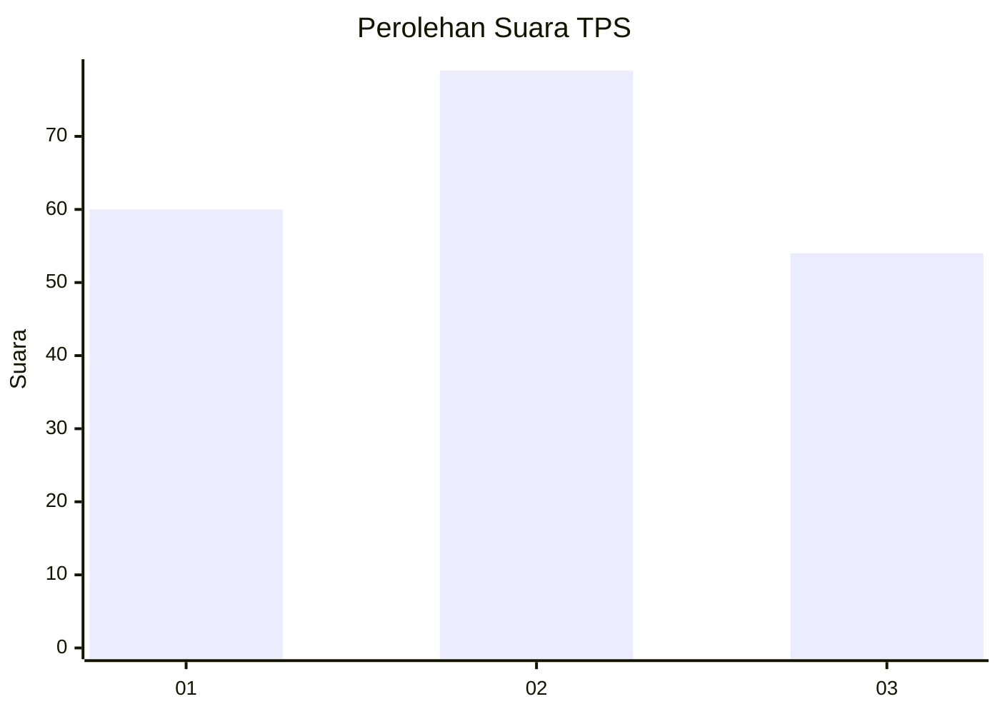
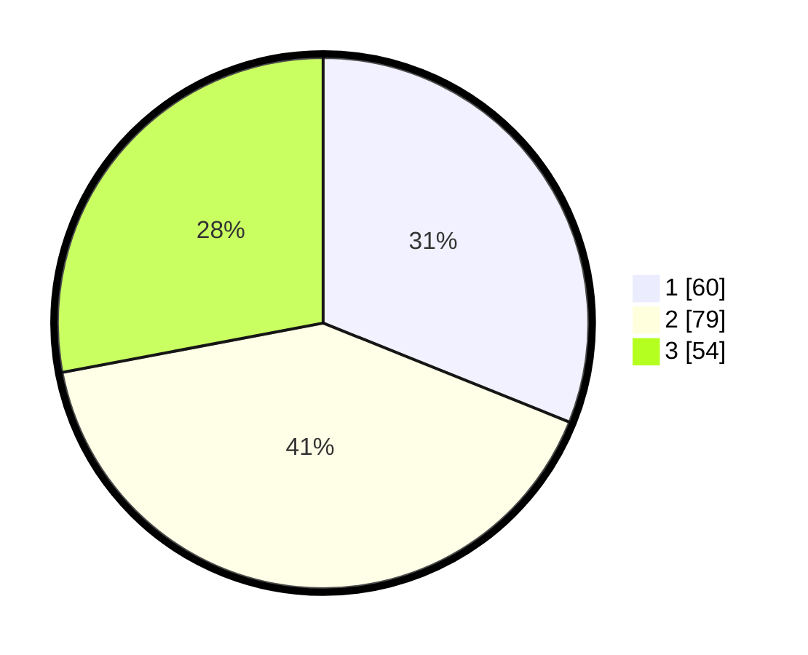

# Hasil

## Grafik

## Tabel

| No. | Nama Paslon    | Suara | Suara (raw) | Persentase |
|:--- |:-------------- | -----:| -----------:| ----------:|
| 1   | ANIES MUHAIMIN | 60    | [60][p-1]   | 31,09      |
| 2   | PRABOWO GIBRAN | 79    | [79][p-2]   | 40,93      |
| 3   | GANJAR MAHFUD  | 54    | [54][p-3]   | 27,98      |

[p-1]: https://github.com/gigit-pemilu/pemilu-2024/blob/main/pilpres/hitung-suara/sub/35-jawa-timur/sub/09-jember/sub/19-kaliwates/sub/1007-tegalbesar/sub/069-tps/sub/paslon-1.txt
[p-2]: https://github.com/gigit-pemilu/pemilu-2024/blob/main/pilpres/hitung-suara/sub/35-jawa-timur/sub/09-jember/sub/19-kaliwates/sub/1007-tegalbesar/sub/069-tps/sub/paslon-2.txt
[p-3]: https://github.com/gigit-pemilu/pemilu-2024/blob/main/pilpres/hitung-suara/sub/35-jawa-timur/sub/09-jember/sub/19-kaliwates/sub/1007-tegalbesar/sub/069-tps/sub/paslon-3.txt

## Foto C Plano

https://sirekap-obj-formc.kpu.go.id/a2ed/pemilu/ppwp/35/09/19/10/07/3509191007069-20240215-014211--71307511-5617-426b-84d2-eb6d7459eae0.jpg

https://sirekap-obj-formc.kpu.go.id/a2ed/pemilu/ppwp/35/09/19/10/07/3509191007069-20240215-014412--4ed1926f-9bed-44c2-b28c-737d6eeb2292.jpg

https://sirekap-obj-formc.kpu.go.id/a2ed/pemilu/ppwp/35/09/19/10/07/3509191007069-20240215-014609--5a424779-ca36-4f6d-ac01-6b36d956a11b.jpg

## Metadata

| Key        | Value               |
| ---------- | ------------------- |
| Time Stamp | 2024-02-15 23:29:50 |

