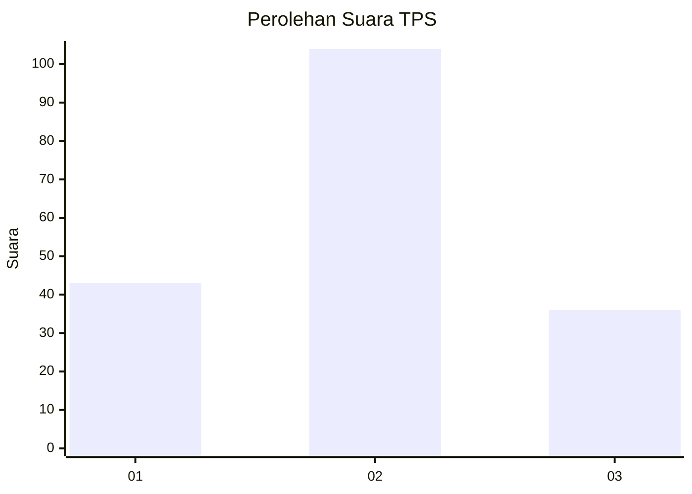
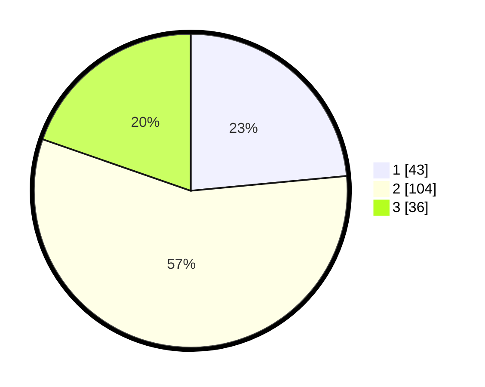

# Hasil

## Grafik

## Tabel

| No. | Nama Paslon    | Suara | Suara (raw) | Persentase |
|:--- |:-------------- | -----:| -----------:| ----------:|
| 1   | ANIES MUHAIMIN | 43    | [43][p-1]   | 23,50      |
| 2   | PRABOWO GIBRAN | 104   | [104][p-2]  | 56,83      |
| 3   | GANJAR MAHFUD  | 36    | [36][p-3]   | 19,67      |

[p-1]: https://github.com/gigit-pemilu/pemilu-2024-35-jawa-timur/blob/main/pilpres/hitung-suara/sub/35-jawa-timur/sub/09-jember/sub/19-kaliwates/sub/1007-tegalbesar/sub/072-tps/sub/paslon-1.txt
[p-2]: https://github.com/gigit-pemilu/pemilu-2024-35-jawa-timur/blob/main/pilpres/hitung-suara/sub/35-jawa-timur/sub/09-jember/sub/19-kaliwates/sub/1007-tegalbesar/sub/072-tps/sub/paslon-2.txt
[p-3]: https://github.com/gigit-pemilu/pemilu-2024-35-jawa-timur/blob/main/pilpres/hitung-suara/sub/35-jawa-timur/sub/09-jember/sub/19-kaliwates/sub/1007-tegalbesar/sub/072-tps/sub/paslon-3.txt

## Foto C Plano

https://sirekap-obj-formc.kpu.go.id/1cfc/pemilu/ppwp/35/09/19/10/07/3509191007072-20240217-112202--028d74cb-44d4-4a67-8d0d-80306745d6b0.jpg

https://sirekap-obj-formc.kpu.go.id/1cfc/pemilu/ppwp/35/09/19/10/07/3509191007072-20240217-112314--f30f7b8c-64ee-4134-92d4-807f4a475ccc.jpg

https://sirekap-obj-formc.kpu.go.id/1cfc/pemilu/ppwp/35/09/19/10/07/3509191007072-20240217-112459--65c81ee8-6b93-4c99-9ee1-a31eec574161.jpg

## Metadata

| Key        | Value               |
| ---------- | ------------------- |
| Time Stamp | 2024-02-25 12:00:00 |

