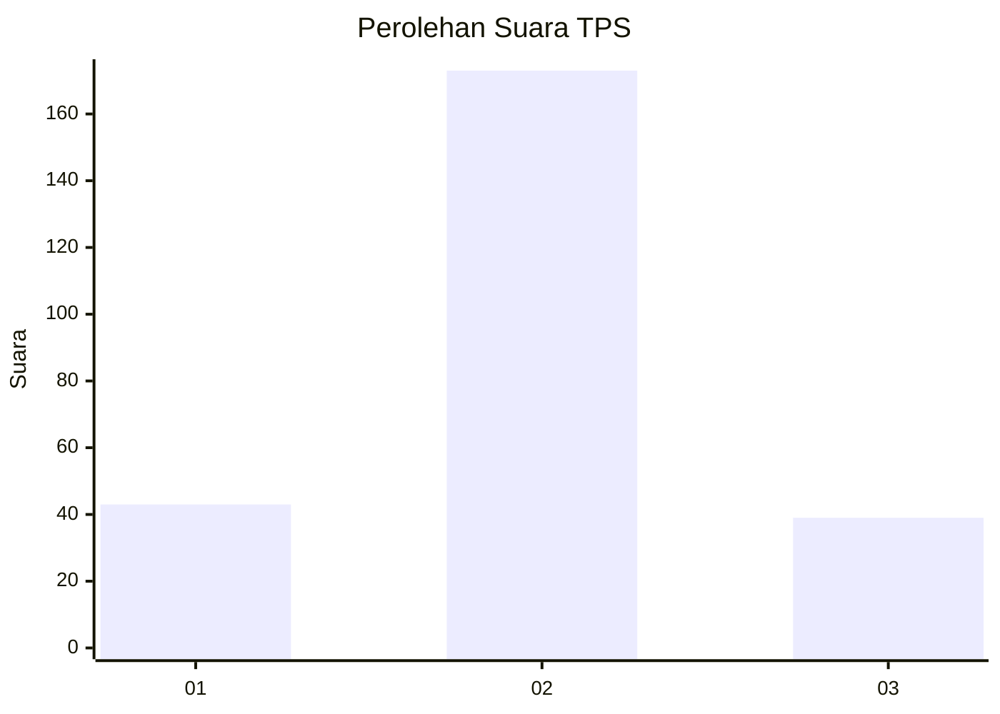
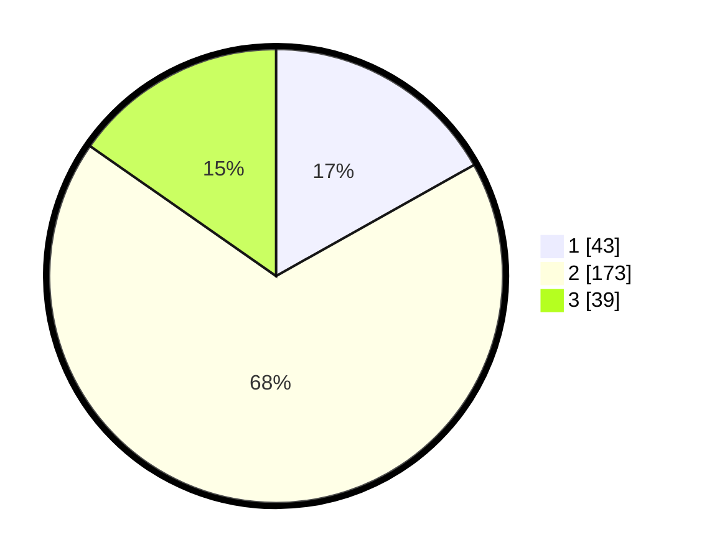

# Hasil

## Grafik

## Tabel

| No. | Nama Paslon    | Suara | Suara (raw) | Persentase |
|:--- |:-------------- | -----:| -----------:| ----------:|
| 1   | ANIES MUHAIMIN | 43    | [43][p-1]   | 16,86      |
| 2   | PRABOWO GIBRAN | 173   | [173][p-2]  | 67,84      |
| 3   | GANJAR MAHFUD  | 39    | [39][p-3]   | 15,29      |

[p-1]: https://github.com/gigit-pemilu/pemilu-2024/blob/main/pilpres/hitung-suara/sub/35-jawa-timur/sub/09-jember/sub/19-kaliwates/sub/1007-tegalbesar/sub/099-tps/sub/paslon-1.txt
[p-2]: https://github.com/gigit-pemilu/pemilu-2024/blob/main/pilpres/hitung-suara/sub/35-jawa-timur/sub/09-jember/sub/19-kaliwates/sub/1007-tegalbesar/sub/099-tps/sub/paslon-2.txt
[p-3]: https://github.com/gigit-pemilu/pemilu-2024/blob/main/pilpres/hitung-suara/sub/35-jawa-timur/sub/09-jember/sub/19-kaliwates/sub/1007-tegalbesar/sub/099-tps/sub/paslon-3.txt

## Foto C Plano

https://sirekap-obj-formc.kpu.go.id/0336/pemilu/ppwp/35/09/19/10/07/3509191007099-20240217-155641--43aefc44-30f8-4e32-87a4-410785ea6a8d.jpg

https://sirekap-obj-formc.kpu.go.id/0336/pemilu/ppwp/35/09/19/10/07/3509191007099-20240217-153219--b50f465d-f855-4528-aa22-65fb1d89edd7.jpg

https://sirekap-obj-formc.kpu.go.id/0336/pemilu/ppwp/35/09/19/10/07/3509191007099-20240217-153336--347a5649-9cf2-43be-8d04-5344235c2962.jpg

## Metadata

| Key        | Value               |
| ---------- | ------------------- |
| Time Stamp | 2024-02-25 21:00:00 |

