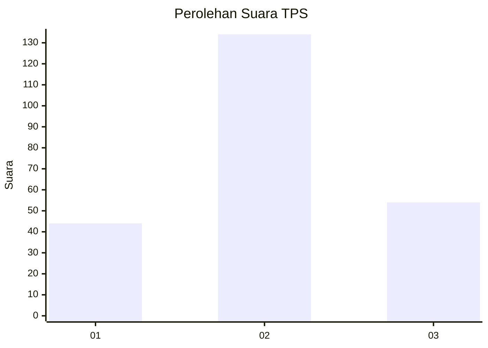
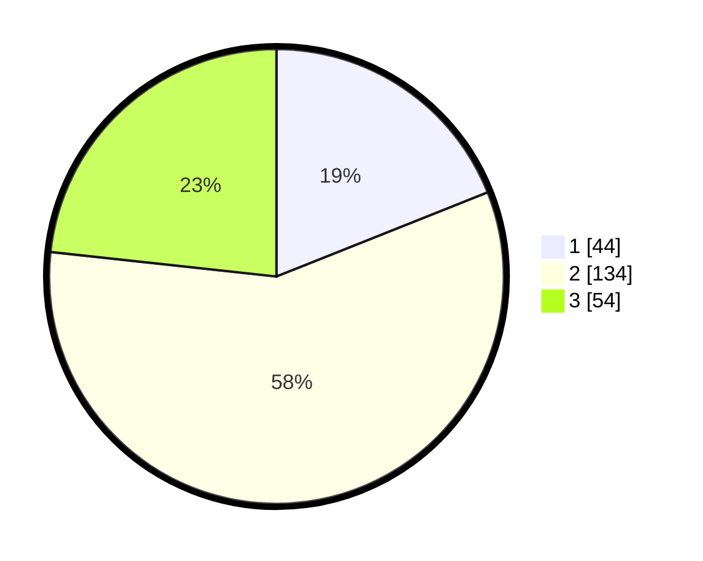

# Hasil

## Grafik

## Tabel

| No. | Nama Paslon    | Suara | Suara (raw) | Persentase |
|:--- |:-------------- | -----:| -----------:| ----------:|
| 1   | ANIES MUHAIMIN | 44    | [44][p-1]   | 18,97      |
| 2   | PRABOWO GIBRAN | 134   | [134][p-2]  | 57,76      |
| 3   | GANJAR MAHFUD  | 54    | [54][p-3]   | 23,28      |

[p-1]: https://github.com/gigit-pemilu/pemilu-2024/blob/main/pilpres/hitung-suara/sub/35-jawa-timur/sub/09-jember/sub/20-patrang/sub/1001-banjarsengon/sub/002-tps/sub/paslon-1.txt
[p-2]: https://github.com/gigit-pemilu/pemilu-2024/blob/main/pilpres/hitung-suara/sub/35-jawa-timur/sub/09-jember/sub/20-patrang/sub/1001-banjarsengon/sub/002-tps/sub/paslon-2.txt
[p-3]: https://github.com/gigit-pemilu/pemilu-2024/blob/main/pilpres/hitung-suara/sub/35-jawa-timur/sub/09-jember/sub/20-patrang/sub/1001-banjarsengon/sub/002-tps/sub/paslon-3.txt

## Foto C Plano

https://sirekap-obj-formc.kpu.go.id/e37b/pemilu/ppwp/35/09/20/10/01/3509201001002-20240214-191918--b62fc3a9-83fa-4bf9-a0b2-ec43faf7c60d.jpg

https://sirekap-obj-formc.kpu.go.id/e37b/pemilu/ppwp/35/09/20/10/01/3509201001002-20240214-192019--e84f7dc5-3778-4367-974c-f8be536a13bf.jpg

https://sirekap-obj-formc.kpu.go.id/e37b/pemilu/ppwp/35/09/20/10/01/3509201001002-20240214-192101--a9169bc8-efd7-4b69-b884-eeb0cc786351.jpg

## Metadata

| Key        | Value               |
| ---------- | ------------------- |
| Time Stamp | 2024-02-16 12:51:22 |

