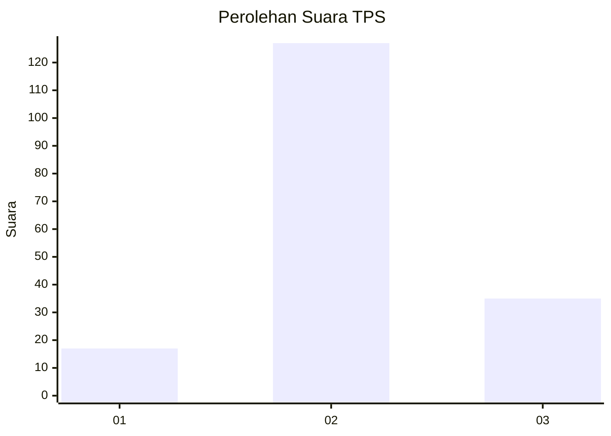
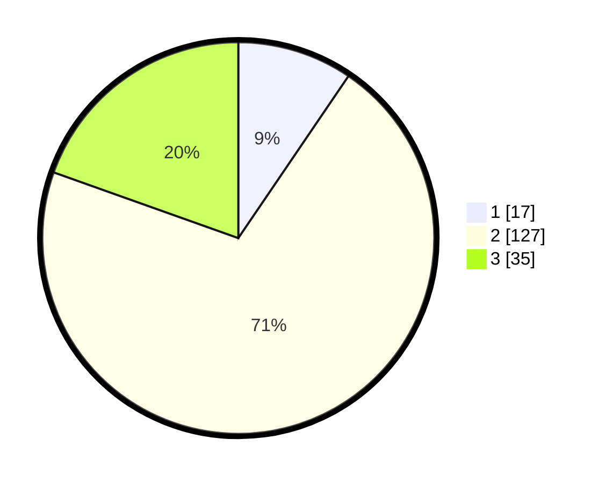

# Hasil

## Grafik

## Tabel

| No. | Nama Paslon    | Suara | Suara (raw) | Persentase |
|:--- |:-------------- | -----:| -----------:| ----------:|
| 1   | ANIES MUHAIMIN | 17    | [17][p-1]   | 9,50       |
| 2   | PRABOWO GIBRAN | 127   | [127][p-2]  | 70,95      |
| 3   | GANJAR MAHFUD  | 35    | [35][p-3]   | 19,55      |

[p-1]: https://github.com/gigit-pemilu/pemilu-2024/blob/main/pilpres/hitung-suara/sub/35-jawa-timur/sub/09-jember/sub/20-patrang/sub/1003-gebang/sub/011-tps/sub/paslon-1.txt
[p-2]: https://github.com/gigit-pemilu/pemilu-2024/blob/main/pilpres/hitung-suara/sub/35-jawa-timur/sub/09-jember/sub/20-patrang/sub/1003-gebang/sub/011-tps/sub/paslon-2.txt
[p-3]: https://github.com/gigit-pemilu/pemilu-2024/blob/main/pilpres/hitung-suara/sub/35-jawa-timur/sub/09-jember/sub/20-patrang/sub/1003-gebang/sub/011-tps/sub/paslon-3.txt

## Foto C Plano

https://sirekap-obj-formc.kpu.go.id/386d/pemilu/ppwp/35/09/20/10/03/3509201003011-20240215-001412--9fe3cfd9-15a1-40cc-9d57-628f7f85588b.jpg

https://sirekap-obj-formc.kpu.go.id/386d/pemilu/ppwp/35/09/20/10/03/3509201003011-20240215-001658--b62d4997-b95e-40f7-bcb3-b931332a7e3b.jpg

https://sirekap-obj-formc.kpu.go.id/386d/pemilu/ppwp/35/09/20/10/03/3509201003011-20240215-001813--8f6c5a2d-8989-4aa9-b6c0-0ca943adb65b.jpg

## Metadata

| Key        | Value               |
| ---------- | ------------------- |
| Time Stamp | 2024-02-15 15:00:29 |

